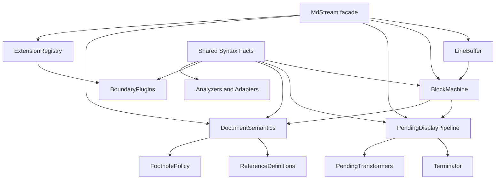
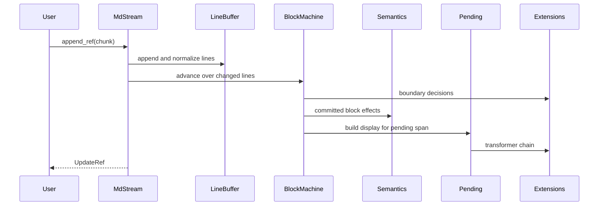

# Goal Capsule

Refactor `mdstream` around deeper internal modules while preserving the library's core streaming contract: committed blocks are stable, at most one pending block is mutable, chunk boundaries do not change final output, and the core crate remains runtime-agnostic.

The target state is a codebase where:

- `MdStream` is a small facade over input buffering, block-state transitions, pending display, cross-block semantics, and extension registries.
- Markdown syntax facts are defined once and reused by streaming, pending termination, analyzers, boundary plugins, and adapters.
- Pending display has one clear pipeline: raw pending span -> terminator -> transformers -> cache/reference update.
- Cross-block semantics for references and footnotes are localized and testable.
- Boundary plugins and pending transformers have a single lifecycle manager.
- `mdstream-tokio` is feeding glue over the core crate, not a second architecture.

This is an intentionally fearless refactor. Internal modules, duplicated helpers, and outdated shallow abstractions may be deleted or moved. User-facing behavior and documented high-level APIs should remain stable unless a break is explicitly documented and covered by compatibility notes.

# Product Contract

## Existing product promises

- The library supports streaming Markdown UIs with a stable `committed + pending` model.
- The core crate is synchronous and runtime-agnostic.
- `append` and `append_ref` expose equivalent behavior, with `append_ref` optimized for hot UI paths.
- `finalize` and `finalize_ref` turn pending content into committed blocks.
- `Update.reset` means consumers must rebuild cached state; `Update.invalidated` means consumers can selectively reparse affected committed blocks.
- The optional `pulldown` feature keeps pulldown reference-definition behavior correct enough for streaming.
- `mdstream-tokio` provides producer/backpressure/coalescing convenience without changing core semantics.

## Explicit scope

In scope:

- Behavior-preserving internal architecture changes.
- Characterization tests for currently documented behavior before high-risk movement.
- Removal of duplicate syntax, pending, and cross-block helper code after replacement call sites are live.
- Public surface cleanup when the old surface exposes shallow internals; document any break.
- Documentation updates for the new architecture and any intentional public API changes.
- Dependency upgrades only when they remove real complexity, fix compatibility, or are needed by the refactor.

Out of scope unless naturally unlocked by the refactor:

- A new Markdown parser.
- Async code inside `mdstream`.
- New renderer-specific behavior beyond the Streamdown/Incremark compatibility contract.
- New footnote invalidation behavior beyond the current reset semantics without a targeted test and documentation update.
- A rewrite of examples or docs unrelated to the new architecture.

## Compatibility priorities

1. Streaming stability and chunking invariance.
2. `append_ref` and `UpdateRef` allocation/lifetime behavior.
3. Reference-definition invalidation and pulldown adapter behavior.
4. Pending display correctness for incomplete fences, lists, emphasis, links, images, HTML, and math.
5. Extension lifecycle behavior for stateful plugins and transformers.
6. Tokio feeding/coalescing API behavior.

# Planning Contract

## Inputs

- `README.md`
- `docs/ARCHITECTURE.md`
- `docs/ADR_0001_STREAMING_CONCURRENCY.md`
- `docs/EXTENSIONS.md`
- `docs/COMPATIBILITY.md`
- `docs/ADAPTERS.md`
- `docs/MVP.md`
- `docs/ROADMAP.md`
- `mdstream/src/lib.rs`
- `mdstream/src/stream.rs`
- `mdstream/src/stream/*`
- `mdstream/src/syntax.rs`
- `mdstream/src/pending/terminator.rs`
- `mdstream/src/transform.rs`
- `mdstream/src/boundary.rs`
- `mdstream/src/analyze.rs`
- `mdstream/src/reference.rs`
- `mdstream/src/adapters/pulldown.rs`
- `mdstream-tokio/src/lib.rs`
- Existing integration tests under `mdstream/tests/`

## Requirements

| ID | Requirement |
| --- | --- |
| R1 | Preserve the committed/pending model and block id semantics. |
| R2 | Preserve chunking invariance for whole-buffer, line, char, and randomized chunk feeds. |
| R3 | Preserve `append`/`append_ref` and `finalize`/`finalize_ref` behavioral equivalence. |
| R4 | Keep `mdstream` runtime-agnostic and keep Tokio integration in `mdstream-tokio`. |
| R5 | Replace duplicated Markdown syntax checks with shared syntax facts. |
| R6 | Extract block-state transitions from the `MdStream` facade. |
| R7 | Extract pending display generation and caching from the `MdStream` facade. |
| R8 | Localize reference and footnote semantics behind a single internal component. |
| R9 | Localize boundary plugin and pending transformer lifecycle management. |
| R10 | Update docs, examples, and tests so the new module boundaries are understandable and enforced. |

## Key Technical Decisions

| ID | Decision | Rationale |
| --- | --- | --- |
| KTD1 | `MdStream` remains the public facade. | Users should not learn the internal state machine to use the crate. |
| KTD2 | New deep modules are internal first. | The refactor should improve locality without prematurely committing to new public APIs. |
| KTD3 | Shared syntax facts live under `mdstream/src/syntax/` with a compatibility shim from `syntax.rs` if needed. | Many call sites need the same facts, but the external surface can be cleaned gradually. |
| KTD4 | Cross-block semantics are separated from display generation. | References and footnotes affect invalidation/reset; pending display should not own those product rules. |
| KTD5 | `mdstream-tokio/src/lib.rs` becomes a re-export facade. | The Tokio crate should stay easy to read while preserving its public API. |
| KTD6 | Tests are added before high-risk movement. | The existing behavior is the migration oracle. |
| KTD7 | Public breaks are allowed only when they delete shallow internals or impossible-to-support surfaces. | The user authorized fearless refactor, but crate users still need an intentional migration path. |

## High-Level Target Design

# Implementation Units

## U1 - Freeze streaming behavior with characterization tests

Purpose: make current behavior explicit before moving core state.

Files:

- `mdstream/tests/support/mod.rs`
- `mdstream/tests/chunking_invariance_suite.rs`
- `mdstream/tests/append_ref_behavior.rs`
- `mdstream/tests/stream_streamdown_streaming_simulation_parity.rs`
- Add `mdstream/tests/stream_trace_equivalence.rs`
- Add `mdstream/tests/extension_lifecycle.rs` if lifecycle behavior is not already covered.

Work:

- Add a compact trace helper that records `reset`, `committed`, `committed_id`, `pending`, `invalidated`, and final `DocumentState`.
- Assert equivalent traces for `append`, `append_ref`, `finalize`, and `finalize_ref` on representative inputs.
- Add characterization coverage for:
  - incomplete code fences with cached pending display;
  - reference definition invalidation after a previously committed usage;
  - footnote reset mode;
  - stateful pending transformer invocation;
  - boundary plugin reset/start/update order.
- Keep these tests focused on public behavior, not module internals.

Acceptance:

- Focused tests pass before production refactor begins.
- Any surprising baseline behavior is recorded in test names or comments, not silently changed.

## U2 - Centralize Markdown syntax facts

Purpose: remove repeated parsing heuristics and give the state machine/pending/analyzer paths the same vocabulary.

Files:

- `mdstream/src/syntax.rs`
- Add `mdstream/src/syntax/mod.rs` or convert `syntax.rs` into a module tree.
- Add `mdstream/src/syntax/facts.rs`
- Consider `mdstream/src/syntax/fence.rs`, `html.rs`, `math.rs`, `references.rs`, and `blocks.rs` when they reduce real complexity.
- Update `mdstream/src/stream.rs`, `mdstream/src/stream/html.rs`, `mdstream/src/stream/refs.rs`, `mdstream/src/stream/footnotes.rs`.
- Update `mdstream/src/pending/terminator.rs`, `mdstream/src/transform.rs`, `mdstream/src/boundary.rs`, `mdstream/src/analyze.rs`, `mdstream/src/adapters/pulldown.rs`.

Work:

- Define a small set of shared facts:
  - line indentation;
  - blank line;
  - ATX heading;
  - setext underline candidate;
  - thematic break candidate;
  - list marker;
  - blockquote marker;
  - fenced code delimiter and info string;
  - math delimiter;
  - HTML block open/close signal;
  - reference definition and reference usage labels;
  - character-boundary-safe tail windows.
- Replace local duplicate helpers one call site at a time.
- Keep the facts value-oriented and cheap to compute; avoid introducing a full AST.
- Preserve existing public helper names only when they are documented or widely used by examples.

Acceptance:

- Existing syntax-oriented tests pass.
- No duplicate local implementation remains for a fact that the new module owns.
- Public compatibility shims are documented or intentionally removed.

## U3 - Extract LineBuffer and BlockMachine internals

Purpose: make `MdStream` a coordinator instead of the owner of every state transition.

Files:

- `mdstream/src/stream.rs`
- `mdstream/src/stream/lines.rs`
- `mdstream/src/stream/compaction.rs`
- Add `mdstream/src/stream/input.rs`
- Add `mdstream/src/stream/machine.rs`
- Add `mdstream/src/stream/mode.rs`

Work:

- Move newline normalization, line indexing, buffer cursor management, and compaction into `LineBuffer`.
- Move `BlockMode`, pending span state, commit spans, boundary decisions, and mode transitions into `BlockMachine`.
- Keep `MdStream` responsible for:
  - public options and constructors;
  - accepting chunks;
  - coordinating line buffer, machine, semantics, pending pipeline, and extensions;
  - assembling `Update` and `UpdateRef`.
- Preserve block id ordering and line-start offsets.
- Avoid borrowing designs that make `UpdateRef` difficult to return. Prefer explicit temporary result structs over deeply nested borrows.

Acceptance:

- `mdstream/src/stream.rs` is materially smaller and reads as orchestration.
- Core streaming tests and chunking invariance pass.
- No public behavior change is introduced by this unit.

## U4 - Deepen pending display pipeline

Purpose: make pending display generation, caching, and transformer application one coherent subsystem.

Files:

- `mdstream/src/pending/mod.rs`
- `mdstream/src/pending/terminator.rs`
- Add `mdstream/src/pending/pipeline.rs`
- `mdstream/src/transform.rs`
- `mdstream/src/stream.rs`

Work:

- Introduce `PendingDisplayPipeline` that owns:
  - deciding whether cached display can be reused;
  - applying the code-fence suffix fast path;
  - calling the terminator;
  - running pending transformers;
  - exposing borrowed and owned display variants needed by `UpdateRef` and `Update`.
- Keep `terminate_markdown` available as the low-level repair primitive unless a documented public break is chosen.
- Remove duplicate tail-window and char-boundary logic after U2 is live.
- Ensure stateful transformers run with the same frequency and order as before.

Acceptance:

- Pending display tests pass.
- `append_ref` still avoids unnecessary allocation on the hot path.
- Pending display cache logic is not spread across `MdStream`.

## U5 - Extract cross-block semantics

Purpose: localize document-level effects that reach across committed blocks.

Files:

- `mdstream/src/reference.rs`
- `mdstream/src/stream/refs.rs`
- `mdstream/src/stream/footnotes.rs`
- Add `mdstream/src/semantics/mod.rs`
- `mdstream/src/stream.rs`
- `mdstream/src/adapters/pulldown.rs`
- `mdstream/src/options.rs`

Work:

- Introduce `DocumentSemantics` to own:
  - reference definition collection;
  - reference usage indexing;
  - invalidation calculation;
  - footnote detection;
  - footnote reset policy.
- Preserve the current default footnote policy unless tests and docs are updated.
- Keep pulldown adapter caches synchronized through explicit semantics outputs instead of ad hoc stream internals.
- Make reset behavior call every component that owns state, including transformers and plugins.

Acceptance:

- Reference and footnote tests pass.
- `Update.reset` and `Update.invalidated` semantics remain clear and documented.
- Cross-block rules are testable without reading the whole stream facade.

## U6 - Consolidate extension lifecycle and analyzer integration

Purpose: make extension call order and reset behavior explicit.

Files:

- `mdstream/src/boundary.rs`
- Add `mdstream/src/extensions/mod.rs`
- Add `mdstream/src/extensions/boundary_registry.rs`
- `mdstream/src/transform.rs`
- `mdstream/src/analyze.rs`
- `mdstream/src/state.rs`
- `mdstream/src/adapters/pulldown.rs`

Work:

- Introduce internal registries for boundary plugins and pending transformers.
- Centralize lifecycle calls:
  - register;
  - start block;
  - update line;
  - boundary decision;
  - reset.
- Preserve trait names and user-facing registration methods unless an intentional break is documented.
- Route analyzers through shared syntax facts where applicable.

Acceptance:

- Boundary and analyzer tests pass.
- Dynamic registration semantics are either preserved or explicitly changed with tests.
- Reset behavior is consistent across plugins, transformers, semantics, and pending cache.

## U7 - Split `mdstream-tokio` feeding strategy

Purpose: keep the Tokio crate as integration glue with clear producer, receiver, and actor responsibilities.

Files:

- `mdstream-tokio/src/lib.rs`
- Add `mdstream-tokio/src/sender.rs`
- Add `mdstream-tokio/src/receiver.rs`
- Add `mdstream-tokio/src/actor.rs`
- Add `mdstream-tokio/src/stats.rs` if it clarifies ownership.
- Consider moving tests into `mdstream-tokio/tests/` only if it improves readability.

Work:

- Move `DeltaSender`, `CoalescingReceiver`, `spawn_mdstream_actor`, stats, and options into focused modules.
- Keep `lib.rs` as docs plus re-exports.
- Preserve `CoalesceOptions`, `CoalescePreset`, `BackpressurePolicy`, and actor helper behavior.
- Do not move async requirements into `mdstream`.

Acceptance:

- Tokio tests pass.
- `mdstream-tokio/src/lib.rs` is a readable facade.
- Public API paths remain stable unless a documented break is chosen.

## U8 - Public surface, docs, examples, and dependency audit

Purpose: make the new design understandable and delete obsolete code.

Files:

- `mdstream/src/lib.rs`
- `README.md`
- `docs/ARCHITECTURE.md`
- `docs/EXTENSIONS.md`
- `docs/ADAPTERS.md`
- `docs/ADR_0001_STREAMING_CONCURRENCY.md`
- `docs/COMPATIBILITY.md`
- `docs/ROADMAP.md`
- Examples under `mdstream/examples/` and `mdstream-tokio/examples/`
- `Cargo.toml` files if dependency changes are justified.

Work:

- Update architecture docs with the new module map.
- Update extension docs with lifecycle semantics.
- Document any public API breaks and migration steps.
- Remove obsolete modules, compatibility shims, or helper functions only after all call sites are gone.
- Audit dependencies; upgrade only when justified by the refactor and verified by tests/examples.

Acceptance:

- Docs match the code.
- Examples compile.
- No dead old architecture remains as misleading compatibility baggage.

# Verification Contract

Run focused verification after each unit, then the full gate before considering the goal complete.

| Gate | Command |
| --- | --- |
| Formatting | `cargo fmt --all -- --check` |
| Lint | `cargo clippy --all-targets --all-features -- -D warnings` |
| Preferred full test gate | `cargo nextest run --workspace --all-features` |
| CI parity tests | `cargo test -p mdstream --tests && cargo test -p mdstream-tokio --tests` |
| All-feature cargo test fallback | `cargo test --workspace --all-features --tests` |
| Core examples | `cargo check -p mdstream --examples` |
| Pulldown examples | `cargo check -p mdstream --features pulldown --examples` |
| Tokio examples | `cargo check -p mdstream-tokio --examples` |

Focused suites by unit:

- U1/U3: `cargo test -p mdstream --test chunking_invariance_suite --test stream_streamdown_streaming_simulation_parity --test stream_block_splitting --test append_ref_behavior`
- U2: `cargo test -p mdstream --test stream_streamdown_code_blocks --test stream_streamdown_html_blocks --test boundary_tag_plugin --test analyzed_stream_math`
- U4: `cargo test -p mdstream --test terminator_remend_parity --test terminator_streamdown_cases --test pending_transformers --test append_ref_behavior`
- U5: `cargo test -p mdstream --test reference_definitions_invalidation --test pulldown_reference_definitions --test incremark_footnote_invalidation_mode --test document_state`
- U6: `cargo test -p mdstream --test boundary_plugin --test fn_boundary_plugin --test container_boundary_plugin --test analyzed_stream_core --test analyzed_stream_overlays`
- U7: `cargo test -p mdstream-tokio --tests`

If `cargo nextest` is unavailable, use the cargo test fallback and record that nextest was unavailable in the final implementation summary.

# Definition of Done

- The plan's implementation units are complete or an explicitly documented unit is left out with a concrete reason.
- All high-risk behavior has characterization tests or updated compatibility tests.
- `MdStream` reads as a facade over deeper internal components.
- Markdown syntax facts, pending display, cross-block semantics, and extension lifecycle each have a clear owning module.
- `mdstream-tokio` is split into focused modules with `lib.rs` as the public facade.
- Dead or duplicated helpers replaced by the new design are removed.
- Public API breaks, if any, are intentional, documented, and reflected in examples/tests.
- The Verification Contract has been run, or any unavailable command is reported with the closest successful fallback.
- Changes are committed in logical Conventional Commit commits when appropriate.

# Landing Strategy

Prefer a sequence of reviewable commits:

1. `test: characterize streaming architecture behavior`
2. `refactor: centralize markdown syntax facts`
3. `refactor: extract stream state machine internals`
4. `refactor: deepen pending display pipeline`
5. `refactor: localize document semantics`
6. `refactor: consolidate extension lifecycle`
7. `refactor: split tokio feeding modules`
8. `docs: describe deep streaming architecture`

Run focused tests before each commit. Run the full Verification Contract before the final commit.
