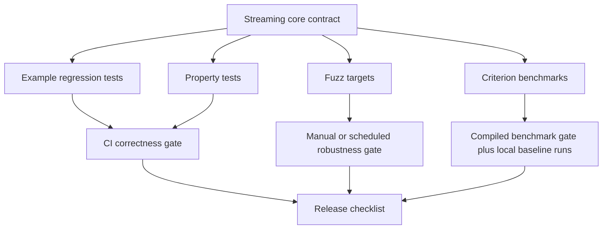
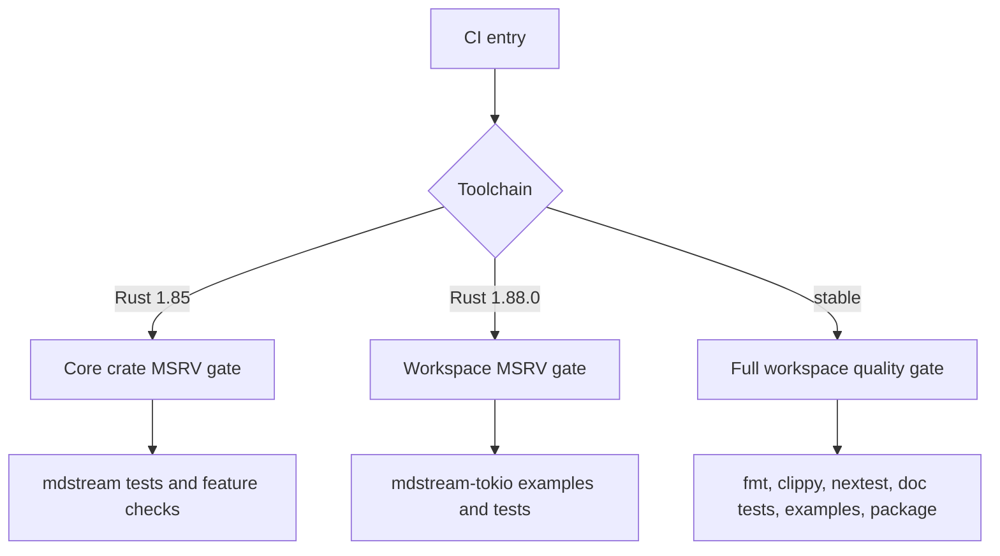

# Engineering Hardening - Plan

## Goal Capsule

Harden `mdstream` after the architecture refactor by adding measurable performance baselines, stronger CI and release gates, randomized robustness coverage, panic-free production internals, and clearer user-facing API guidance.

Authority order:

1. Preserve the streaming contract documented in `README.md` and `docs/ARCHITECTURE.md`.
2. Keep `mdstream` runtime-agnostic; Tokio integration remains in `mdstream-tokio`.
3. Prefer proof-first or characterization-first changes for behavior-bearing code.
4. Allow breaking internal and public cleanup only when the migration path is documented in `CHANGELOG.md`, README, or focused docs.
5. Do not commit ignored `Cargo.lock`; Cargo dependency resolution is verified through the repo gates.

Execution profile: deep refactor/hardening, safe for multiple incremental commits. The plan is complete when CI-equivalent gates pass locally, new hardening artifacts are documented, and abandoned experimental code is removed.

---

## Product Contract

### Summary

This plan adds an engineering safety layer around the existing streaming Markdown architecture: benchmarks tell us whether hot paths regress, CI proves the supported Rust/toolchain matrix, property and fuzz tests search chunk-boundary bugs, production code avoids avoidable panics, and docs explain the resulting workflow.

### Problem Frame

The previous refactor made the core architecture deeper and more maintainable, but the project still lacks the guardrails that make future fearless refactors cheap: formal benchmarks, randomized robustness checks, CI that mirrors the current local gates, and a written release workflow that reflects `nextest`, doc tests, examples, packaging, and MSRV split.

The codebase already has strong example-based regression coverage and Streamdown/Incremark fixture parity. The remaining risk is silent drift: a future change can still add full-buffer rescans, rely on hidden panic assumptions, miss target-specific CI gaps, or make API behavior harder for new integrators to understand.

### Requirements

**Performance and regression safety**

- R1. Add a benchmark harness covering the core streaming hot paths: normal text, large code fences, large tables, randomized chunking, `append`, `append_ref`, and pending display.
- R2. Keep performance CI deterministic by compiling benchmarks and running smoke-level checks, while leaving noisy statistical comparison to local/manual runs.
- R3. Document how to run and interpret benchmarks so future maintainers know which scenarios are guardrails and which are exploratory.

**CI and release quality**

- R4. Update CI so it verifies formatting, Clippy, nextest, doc tests, examples, feature combinations, packaging, and the split MSRV story for `mdstream` and `mdstream-tokio`.
- R5. Update the release checklist so it matches the implemented CI gates and current dependency/toolchain reality.
- R6. Keep `mdstream` verifiable on Rust 1.85 while `mdstream-tokio` is verified on Rust 1.88.0 or newer because of `ratatui` 0.30.2.

**Robustness and fault containment**

- R7. Add property-based and fuzz-oriented coverage for chunking invariance, reset behavior, Unicode boundaries, and incomplete Markdown tails.
- R8. Remove avoidable production `expect`/panic points or replace them with explicit recovery/invariant-preserving code paths.
- R9. Keep test-only unwraps/expectations acceptable when they make assertions clearer; production panic policy is the target.

**API and documentation**

- R10. Clarify the supported user-facing APIs, hot-path recommendations, and release/benchmark/fuzz workflows in docs.
- R11. Update `CHANGELOG.md` under `Unreleased` for any new dev dependencies, workflow changes, MSRV notes, or public-facing behavior/documentation changes.

### Scope Boundaries

In scope:

- Add development-only dependencies for benchmarks, property tests, fuzz harnesses, and CI support.
- Add or modify CI workflows under `.github/workflows/`.
- Add benchmark, fuzz, and property-test files.
- Change production code only where hardening removes avoidable panic paths or clarifies invariants.
- Update docs and release checklist to match the new workflow.

Out of scope:

- Replacing the Markdown parser or adding a new renderer.
- Introducing async into `mdstream`.
- Changing the committed/pending model, `BlockId` stability contract, reset semantics, or invalidation semantics.
- Publishing to crates.io or pushing `main` before all gates are green.

#### Deferred to Follow-Up Work

- Quantitative performance thresholds based on historical trend data. This plan creates the harness and initial baseline; hard thresholds should be added after several representative runs.
- A full CommonMark/GFM conformance suite. The project remains streaming-stability first.
- A public semantic-versioned API redesign beyond documentation and obviously unsupported internals.
- Durable `docs/solutions/` learning capture after implementation lands.

---

## Planning Contract

### Key Technical Decisions

- KTD1. Benchmarks use Criterion as a dev dependency in `mdstream`, not ad hoc timing tests. Criterion is purpose-built for statistical micro-benchmarks, while unit tests remain correctness gates.
- KTD2. CI compiles or smoke-runs benchmark/fuzz artifacts but does not fail normal PRs on statistical benchmark variance. GitHub-hosted runners are too noisy for hard performance thresholds.
- KTD3. `nextest` becomes the preferred test runner in CI and release documentation, with `cargo test` kept only where doc tests or fallback behavior require it.
- KTD4. Property tests live in normal integration tests so they run in the regular Rust test lifecycle; fuzz targets live under `fuzz/` so `cargo-fuzz` users can run deeper exploration separately.
- KTD5. Production panic removal targets only runtime/library paths. Test code may keep `unwrap` and `expect` when the panic message is the assertion.
- KTD6. The pulldown adapter's sync scratch mutex should recover from poisoning by clearing the scratch buffer before reuse, not panic inside a library path.
- KTD7. The commit path should avoid post-push `expect` by using the committed block value or stable index known before mutation.
- KTD8. CI verifies `mdstream` and `mdstream-tokio` MSRV separately because the crates now have different Rust version floors.

### High-Level Technical Design

### Assumptions

- Benchmark dependencies can be added as dev dependencies without changing library users' dependency graph.
- `cargo-fuzz` targets can live outside the workspace default members, preserving normal workspace commands.
- Current CI provider remains GitHub Actions because `.github/workflows/ci.yml` and `.github/workflows/release.yml` already exist.
- The user's permission to merge/push `main` is operational permission, not a requirement to push before all local and CI-equivalent gates pass.

### Sources and Research

- Existing repo patterns: `mdstream/tests/support/mod.rs`, `mdstream/tests/chunking_invariance_suite.rs`, `mdstream/tests/stream_streamdown_*`, `mdstream/tests/update_ref.rs`, `.github/workflows/ci.yml`, `.github/workflows/release.yml`, `RELEASE_CHECKLIST.md`.
- External implementation references to consult during execution: Criterion.rs book (`https://bheisler.github.io/criterion.rs/book/`), Rust Fuzz Book (`https://rust-fuzz.github.io/book/`), nextest documentation (`https://nexte.st/`), and GitHub Actions workflow syntax docs (`https://docs.github.com/actions`).
- Institutional learning search found no `CONCEPTS.md` or `docs/solutions/` corpus in this repo, so this plan is grounded in current code and docs rather than prior solution notes.

---

## System-Wide Impact

- CI becomes the primary enforcement layer for MSRV, examples, doc tests, and packaging rather than a smaller subset of local checks.
- New dev dependencies affect contributor setup but should not affect published runtime dependencies.
- Fuzz and benchmark artifacts create new maintenance surfaces; docs must explain when they are expected to run.
- Panic policy changes library reliability under poisoned mutex or internal invariant paths, but should preserve observable API behavior.
- Main-branch merging and remote pushes should happen only after a clean feature branch and green gates; this plan does not require bypassing review or CI.

---

## Implementation Units

### U1. Add Criterion Performance Baselines

- **Goal:** Add a repeatable benchmark harness for core streaming scenarios without changing runtime behavior.
- **Requirements:** R1, R2, R3.
- **Dependencies:** None.
- **Files:** `mdstream/Cargo.toml`, `mdstream/benches/streaming.rs`, `docs/PERFORMANCE.md`, `CHANGELOG.md`.
- **Approach:** Add Criterion as a dev dependency and benchmark the existing public API rather than internal modules. Reuse existing Streamdown fixture inputs and `mdstream/tests/support/mod.rs` chunking ideas, but keep benchmark helpers self-contained if test support is not importable from benches. Cover whole-buffer, line, char, and pseudo-random chunking; include large code fence/table scenarios and compare owned vs borrowed update flows.
- **Execution note:** Start by compiling a minimal no-op benchmark target, then add scenarios incrementally so failures identify the scenario that introduced the issue.
- **Patterns to follow:** `mdstream/tests/fixtures/streamdown_bench/*`, `mdstream/tests/support/mod.rs`, `docs/ROADMAP.md` performance item.
- **Test scenarios:**
  - Happy path: running the benchmark target compiles every scenario for the default feature set.
  - Edge case: benchmark inputs include a large pending code fence and a large table to catch accidental full-buffer rescans.
  - Integration: benchmark code exercises only public `MdStream` APIs so it reflects user-observable performance.
- **Verification:** The benchmark target compiles, local benchmark smoke execution works, and docs explain how to run full Criterion measurements.

### U2. Strengthen CI and Release Gates

- **Goal:** Bring GitHub Actions and the release checklist in line with the current Rust versions, `nextest` preference, doc tests, examples, and packaging behavior.
- **Requirements:** R4, R5, R6.
- **Dependencies:** U1 for benchmark compile/smoke gates if CI references benchmark targets.
- **Files:** `.github/workflows/ci.yml`, `.github/workflows/release.yml`, `RELEASE_CHECKLIST.md`, `CHANGELOG.md`.
- **Approach:** Split CI into explicit toolchain responsibilities: core `mdstream` MSRV on Rust 1.85, workspace MSRV on Rust 1.88.0 or newer, and stable full gates. Install and use nextest for normal tests, keep cargo doc tests as a separate gate, keep example checks for default/pulldown/Tokio surfaces, and keep release packaging aware that `mdstream-tokio` depends on a published `mdstream`.
- **Execution note:** Treat CI edits as packaging/config work; prefer workflow lint-by-inspection plus local command parity over adding unit tests.
- **Patterns to follow:** Existing `.github/workflows/ci.yml`, `.github/workflows/release.yml`, previous plan verification contract in `docs/plans/2026-07-06-001-refactor-deepen-streaming-architecture-plan.md`.
- **Test scenarios:**
  - Happy path: CI workflow has a path that runs formatting, Clippy, nextest, doc tests, examples, and package verification.
  - Edge case: Rust 1.85 job does not attempt to build `mdstream-tokio` dev dependencies that require Rust 1.88.0.
  - Integration: release workflow and release checklist describe the same validation surfaces.
- **Verification:** Workflow YAML is syntactically coherent by review, local equivalents of the listed gates pass, and release checklist no longer names stale test commands as the primary path.

### U3. Add Property and Fuzz Robustness Coverage

- **Goal:** Add randomized correctness coverage for chunk boundaries and fuzz targets for deeper parser-state exploration.
- **Requirements:** R7, R11.
- **Dependencies:** U2 if CI will compile or smoke the new targets.
- **Files:** `mdstream/Cargo.toml`, `mdstream/tests/proptest_chunking.rs`, `fuzz/Cargo.toml`, `fuzz/fuzz_targets/stream_chunking.rs`, `fuzz/fuzz_targets/terminator.rs`, `fuzz/README.md`, `CHANGELOG.md`.
- **Approach:** Add `proptest` for bounded integration tests that compare whole input against chunked input for generated Markdown-ish strings. Add `cargo-fuzz` harness files using `arbitrary`-driven byte input to stress `MdStream` chunking and pending termination. Keep fuzz out of default workspace members so ordinary `cargo test --workspace` remains predictable.
- **Execution note:** Write property tests before changing production code; the initial expected state should pass, proving they are characterization guards rather than post-hoc tests.
- **Patterns to follow:** `mdstream/tests/chunking_invariance_suite.rs`, `mdstream/tests/incremark_robustness_invariants.rs`, `mdstream/tests/support/mod.rs`.
- **Test scenarios:**
  - Happy path: generated text fed as one chunk and generated chunk splits produce the same final raw blocks when no reset changes the expected state.
  - Edge case: generated inputs include Unicode, CRLF, incomplete fences, brackets, emphasis markers, block quotes, and blank-line runs.
  - Failure path: property tests shrink failing inputs to a stable minimal case without panicking in the test harness itself.
  - Integration: fuzz targets compile and can be invoked by `cargo fuzz` without joining the default workspace.
- **Verification:** Property tests pass under nextest, fuzz targets compile, and fuzz documentation explains install/run expectations and why fuzz is not a default PR gate.

### U4. Remove Avoidable Production Panic Paths

- **Goal:** Replace avoidable production `expect` paths with explicit invariant-preserving logic.
- **Requirements:** R8, R9.
- **Dependencies:** U3 is recommended so randomized tests guard the refactor, but U4 can proceed with existing tests if needed.
- **Files:** `mdstream/src/stream/machine.rs`, `mdstream/src/adapters/pulldown.rs`, `mdstream/tests/stream_trace_equivalence.rs`, `mdstream/tests/pulldown_reference_definitions.rs`, `CHANGELOG.md`.
- **Approach:** In the commit path, avoid reading back with `last().expect` after pushing by using the committed block value or a precomputed stable index. In the sync pulldown adapter, recover a poisoned scratch mutex by taking the inner buffer, clearing it, and continuing. Do not hide invariants behind silent data corruption; the scratch buffer must be reset before reuse.
- **Execution note:** Use existing tests as characterization first, then change one panic path at a time and rerun focused tests after each change.
- **Patterns to follow:** Existing append/append_ref equivalence tests in `mdstream/tests/stream_trace_equivalence.rs`, pulldown invalidation tests in `mdstream/tests/pulldown_reference_definitions.rs`.
- **Test scenarios:**
  - Happy path: existing committed block emission, append/append_ref equivalence, and pulldown invalidation behavior remain unchanged.
  - Edge case: `sync` feature build covers the mutex-backed pulldown scratch path.
  - Failure path: poisoned scratch recovery clears stale partial contents before parsing the next block.
- **Verification:** No production `expect`, `unwrap`, `panic!`, `todo!`, or `unimplemented!` remain in `mdstream/src` or `mdstream-tokio/src` except documented test modules; focused and full test gates pass.

### U5. Clarify API, Workflow, and Compatibility Documentation

- **Goal:** Make the hardening workflow and supported API surfaces understandable to crate users and maintainers.
- **Requirements:** R3, R5, R10, R11.
- **Dependencies:** U1, U2, U3, U4.
- **Files:** `README.md`, `docs/USAGE.md`, `docs/ARCHITECTURE.md`, `docs/COMPATIBILITY.md`, `docs/PERFORMANCE.md`, `RELEASE_CHECKLIST.md`, `CHANGELOG.md`.
- **Approach:** Update docs to describe the benchmark workflow, fuzz workflow, nextest/release gates, MSRV split, hot-path API recommendations, and when to use owned vs borrowed updates. Keep user-facing docs in English to match the repo, and keep Chinese discussion in chat only.
- **Execution note:** Prefer documentation edits after implementation so docs describe the actual commands and artifacts that landed.
- **Patterns to follow:** Existing README API-at-a-glance section, `docs/ADR_0001_STREAMING_CONCURRENCY.md`, `docs/COMPATIBILITY.md`.
- **Test scenarios:** 
  - Happy path: README install and quick-start guidance still names current crate versions and recommended APIs.
  - Edge case: docs distinguish user-visible content streams from status/progress signals for `mdstream-tokio` backpressure choices.
  - Integration: release checklist and CI workflow describe the same gates.
- **Verification:** Documentation paths exist, no stale pre-upgrade dependency/toolchain claims remain, and `CHANGELOG.md` has clear `Unreleased` entries.

### U6. Final Review, Cleanup, and Landing Readiness

- **Goal:** Finish with a clean, reviewable branch that can be merged and pushed only after gates are green.
- **Requirements:** R2, R4, R5, R11.
- **Dependencies:** U1, U2, U3, U4, U5.
- **Files:** Potentially any file touched by U1-U5, plus `docs/solutions/` only if a durable learning is captured after implementation.
- **Approach:** Run the full verification contract, remove dead experiment code, simplify duplicated helpers introduced during implementation, and run code review on the final diff. Commit logical units with Conventional Commit messages. Merge or push `main` only when the branch is clean, gates pass, and remote state has been reconciled safely.
- **Execution note:** This is mostly verification and cleanup; do not add new feature scope here.
- **Patterns to follow:** `RELEASE_CHECKLIST.md`, `docs/plans/2026-07-06-001-refactor-deepen-streaming-architecture-plan.md` verification shape.
- **Test scenarios:** Test expectation: none -- this unit is the final quality gate over prior behavior-bearing units.
- **Verification:** Full gates pass, review findings are resolved or explicitly accepted as residuals, and `git status --short` is clean after commit.

---

## Verification Contract

| Gate | Command or outcome | Applies to |
| --- | --- | --- |
| Format | `cargo fmt --all -- --check` | U1-U6 |
| Lint | `cargo clippy --workspace --all-targets --all-features -- -D warnings` | U1-U6 |
| Preferred tests | `cargo nextest run --workspace --all-features` | U2-U6 |
| Doc tests | `cargo test --workspace --all-features --doc` | U2-U6 |
| Examples | `cargo check -p mdstream --examples` and `cargo check -p mdstream --features pulldown --examples` | U2, U5 |
| Tokio examples | `cargo check -p mdstream-tokio --examples` | U2, U5 |
| Core MSRV | Rust 1.85 verifies the `mdstream` crate without `mdstream-tokio` dev dependencies | U2 |
| Tokio MSRV | Rust 1.88.0 or newer verifies the full workspace | U2 |
| Benchmark compile | Benchmark target compiles and at least one smoke run is documented | U1, U2 |
| Fuzz compile | Fuzz targets compile or the documented local `cargo fuzz` setup is verified | U3 |
| Packaging | `cargo package -p mdstream` remains valid; release docs explain `mdstream-tokio` publish ordering | U2, U5 |
| Production panic scan | `mdstream/src` and `mdstream-tokio/src` contain no avoidable production panic macros or unwrap/expect calls | U4 |

On Windows, local test runs that launch binaries with names like `update_ref` may require `__COMPAT_LAYER=RUNASINVOKER` to avoid UAC interference.

---

## Risks & Dependencies

- **CI runner variance:** Statistical benchmark thresholds can produce false failures. Mitigation: CI compiles/smokes benchmarks, while local/manual runs establish baselines.
- **Toolchain split drift:** `mdstream` and `mdstream-tokio` now have different MSRVs. Mitigation: CI has explicit jobs for each crate floor.
- **Fuzz workspace friction:** `cargo-fuzz` expects a nested fuzz package and often nightly tooling. Mitigation: keep fuzz out of default workspace and document setup clearly.
- **Property-test flakiness:** Overbroad generators can produce slow or non-diagnostic failures. Mitigation: bound input size, seed deterministically where possible, and keep generated cases focused on streaming constructs.
- **Mutex poisoning recovery:** Recovering from poison without clearing scratch could reuse corrupted data. Mitigation: always clear recovered scratch before parsing.
- **Main branch push risk:** Direct `main` updates can surprise collaborators if remote moved. Mitigation: fetch/reconcile before merge and push only after clean gates.

---

## Documentation / Operational Notes

- `CHANGELOG.md` should keep all hardening items under `Unreleased` until the next release section is cut.
- `RELEASE_CHECKLIST.md` should become the human-readable mirror of CI rather than a separate command list that drifts.
- `docs/PERFORMANCE.md` should explain benchmark intent, not claim universal numbers from a single machine.
- Fuzz docs should state that fuzzing is exploratory and not required for every PR unless a future CI schedule is added.

---

## Definition of Done

- All implementation units U1-U6 are complete or explicitly superseded by a better implementation-time decision that still satisfies R1-R11.
- CI workflow and release checklist agree on the main validation surfaces.
- Benchmarks, property tests, fuzz targets, and docs are present and runnable or documented with clear prerequisites.
- Production runtime paths no longer contain avoidable `expect`/`unwrap`/panic macros.
- `CHANGELOG.md` `Unreleased` describes user-visible workflow, dependency, MSRV, and documentation changes.
- Full verification gates pass locally.
- Code review has been run on the final diff, and actionable findings are fixed or recorded as accepted residuals.
- The working tree is clean after commits, with no ignored lockfile or generated artifact accidentally staged.
