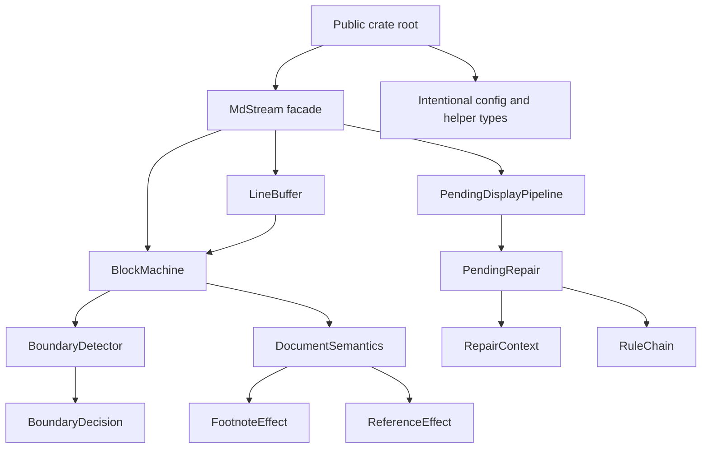
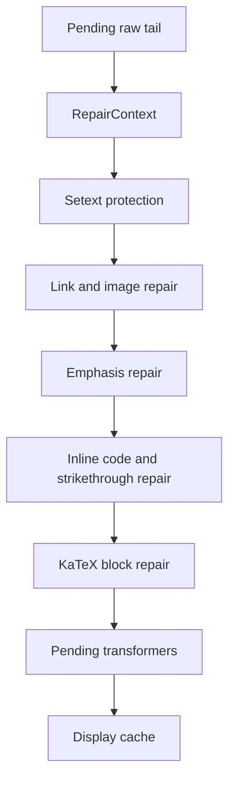
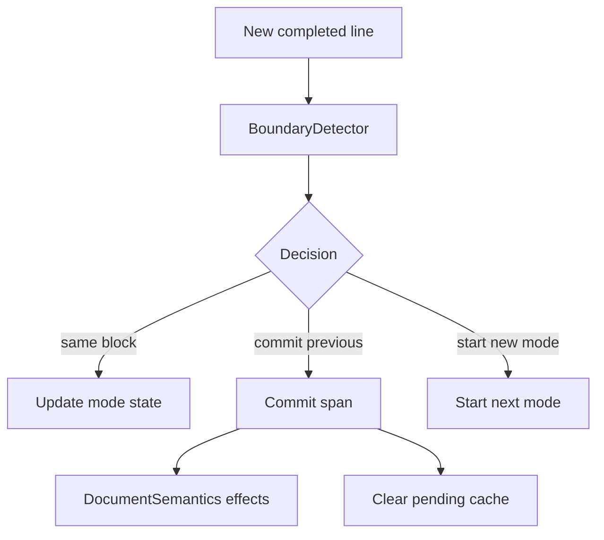

# Remaining Architecture Deepening - Plan

## Goal Capsule

Deepen the remaining high-density `mdstream` internals after the completed streaming architecture and hardening work.
The target is a smaller, more intentional public interface and deeper internal modules for pending repair, stable boundary detection, document-scoped semantics, and shared test/fuzz invariants.

Authority order:

1. Preserve the streaming contract documented in `README.md` and `docs/ARCHITECTURE.md`: committed blocks are stable, one pending block is mutable, chunking is invariant, and the core crate remains runtime-agnostic.
2. Prefer deep internal modules over shallow exported helpers, even when that requires public breaking changes before 1.0.
3. Keep `MdStream`, `Options`, `Block`, `Update`, `UpdateRef`, `DocumentState`, extension traits, analyzers, and the optional pulldown adapter as the intentional user-facing surface unless implementation proves a narrower break is better.
4. Use characterization or proof-first tests for behavior-bearing refactors, especially pending repair and boundary decisions.
5. Document every intentional public break in `CHANGELOG.md`, README or focused docs, and examples/tests.

Execution profile: deep, cross-cutting Rust refactor with incremental commits.
Stop only for a scope contradiction, a public break that cannot be documented coherently, or a verification failure that reveals current behavior is unknowable without a new planning decision.

---

## Product Contract

### Summary

This plan finishes the remaining architecture-deepening opportunities identified after the previous refactor: turn pending Markdown repair into a rule engine, move line buffering and block-machine state out of `MdStream`, isolate boundary decisions from commit effects, split document semantics into effect modules, shrink low-level public module paths, and align test/fuzz/docs around the new seams.

### Problem Frame

The first architecture refactor made `MdStream` a facade over input, machine, pending display, semantics, and extension registries.
The hardening pass added CI, property tests, fuzz targets, benchmarks, and panic policy.
The remaining risk is concentrated complexity: `pending/terminator.rs` still holds many interacting rules in one file, `stream/machine.rs` still mixes boundary decisions with commit effects, and `lib.rs` still exposes low-level modules that make implementation details part of the crate interface.

### Requirements

**Pending repair depth**

- R1. Keep pending display behavior compatible with existing Streamdown/remend-inspired tests for links, images, emphasis, inline code, strikethrough, KaTeX, setext protection, Unicode, and code-fence handling.
- R2. Replace the monolithic pending terminator implementation with internal rule modules that share scanning context and ordering policy behind one small repair interface.
- R3. Preserve the tail-window performance contract and avoid full-document repair scans beyond the configured window.

**Stable boundary depth**

- R4. Preserve chunking invariance and block id semantics while moving stable-boundary decisions behind a decision-shaped internal module.
- R5. Keep boundary plugins as the external seam for custom blocks, but prevent plugin lifecycle details from leaking into unrelated machine logic.
- R6. Make incomplete-line timing for table, thematic, setext, list, block quote, HTML, math, and footnote cases testable through public stream behavior.

**Semantics and public interface**

- R7. Split document-scoped semantics into focused internal effect modules for footnote detection, reference usage indexing, and invalidation calculation.
- R8. Remove or demote shallow public module paths such as `mdstream::pending` and overbroad `mdstream::syntax` when equivalent intentional root-level helpers or block methods exist.
- R9. Keep configuration types needed by public structs reachable from the crate root.
- R10. Update docs and `CHANGELOG.md` so current footnote/reference invalidation behavior and public breakage are not described as future-only or post-MVP when implemented.

**Testing and maintenance**

- R11. Unify duplicate chunk-invariance logic across deterministic tests and fuzz targets when doing so creates a real test-support seam rather than a new shallow wrapper.
- R12. Preserve all CI and release gates added by the hardening plan, including benchmarks/fuzz compilation, examples, MSRV split, nextest, doc tests, packaging, and Clippy.
- R13. Delete obsolete compatibility shims and dead helper code once call sites have moved.
- R14. Strengthen thin Tokio glue tests without moving async responsibilities into the core crate.

### Scope Boundaries

In scope:

- Internal module moves, file splits, and renames under `mdstream/src/`.
- Public breaking changes that shrink low-level module paths and have documented migration paths.
- Test rewrites that move low-level terminator tests into crate-internal modules if the low-level function stops being public.
- Documentation and example updates for changed imports or public paths.
- A small test-support module or local fuzz helper if it removes real duplication between deterministic and fuzz chunking checks.

Out of scope:

- Replacing `pulldown-cmark` or adding a new Markdown parser.
- Adding async behavior to `mdstream`.
- Changing the committed/pending model, `Update.reset`, `Update.invalidated`, or `BlockId` semantics.
- Adding a full CommonMark/GFM conformance suite.
- Publishing a release.

#### Deferred to Follow-Up Work

- A broader public 1.0 API design pass across every exported symbol.
- Scheduled long-running fuzz campaigns and quantitative performance thresholds.
- New renderer-specific adapters beyond the existing optional pulldown adapter.

---

## Planning Contract

### Key Technical Decisions

- KTD1. The public crate root becomes the primary interface. Callers should learn `mdstream::MdStream`, `mdstream::Options`, `mdstream::TerminatorOptions`, `mdstream::DocumentState`, analyzers, extension traits, and adapters rather than internal module paths.
- KTD2. `terminate_markdown` stays available as a compatibility shim during this pass. Internally it delegates to the rule engine so existing low-level users are not broken merely to improve file structure.
- KTD3. Pending repair becomes an internal rule engine, not a collection of public helper functions. The rule engine may be internally split by links/images, emphasis, code/math, setext, and marker scanning, but callers cross one repair seam.
- KTD4. Line buffering and block-machine state become real internal modules. `MdStream` coordinates them instead of storing every cursor and mode field directly.
- KTD5. Boundary detection returns decisions, while the block machine applies effects. This separates "is the previous block stable?" from "commit this block, update ids, clear caches, and update semantics."
- KTD6. Document semantics produce explicit effects. Reference invalidation and footnote detection share a coordinator, but their state and algorithms live in focused internal modules.
- KTD7. Test seams follow product behavior where possible. Low-level repair rules may have crate-internal unit tests, but integration tests should still prove `MdStream` pending display and chunking behavior.
- KTD8. Test/fuzz harness sharing is justified only if two adapters consume it. Deterministic integration tests and fuzz targets are two real adapters; shared logic should live in dev-only or fuzz-local support, not in runtime code.
- KTD9. Documentation follows implementation truth. If `FootnotesMode::Invalidate` and reference invalidation are implemented, comments and docs must stop calling those behaviors purely post-MVP.

### High-Level Technical Design

### Assumptions

- The user has already confirmed the full set of architecture-review candidates as in scope, so this plan does not ask for a smaller subset.
- Breaking changes are acceptable because the crate is still pre-1.0, but every public break still needs a migration note.
- External research is not load-bearing for this pass because the relevant design patterns are local Rust module seams, current tests, and the existing docs.
- Subagents may assist with read-only analysis, implementation review, and focused unit work, but the orchestrator owns staging, commits, full verification, and final status.

### Sources and Research

- Current code: `mdstream/src/pending/terminator.rs`, `mdstream/src/pending/pipeline.rs`, `mdstream/src/stream.rs`, `mdstream/src/stream/machine.rs`, `mdstream/src/stream/mode.rs`, `mdstream/src/semantics/mod.rs`, `mdstream/src/syntax.rs`, `mdstream/src/syntax/facts.rs`, `mdstream/src/lib.rs`, `mdstream/src/options.rs`, `mdstream/src/types.rs`.
- Current tests: `mdstream/tests/terminator_streamdown_cases.rs`, `mdstream/tests/terminator_remend_parity.rs`, `mdstream/tests/pending_transformers.rs`, `mdstream/tests/stream_block_splitting.rs`, `mdstream/tests/stream_trace_equivalence.rs`, `mdstream/tests/proptest_chunking.rs`, `mdstream/tests/reference_definitions_invalidation.rs`, `mdstream/tests/incremark_footnote_invalidation_mode.rs`, fuzz targets under `fuzz/fuzz_targets/`.
- Current docs: `README.md`, `CHANGELOG.md`, `docs/ARCHITECTURE.md`, `docs/ADAPTERS.md`, `docs/EXTENSIONS.md`, `docs/COMPATIBILITY.md`, `docs/ROADMAP.md`, `docs/STATE.md`, `docs/ADR_0001_STREAMING_CONCURRENCY.md`.
- Prior plans: `docs/plans/2026-07-06-001-refactor-deepen-streaming-architecture-plan.md` and `docs/plans/2026-07-06-002-refactor-engineering-hardening-plan.md`.
- No `CONCEPTS.md`, `STRATEGY.md`, or `docs/solutions/` corpus exists in this repo at planning time.

---

## System-Wide Impact

- Public module imports for low-level pending and syntax helpers may break. The replacement path should be root-level exports or higher-level `MdStream`/`Block` behavior.
- Internal test layout may move some integration-style terminator assertions into crate-internal module tests if the low-level repair function stops being public.
- Fuzz targets may need a small local support module to share chunking logic without making runtime code depend on test utilities.
- Docs and examples must compile against the new public interface.
- CI gates remain the final authority; no plan unit is done if focused tests pass but full workspace gates fail.

---

## Implementation Units

### U1. Characterize Public Surface and Repair Behavior

- **Goal:** Establish the migration baseline for low-level public exports and pending repair behavior before changing internals.
- **Requirements:** R1, R3, R8, R9.
- **Dependencies:** None.
- **Files:** `mdstream/src/lib.rs`, `mdstream/src/pending/mod.rs`, `mdstream/src/options.rs`, `mdstream/tests/terminator_streamdown_cases.rs`, `mdstream/tests/terminator_remend_parity.rs`, `mdstream/tests/pending_transformers.rs`, `mdstream/tests/append_ref_behavior.rs`, `mdstream/examples/tui_like.rs`.
- **Approach:** Inventory current external paths used by in-repo examples and tests, decide which symbols remain root-level public, and add or adjust characterization tests that prove pending display through `MdStream` rather than only direct terminator calls.
- **Execution note:** Start proof-first for any changed import or direct terminator expectation: update the test to the desired public surface, observe the expected compile or assertion failure, then implement the surface change.
- **Patterns to follow:** `Block::code_fence_header` root-accessible helper style in `mdstream/src/types.rs`, README API-at-a-glance section, existing pending transformer tests.
- **Test scenarios:**
  - Happy path: callers can configure terminator options through reachable root-level types after `pending` module visibility changes.
  - Happy path: direct pending display behavior remains observable through `MdStream::append` and `append_ref` for incomplete links, images, emphasis, inline code, and code fences.
  - Edge case: `streamdown_defaults` still disables built-in link/image repair and routes those cases through transformers.
  - Integration: examples compile with the new import paths.
- **Verification:** Focused terminator/pending tests pass or are intentionally moved to crate-internal tests, and examples compile with no dependency on `mdstream::pending`.

### U2. Build Pending Repair Rule Engine

- **Goal:** Replace the monolithic terminator implementation with a deeper internal rule engine while preserving behavior and tail-window cost.
- **Requirements:** R1, R2, R3, R13.
- **Dependencies:** U1.
- **Files:** `mdstream/src/pending/terminator.rs`, `mdstream/src/pending/mod.rs`, `mdstream/src/pending/pipeline.rs`, new internal files under `mdstream/src/pending/`, `mdstream/src/transform.rs`, `mdstream/tests/terminator_streamdown_cases.rs`, `mdstream/tests/terminator_remend_parity.rs`, `mdstream/tests/pending_transformers.rs`, `fuzz/fuzz_targets/terminator.rs`.
- **Approach:** Introduce an internal `PendingRepair` module shape with shared context scanning, a rule chain, and narrowly owned rules. Keep `TerminatorOptions` as the public configuration type and keep `terminate_markdown` as a compatibility shim that delegates to the new engine.
- **Execution note:** Use characterization-first movement: copy behavior into the new structure under tests, switch the pipeline call site, then delete the old helpers.
- **Patterns to follow:** `pending/pipeline.rs` cache ownership, `syntax/facts.rs` value-oriented helpers, fuzz output-size invariant.
- **Test scenarios:**
  - Happy path: every existing Streamdown/remend parity case returns the same display string.
  - Edge case: Unicode and multibyte tails stay char-boundary safe inside a configured small window.
  - Edge case: repair rules do not modify fenced code contents except code-fence pending suffix behavior owned by the pipeline.
  - Edge case: links/images inside code or math contexts are not repaired incorrectly.
  - Failure path: fuzz terminator target still bounds output growth for arbitrary input and option combinations.
  - Integration: `PendingDisplayPipeline` still caches repaired output and preserves transformer order.
- **Verification:** Focused pending suites, fuzz target compilation, property tests, and Clippy pass with no duplicate old repair helpers left behind.

### U3. Extract LineBuffer, BlockMachine, and BoundaryDetector Decisions

- **Goal:** Turn `stream/input.rs` and `stream/machine.rs` from `impl MdStream` method buckets into deeper internal modules, then separate boundary decisions from commit effects.
- **Requirements:** R4, R5, R6, R13.
- **Dependencies:** U1.
- **Files:** `mdstream/src/stream.rs`, `mdstream/src/stream/input.rs`, `mdstream/src/stream/compaction.rs`, `mdstream/src/stream/machine.rs`, `mdstream/src/stream/mode.rs`, new internal files under `mdstream/src/stream/`, `mdstream/src/extensions/boundary_registry.rs`, `mdstream/src/syntax/facts.rs`, `mdstream/tests/stream_block_splitting.rs`, `mdstream/tests/stream_streamdown_tables.rs`, `mdstream/tests/boundary_plugin.rs`, `mdstream/tests/boundary_tag_plugin.rs`, `mdstream/tests/container_boundary_plugin.rs`, `mdstream/tests/fn_boundary_plugin.rs`, `mdstream/tests/stream_trace_equivalence.rs`, `mdstream/tests/proptest_chunking.rs`, `mdstream/tests/buffer_compaction.rs`.
- **Approach:** Introduce `LineBuffer` to own buffer text, line index, CRLF normalization, buffer rebuild, and compaction cursor rebasing. Introduce `BlockMachine` to own processed-line cursor, current block start, current mode, and block id allocation. Create a decision-shaped `BoundaryDetector` that receives mode, line facts, line completeness, plugin start signals, and block-start context, then returns whether to stay, commit previous, or start a new mode.
- **Execution note:** Add focused characterization for at least one incomplete-line decision and one compaction/rebase scenario before moving state.
- **Patterns to follow:** `stream/input.rs` line representation, `stream/compaction.rs` char-boundary guardrails, `stream/mode.rs` mode-to-kind mapping, existing boundary plugin tests.
- **Test scenarios:**
  - Happy path: paragraph, heading, thematic break, code fence, table, list, block quote, HTML, math, and footnote blocks split as before.
  - Edge case: incomplete table delimiter and thematic/setext candidates do not commit early before newline.
  - Edge case: list marker prefixes split across chunks do not prematurely end the current list block.
  - Edge case: boundary plugins retain start/update/close lifecycle order.
  - Edge case: compaction preserves char boundaries, processed-line cursor, current block start, and pending display invalidation.
  - Integration: chunking invariance holds across whole, line, char, and pseudo-random chunk feeds.
- **Verification:** Stream block splitting, boundary plugin, table, compaction, proptest, and trace-equivalence suites pass with `MdStream` reading as orchestration over `LineBuffer`, `BlockMachine`, and pending/semantics modules.

### U4. Split Document Semantics Effects

- **Goal:** Localize footnote and reference state behind focused internal effect modules.
- **Requirements:** R7, R10, R13.
- **Dependencies:** U3 is recommended because boundary effects call into semantics, but U4 can proceed after U1 if needed.
- **Files:** `mdstream/src/semantics/mod.rs`, new internal files under `mdstream/src/semantics/`, `mdstream/src/reference.rs`, `mdstream/src/stream.rs`, `mdstream/src/stream/machine.rs`, `mdstream/src/options.rs`, `mdstream/src/types.rs`, `mdstream/tests/reference_definitions_invalidation.rs`, `mdstream/tests/pulldown_reference_definitions.rs`, `mdstream/tests/incremark_footnote_invalidation_mode.rs`, `mdstream/tests/stream_incremark_regressions.rs`, `mdstream/tests/document_state.rs`.
- **Approach:** Keep `DocumentSemantics` as the coordinator interface while moving reference usage indexing, reference definition invalidation, footnote detection tail state, and effect aggregation into focused internal modules. Update outdated comments that call implemented invalidation behavior post-MVP.
- **Execution note:** Preserve current public behavior first, then update docs/comments after tests prove the moved effects.
- **Patterns to follow:** `reference.rs` label normalization, `DocumentState::apply`, pulldown adapter invalidation handling.
- **Test scenarios:**
  - Happy path: late reference definitions invalidate earlier committed usages in `ReferenceDefinitionsMode::Invalidate`.
  - Happy path: footnote detection across chunk boundaries triggers SingleBlock reset when configured.
  - Edge case: invalid footnote syntax does not trigger SingleBlock reset.
  - Edge case: footnote definitions do not trigger reference-definition invalidations.
  - Integration: pulldown adapter reparses invalidated blocks with known definitions.
- **Verification:** Reference, footnote, pulldown, and document-state suites pass; comments and docs no longer describe implemented behavior as only future work.

### U5. Shrink Low-Level Module Paths and Update Docs

- **Goal:** Make the crate interface intentional and document every break.
- **Requirements:** R8, R9, R10, R13.
- **Dependencies:** U1, U2, U4.
- **Files:** `mdstream/src/lib.rs`, `mdstream/src/pending/mod.rs`, `mdstream/src/syntax.rs`, `mdstream/src/types.rs`, `mdstream/src/options.rs`, `README.md`, `docs/ARCHITECTURE.md`, `docs/ADAPTERS.md`, `docs/EXTENSIONS.md`, `docs/COMPATIBILITY.md`, `docs/ROADMAP.md`, `docs/STATE.md`, `CHANGELOG.md`, examples under `mdstream/examples/`.
- **Approach:** Remove or demote `pub mod pending` if root-level re-exports cover `TerminatorOptions` and `terminate_markdown`. Keep `syntax` public only for intentional helpers used by `Block` or documented adapter needs; otherwise demote internals to crate-private modules. Update docs and examples for new imports and current behavior.
- **Execution note:** Treat this as a breaking module-path cleanup. Each removed public path needs either a replacement path or an explicit changelog note.
- **Patterns to follow:** README API-at-a-glance, `types.rs` block helper methods, `CHANGELOG.md` Unreleased style.
- **Test scenarios:**
  - Happy path: examples compile after import migration.
  - Edge case: public fields in `Options`, `Block`, `Update`, and `UpdateRef` do not expose unreachable private types.
  - Integration: README and docs snippets name current public paths and behavior.
- **Verification:** Examples, doc tests, Clippy, and docs search show no stale `mdstream::pending` imports outside internal tests unless deliberately retained through a documented compatibility path.

### U6. Unify Chunk-Invariance Test and Fuzz Support

- **Goal:** Reduce drift between deterministic chunking tests and fuzz chunking targets without leaking test support into runtime code.
- **Requirements:** R11, R12.
- **Dependencies:** U3 and U4 are recommended so shared harnesses reflect the final machine/semantics behavior.
- **Files:** `mdstream/tests/support/mod.rs`, `mdstream/tests/proptest_chunking.rs`, `mdstream/tests/chunking_invariance_suite.rs`, `fuzz/fuzz_targets/stream_chunking.rs`, optional support files under `fuzz/`, `fuzz/README.md`.
- **Approach:** Extract only the invariant application logic that deterministic tests and fuzz targets both need. If Cargo package boundaries make direct sharing awkward, keep a small fuzz-local mirror and document why instead of adding runtime dependencies for tests.
- **Execution note:** Do not over-abstract. If the shared seam becomes more complex than the duplicated logic, document the decision and skip code sharing.
- **Patterns to follow:** Current `mdstream/tests/support/mod.rs`, `DocumentState::apply`, fuzz target bounded input style.
- **Test scenarios:**
  - Happy path: whole input and split input produce the same final `DocumentState` block sequence under default options.
  - Happy path: borrowed and owned update paths produce equivalent final state in fuzz target logic.
  - Edge case: reset clears prior accumulated expected state before comparing final blocks.
  - Edge case: Unicode split bytes advance to char boundaries.
  - Integration: fuzz target compiles after any support movement.
- **Verification:** Proptest, chunking invariance suite, and fuzz target compilation pass; no runtime crate code imports test-only support.

### U7. Strengthen Tokio Glue Tests and Drifted Release Docs

- **Goal:** Close thin test coverage and documentation drift around the already-split Tokio glue crate and release workflow.
- **Requirements:** R10, R12, R14.
- **Dependencies:** U5.
- **Files:** `mdstream-tokio/src/sender.rs`, `mdstream-tokio/src/receiver.rs`, `mdstream-tokio/src/actor.rs`, `mdstream-tokio/src/options.rs`, optional tests under `mdstream-tokio/tests/`, `docs/ADR_0001_STREAMING_CONCURRENCY.md`, `RELEASE_CHECKLIST.md`, `CHANGELOG.md`.
- **Approach:** Keep `mdstream-tokio` as focused glue, but add integration tests for receiver flush reasons, sender policy edge cases, actor finalization, and output-channel closure. Align release docs with the workflow's two-crate version validation and publish ordering.
- **Execution note:** Do not move async responsibilities into `mdstream`. This unit is coverage and docs alignment over the existing split.
- **Patterns to follow:** Existing tests in `mdstream-tokio/src/lib.rs`, `CoalescePreset` examples in README, release workflow validation jobs.
- **Test scenarios:**
  - Happy path: receiver flushes on newline, max bytes, max delay, and channel close with correct metadata.
  - Happy path: sender `Block`, `DropNew`, and `CoalesceLocal` policies report expected outcomes.
  - Edge case: sender returns `Closed` when the receiver is gone.
  - Integration: actor emits a final update after input channel closes and exits when output receiver closes.
- **Verification:** `cargo test -p mdstream-tokio --tests` and `cargo check -p mdstream-tokio --examples` pass; release checklist names both crate versions and publish ordering.

### U8. Final Simplification, Review, and Release Readiness

- **Goal:** Finish with a clean, reviewable architecture diff and full gate evidence.
- **Requirements:** R12, R13, R14.
- **Dependencies:** U1, U2, U3, U4, U5, U6, U7.
- **Files:** All files touched by U1-U7, `.github/workflows/ci.yml`, `RELEASE_CHECKLIST.md`, `CHANGELOG.md`.
- **Approach:** Run a simplification pass across recently changed Rust modules, remove abandoned approaches, ensure docs match code, run full verification, run code review, fix eligible findings, and commit logical units with Conventional Commit messages.
- **Execution note:** This unit is verification and cleanup only. Do not add new feature scope here.
- **Patterns to follow:** `RELEASE_CHECKLIST.md`, current CI workflow, prior hardening plan verification contract.
- **Test scenarios:** Test expectation: none -- this unit verifies and reviews prior behavior-bearing units.
- **Verification:** Full verification contract passes or any unavailable command is reported with a concrete fallback; review findings are fixed or recorded as accepted residuals; working tree is clean after commits.

---

## Verification Contract

| Gate | Command or outcome | Applies to |
| --- | --- | --- |
| Format | `cargo fmt --all -- --check` | U1-U8 |
| Lint | `cargo clippy --workspace --all-targets --all-features -- -D warnings` | U1-U8 |
| Preferred full tests | `cargo nextest run --workspace --all-features` | U1-U8 |
| Doc tests | `cargo test --workspace --all-features --doc` | U5-U8 |
| Core examples | `cargo check -p mdstream --examples` and `cargo check -p mdstream --features pulldown --examples` | U5-U8 |
| Tokio examples | `cargo check -p mdstream-tokio --examples` | U7, U8 |
| Pending repair focus | `cargo test -p mdstream --test terminator_streamdown_cases --test terminator_remend_parity --test pending_transformers --test append_ref_behavior` | U1, U2 |
| Boundary and stream-state focus | `cargo test -p mdstream --test stream_block_splitting --test stream_streamdown_tables --test boundary_plugin --test boundary_tag_plugin --test container_boundary_plugin --test fn_boundary_plugin --test stream_trace_equivalence --test buffer_compaction` | U3 |
| Semantics focus | `cargo test -p mdstream --test reference_definitions_invalidation --test pulldown_reference_definitions --test incremark_footnote_invalidation_mode --test stream_incremark_regressions --test document_state` | U4 |
| Property and fuzz compile | `cargo test -p mdstream --test proptest_chunking` and `cargo check --manifest-path fuzz/Cargo.toml --bins` | U2, U3, U6 |
| Tokio glue | `cargo test -p mdstream-tokio --tests` and `cargo check -p mdstream-tokio --examples` | U7 |
| Benchmark compile | `cargo check -p mdstream --benches` | U8 |
| MSRV core | `cargo +1.85.0 test -p mdstream --tests --all-features` | U8 |
| MSRV workspace | `cargo +1.88.0 nextest run --workspace --all-features` | U8 |
| Package | `cargo package -p mdstream` | U8 |
| Public-surface search | No stale `mdstream::pending` or outdated post-MVP comments remain unless intentionally documented | U5, U8 |

Windows test target names should avoid installer-trigger words such as `update` so local `cargo test` and `nextest` runs do not trip UAC heuristics.

---

## Risks & Dependencies

- **Public break confusion:** Removing low-level module paths can break existing users. Mitigation: root-level re-exports for configuration types and clear `CHANGELOG.md` migration notes.
- **Terminator regression risk:** Pending repair rules are order-sensitive. Mitigation: preserve exact parity tests, add public-path pending display checks, and keep fuzz output bounds.
- **Boundary early-commit risk:** Separating decisions from effects can accidentally commit incomplete lines. Mitigation: characterization for table/list/setext timing before moving logic.
- **Borrowing complexity:** Decision modules can fight `UpdateRef` lifetimes if they borrow stream state too broadly. Mitigation: return small value decisions and keep borrowed update assembly in `MdStream`.
- **Test-support overreach:** Sharing test/fuzz helpers can add more abstraction than it removes. Mitigation: apply the two-adapter deletion test and skip sharing if the seam is shallow.
- **Doc drift:** Prior docs still contain post-MVP language for behavior now implemented. Mitigation: pair U4/U5 code movement with docs and comment cleanup.

---

## Documentation / Operational Notes

- `CHANGELOG.md` must record breaking public import changes under `Unreleased`.
- README API-at-a-glance should name the intentional public surface after U5.
- `docs/ARCHITECTURE.md` should describe `PendingRepair`, `BoundaryDetector`, and semantic effects if those names land.
- `docs/ADAPTERS.md` and `docs/COMPATIBILITY.md` should describe current invalidation behavior without suggesting implemented paths are future-only.
- `fuzz/README.md` should mention any shared or intentionally duplicated test/fuzz harness shape.

---

## Definition of Done

- U1-U8 are complete or a unit is explicitly superseded by an implementation-time decision that still satisfies R1-R14.
- Pending repair is internally deepened, old duplicate helpers are deleted, and existing repair behavior is preserved or intentionally changed with tests and changelog notes.
- Line buffering, block-machine state, and boundary decisions are isolated from `MdStream` orchestration and covered by focused boundary/chunking/compaction tests.
- Document semantics have focused internal effect modules and no stale post-MVP comments for implemented behavior.
- Low-level public module paths are shrunk or deliberately retained with rationale; examples and docs compile against the final surface.
- Test/fuzz chunking logic is either shared through a real seam or duplication is documented as intentional.
- Tokio glue has behavior tests for sender, receiver, and actor edge cases while remaining outside the core crate.
- Full verification contract passes locally, or any unavailable command has a documented fallback result.
- Code review has run on the final non-mechanical diff, actionable findings are resolved, and residual findings are recorded.
- Abandoned experimental code and obsolete compatibility shims are removed.
- The working tree is clean after logical Conventional Commit commits.
