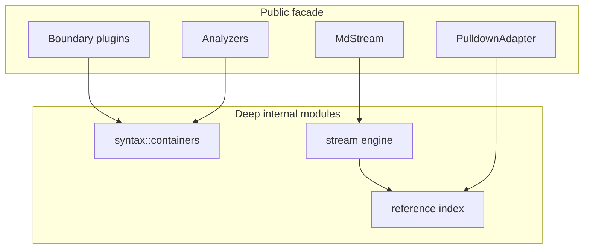

# Architecture Deepening Wave - Plan

## Goal Capsule

| Field | Decision |
|---|---|
| Objective | Deepen the remaining mdstream internal modules where two or more real callers share the same rules, while keeping public streaming behavior stable unless a breaking cleanup is clearly better. |
| Authority | User request for fearless refactor on main, repo architecture docs, existing public tests, then current implementation. |
| Execution profile | Work directly on `main`; use incremental conventional commits; push `origin/main` after the plan reaches a verified state. |
| Stop conditions | Stop only for behavior drift that contradicts documented streaming invariants, a verification failure that cannot be isolated, or an external dependency/toolchain failure. |
| Tail ownership | The executor owns implementation, simplification, code review, full verification, and push. |

---

## Product Contract

### Summary

This refactor wave finishes the next set of architecture deepening opportunities after the prior stream/pending/semantics split.
The product behavior remains a streaming-first Markdown middleware with stable committed blocks, one pending block, optional invalidation, and extension seams for boundary plugins and pending transformers.

### Problem Frame

Several rules are now intentionally internal but still duplicated across modules.
Tag/container syntax is parsed separately by boundary plugins and analyzers.
Reference label and definition state is split between core semantics and the pulldown adapter.
`MdStream` has a small public interface, but its implementation still coordinates append, finalize, pending display, semantics, plugins, and compaction directly.
Completed planning documents also remain in `docs/plans/` as live-looking artifacts and create unnecessary reader work.

### Requirements

**Markup container syntax**

- R1. Tag, directive-container, and fence-container syntax facts must live behind one crate-private syntax module used by both boundary plugins and analyzers.
- R2. Existing `BoundaryPlugin`, `FenceBoundaryPlugin`, `TagBoundaryPlugin`, `ContainerBoundaryPlugin`, and `TaggedBlockAnalyzer` behavior must remain covered through public tests before parser duplication is removed.
- R3. The refactor must not accidentally expose new syntax types through the crate root.

**Reference semantics**

- R4. Reference definition scanning, label normalization, usage indexing, invalidation effects, and pulldown definition prelude generation must share one internal reference module.
- R5. `Update.invalidated`, `ReferenceDefinitionsMode`, `PulldownAdapter`, and `DocumentState` behavior must remain compatible with existing public contracts.
- R6. Reset and SingleBlock footnote transitions must clear reference state so old usages cannot leak into new documents.

**Stream engine depth**

- R7. `MdStream` should remain the public facade while append/finalize transaction ordering moves into a deeper internal module.
- R8. `append()` and `append_ref().to_owned()` must stay equivalent across normal, reset, invalidation, plugin, pending-display, finalize, and compaction scenarios.
- R9. Stateful pending transformers and boundary plugins must keep their lifecycle order and call frequency.

**Public setup and docs**

- R10. Setup-time configuration should be clearer without forcing users to understand internal cache invalidation rules.
- R11. Completed or superseded plans must stop competing with the current architecture docs as the maintainer interface.
- R12. CHANGELOG Unreleased and user docs must describe any planned breaking cleanup or behavior-preserving internal move.

### Scope Boundaries

The plan does not change Markdown grammar ambitions beyond the currently documented best-effort behavior.
It does not make `mdstream` async or move Tokio glue into the core crate.
It does not introduce a public `StreamEngine`, `AppendTransaction`, `ReferenceIndex`, or MarkupContainers interface.
It does not replace `pulldown-cmark`, add a database, or add new runtime dependencies.

### Assumptions

- The user has explicitly authorized direct work on `main`, breaking changes, deletion of unneeded code, incremental commits, subagents, and pushing `origin/main`.
- Public behavior should be preserved unless tests and docs make a better breaking cleanup intentional.
- Local patterns and the prior architecture review are sufficient; no external research is load-bearing for this internal Rust refactor.

---

## Planning Contract

### Key Technical Decisions

- KTD1. Markup container parsing becomes a crate-private syntax module, not a new extension trait.
  Boundary plugins and analyzers are two real adapters at one seam; adding another public trait would create a shallow interface.
- KTD2. Indentation and name-matching differences become explicit parser policy, not accidental helper differences.
  `TagBoundaryPlugin`, `TaggedBlockAnalyzer`, `ContainerBoundaryPlugin`, and `FenceBoundaryPlugin` currently use slightly different policies that must be preserved or intentionally tested as a bug fix.
- KTD3. Reference handling becomes an internal state module with two focused adapters: core semantics and pulldown parsing.
  The core needs invalidated IDs; the pulldown adapter needs definition prelude text; neither should own duplicate scanner rules.
- KTD4. Stream engine extraction uses value effects rather than a transaction object that holds wide mutable borrows.
  This avoids fighting `UpdateRef` lifetimes while still concentrating append/finalize ordering.
- KTD5. Setup interface cleanup may add a builder, but it must not force a migration unless the old mutators become demonstrably harmful.
  The deeper win is separating setup-time cache invalidation knowledge from runtime streaming, not adding API surface for its own sake.
- KTD6. Completed plans should be demoted into history or summarized in durable docs.
  Future maintainers should enter through README, ARCHITECTURE, RELEASE_CHECKLIST, CHANGELOG, and the current plan rather than three stale execution plans.

### High-Level Technical Design

The implementation should move shared rules behind smaller internal interfaces.
Public types continue to exercise the behavior through existing tests.

### Sequencing

1. Lock characterization around container and reference edge cases before moving shared parsers.
2. Extract container syntax first because it is local and high-confidence.
3. Extract reference state next because it crosses semantics and adapters.
4. Extract stream engine after reference behavior is stable so append effects have a clearer shape.
5. Do setup/docs cleanup last, when final public surface changes are known.

---

## Implementation Units

### U1. Characterize markup container syntax

- **Goal:** Add focused tests that freeze current tag/container/fence parsing behavior before moving parser logic.
- **Requirements:** R1, R2, R3.
- **Dependencies:** None.
- **Files:** `mdstream/tests/markup_containers.rs`, `mdstream/tests/analyzed_stream_tagged_blocks.rs`, `mdstream/tests/boundary_tag_plugin.rs`, `mdstream/tests/container_boundary_plugin.rs`, `mdstream/tests/boundary_plugin.rs`.
- **Approach:** Cover the visible behavior through public stream/analyzer paths first, then add low-level tests only if a crate-private module exposes testable facts inside the crate.
- **Execution note:** Start with characterization tests and observe the baseline before production refactor.
- **Patterns to follow:** Existing plugin lifecycle tests in `mdstream/tests/extension_lifecycle.rs` and chunking helpers in `mdstream/tests/support/mod.rs`.
- **Test scenarios:**
  - Happy path: `<thinking>` starts a tag boundary and `</thinking>` closes it without splitting the block.
  - Happy path: `TaggedBlockAnalyzer` extracts tag name, attributes, closed state, and content for a completed tag block.
  - Edge case: a tag opening with three leading spaces is accepted by boundary behavior.
  - Edge case: a tag opening with four leading spaces preserves the current analyzer/boundary behavior, whichever the baseline proves.
  - Edge case: `</thinking> trailing` closed-state behavior is explicitly locked.
  - Edge case: `::: warning` behaves as an Incremark-style container opening, while `:::warning` remains fence-like behavior when using `FenceBoundaryPlugin`.
  - Edge case: nested longer container markers keep current depth behavior.
  - Integration: boundary plugin start/update/reset order remains unchanged after parser extraction.
- **Verification:** Container, tag boundary, analyzer, extension lifecycle, and stream trace tests pass with the characterization coverage present.

### U2. Extract crate-private markup container syntax module

- **Goal:** Move tag, directive-container, and fence-container parsing facts into one crate-private syntax module and delete duplicate helpers.
- **Requirements:** R1, R2, R3.
- **Dependencies:** U1.
- **Files:** `mdstream/src/syntax.rs`, `mdstream/src/syntax/containers.rs`, `mdstream/src/boundary.rs`, `mdstream/src/analyze.rs`, `mdstream/tests/markup_containers.rs`, `mdstream/tests/analyzed_stream_tagged_blocks.rs`, `mdstream/tests/boundary_tag_plugin.rs`, `mdstream/tests/container_boundary_plugin.rs`, `mdstream/tests/boundary_plugin.rs`.
- **Approach:** Keep parser functions pure and state-free.
  Boundary plugins retain `active`, `just_started`, marker length, and nesting state.
  Analyzer code converts borrowed parser facts into owned metadata at the edge.
  Any helper exposed from `syntax.rs` must remain `pub(crate)` unless it is intentionally documented as public.
- **Patterns to follow:** `mdstream/src/syntax/facts.rs` for pure facts; `mdstream/src/stream/boundary_detector.rs` for keeping decision objects internal.
- **Test scenarios:**
  - Happy path: all U1 characterization tests remain green after duplicate helper deletion.
  - Edge case: parser policies keep up-to-three-space and any-leading-whitespace differences explicit.
  - Edge case: ASCII-only marker assumptions remain unchanged.
  - Integration: chunking invariance holds for tag and container fixtures.
- **Verification:** No stale duplicate tag/container parser helpers remain in `boundary.rs` or `analyze.rs`; focused boundary/analyzer suites and `cargo clippy -p mdstream --all-targets --all-features -- -D warnings` pass.

### U3. Deepen reference handling into an internal reference index

- **Goal:** Concentrate reference scanner, usage index, invalidation effects, and definition prelude behavior behind internal reference types.
- **Requirements:** R4, R5, R6.
- **Dependencies:** U2.
- **Files:** `mdstream/src/reference.rs`, `mdstream/src/semantics/references.rs`, `mdstream/src/semantics/mod.rs`, `mdstream/src/adapters/pulldown.rs`, `mdstream/tests/reference_definitions_invalidation.rs`, `mdstream/tests/pulldown_reference_definitions.rs`, `mdstream/tests/stream_trace_equivalence.rs`, `mdstream/tests/proptest_chunking.rs`, `mdstream/tests/document_state.rs`.
- **Approach:** Promote `reference.rs` from helper functions into a deep internal module.
  Core semantics uses it to observe committed blocks and emit invalidated IDs.
  The pulldown adapter uses it to collect definition prelude text without depending on core invalidation state.
  Keep pulldown event parsing in the adapter.
- **Execution note:** Add or strengthen characterization tests for repeated definitions, multiple definitions in one block, image references, and reset behavior before moving state.
- **Patterns to follow:** `mdstream/src/semantics/footnotes.rs` for focused state and `mdstream/src/adapters/pulldown.rs` for adapter-local parse scratch handling.
- **Test scenarios:**
  - Happy path: late reference definition invalidates earlier shortcut, collapsed, full, and image references in `ReferenceDefinitionsMode::Invalidate`.
  - Happy path: pulldown adapter reparses invalidated committed blocks and pending blocks with the latest definition prelude.
  - Edge case: a block containing both usage and definition does not invalidate itself.
  - Edge case: multiple definitions in one committed block produce stable, deduplicated invalidated IDs.
  - Edge case: repeated definition labels preserve the current latest-definition behavior unless intentionally changed and documented.
  - Edge case: footnote definitions do not become reference definitions.
  - Edge case: code fences do not contribute reference definitions or usages.
  - Integration: `MdStream::reset()` and SingleBlock footnote reset clear reference state.
- **Verification:** Reference, pulldown, document state, stream trace, and proptest chunking suites pass; adapter no longer owns duplicate definition scanner policy.

### U4. Extract stream engine effects behind the MdStream facade

- **Goal:** Move append/finalize transaction ordering out of the public facade implementation while preserving borrowed update lifetimes.
- **Requirements:** R7, R8, R9.
- **Dependencies:** U3.
- **Files:** `mdstream/src/stream.rs`, `mdstream/src/stream/engine.rs`, `mdstream/src/stream/machine.rs`, `mdstream/src/stream/block_machine.rs`, `mdstream/src/stream/input.rs`, `mdstream/src/stream/compaction.rs`, `mdstream/tests/stream_trace_equivalence.rs`, `mdstream/tests/append_ref_behavior.rs`, `mdstream/tests/buffer_compaction.rs`, `mdstream/tests/extension_lifecycle.rs`, `mdstream/tests/stream_block_splitting.rs`, `mdstream/tests/proptest_chunking.rs`.
- **Approach:** Introduce a crate-private engine or effects module that owns line processing, commit effects, reset effects, pending-display dirtiness, and compaction decisions.
  Avoid a transaction object that holds long `&mut` borrows across `UpdateRef` assembly.
  `MdStream` remains responsible for the public method names and borrowed view construction.
- **Execution note:** Characterize append/finalize edge cases before moving the transaction order.
- **Patterns to follow:** Existing `BlockMachine` value ownership and `BoundaryDetector` decision object style.
- **Test scenarios:**
  - Happy path: `append()` and `append_ref().to_owned()` emit equivalent updates for paragraphs, code fences, tables, HTML, math, containers, reference invalidations, and SingleBlock footnote reset.
  - Edge case: empty chunk with pending CR keeps newline normalization behavior.
  - Edge case: finalize is idempotent after no new input and after trailing CR flush.
  - Edge case: compaction keeps pending raw/display consistent after committed prefix removal.
  - Edge case: pending transformer call count and boundary plugin lifecycle order remain stable.
  - Integration: full stream block splitting and proptest chunking suites stay green.
- **Verification:** Public streaming tests pass; `stream.rs` reads as a facade and no new public engine type is exported.

### U5. Clarify setup-time interface without widening runtime complexity

- **Goal:** Make setup and runtime mutation clearer, adding a builder only if it reduces real interface knowledge.
- **Requirements:** R10, R12.
- **Dependencies:** U4.
- **Files:** `mdstream/src/stream.rs`, `mdstream/src/options.rs`, `mdstream/src/transform.rs`, `mdstream/src/boundary.rs`, `mdstream/src/lib.rs`, `README.md`, `docs/EXTENSIONS.md`, `CHANGELOG.md`, `mdstream/tests/pending_transformers.rs`, `mdstream/tests/extension_lifecycle.rs`, `mdstream/tests/append_ref_behavior.rs`.
- **Approach:** Prefer compatibility-preserving cleanup unless the old interface becomes misleading.
  If adding `MdStreamBuilder`, keep it as a setup convenience that builds the same internal state as `MdStream::new`, `streamdown_defaults`, and `with_*` methods.
  Do not expose internal engine, container, or reference types.
- **Patterns to follow:** Existing fluent `with_pending_transformer` and `with_boundary_plugin` methods.
- **Test scenarios:**
  - Happy path: builder-created streams match `MdStream::new` for default options.
  - Happy path: builder-created Streamdown defaults match `MdStream::streamdown_defaults`.
  - Edge case: terminator window bytes are normalized consistently between `Options` and `TerminatorOptions`.
  - Integration: pending transformer and boundary plugin lifecycle tests pass through builder and existing setup paths.
  - Documentation: README examples compile with the final setup interface.
- **Verification:** Public examples compile; docs and CHANGELOG state any setup-interface migration or compatibility decision.

### U6. Prune and refresh architecture documentation

- **Goal:** Turn completed execution plans into durable architecture memory and remove stale maintainer paths.
- **Requirements:** R11, R12.
- **Dependencies:** U1, U2, U3, U4, U5.
- **Files:** `docs/plans/2026-07-06-001-refactor-deepen-streaming-architecture-plan.md`, `docs/plans/2026-07-06-002-refactor-engineering-hardening-plan.md`, `docs/plans/2026-07-06-003-refactor-remaining-architecture-deepening-plan.md`, `docs/ARCHITECTURE.md`, `docs/EXTENSIONS.md`, `docs/ADAPTERS.md`, `README.md`, `CHANGELOG.md`, `RELEASE_CHECKLIST.md`.
- **Approach:** Prefer deleting or moving obsolete plan detail only when the durable docs now carry the decision.
  If keeping historical plans, mark them as superseded in a small frontmatter/comment block rather than leaving them as current implementation surfaces.
  Update architecture module map for new container/reference/engine modules.
- **Patterns to follow:** Current `docs/ARCHITECTURE.md` module map and `CHANGELOG.md` Unreleased section.
- **Test scenarios:** Test expectation: none -- documentation-only unit; replacement verification is link/path scan plus package/doc/example checks.
- **Verification:** No stale references to deleted module names, outdated test targets, or future-only descriptions of implemented behavior remain.

### U7. Full verification, review, and landing

- **Goal:** Prove the refactor wave is behavior-preserving or intentionally documented, then push `main`.
- **Requirements:** R1-R12.
- **Dependencies:** U1, U2, U3, U4, U5, U6.
- **Files:** `.github/workflows/ci.yml`, `RELEASE_CHECKLIST.md`, `Cargo.toml`, `mdstream/Cargo.toml`, `mdstream-tokio/Cargo.toml`, `fuzz/Cargo.toml`.
- **Approach:** Run the repo's full stable and MSRV gates, package both crates, inspect the final diff, run independent review, fix findings, and push.
- **Patterns to follow:** `RELEASE_CHECKLIST.md` and prior CI gate layout.
- **Test scenarios:** Test expectation: none -- verification unit; replacement verification is the full command gate and read-only review.
- **Verification:** Every command in the Verification Contract passes or has a documented environment-specific reason; final review has no unresolved blocking findings; `git status --short --branch` is clean and `origin/main` contains the commits.

---

## Verification Contract

| Gate | Command | Applies |
|---|---|---|
| Formatting | `cargo fmt --all -- --check` | U1-U7 |
| Workspace lint | `cargo clippy --workspace --all-targets --all-features -- -D warnings` | U2-U7 |
| Workspace tests | `cargo nextest run --workspace --all-features` | U1-U7 |
| Doc tests | `cargo test --workspace --all-features --doc` | U5-U7 |
| Core examples | `cargo check -p mdstream --examples` and `cargo check -p mdstream --features pulldown --examples` | U5-U7 |
| Tokio examples | `cargo check -p mdstream-tokio --examples` | U7 |
| Fuzz compile | `cargo check --manifest-path fuzz/Cargo.toml --bins` | U7 |
| Bench compile | `cargo check -p mdstream --benches` | U7 |
| Package dry run | `cargo package -p mdstream` and `cargo package -p mdstream-tokio` | U7 |
| Core MSRV | `cargo +1.85.0 test -p mdstream --tests --all-features`; `cargo +1.85.0 check -p mdstream --examples`; `cargo +1.85.0 check -p mdstream --features pulldown --examples` | U7 |
| Workspace MSRV | `cargo +1.88.0 nextest run --workspace --all-features`; `cargo +1.88.0 test --workspace --all-features --doc`; `cargo +1.88.0 check -p mdstream-tokio --examples` | U7 |

Focused verification should use the affected suites from each unit before the full gates.

---

## Definition of Done

- Every U-ID is implemented or explicitly proven unnecessary by current code.
- Public behavior covered by the unit scenarios is preserved or intentionally changed with tests and CHANGELOG notes.
- New internal modules are crate-private unless the plan intentionally documents a public surface.
- Duplicate parser/reference logic removed by the refactor is not left behind as dead code.
- Abandoned exploratory code and stale documentation from failed approaches are deleted.
- Focused tests, full workspace tests, clippy, formatting, examples, fuzz compile, bench compile, package dry runs, and MSRV gates pass.
- Independent review finds no unresolved blocking correctness, maintainability, test, release, or documentation issue.
- Commits are conventional, scoped to coherent units, and pushed to `origin/main`.

---

## Appendix

### Sources and Research

- Prior architecture review report generated on 2026-07-07 identified `MarkupContainers`, `ReferenceIndex`, internal stream engine extraction, setup interface cleanup, and completed-plan pruning as remaining candidates.
- Read-only subagent analysis confirmed `MarkupContainers` as the strongest low-risk seam because boundary plugins and analyzers are two real adapters.
- Read-only subagent analysis confirmed reference handling should stay internal and avoid pulldown type coupling.
- Read-only subagent analysis recommended `StreamEngine` as worthwhile, while treating `MdStreamBuilder` as compatibility-sensitive and secondary.
- Repo guidance requires English code/docs, Chinese conversation, Rust `cargo fmt`, nextest where practical, and no rollback of user changes.
