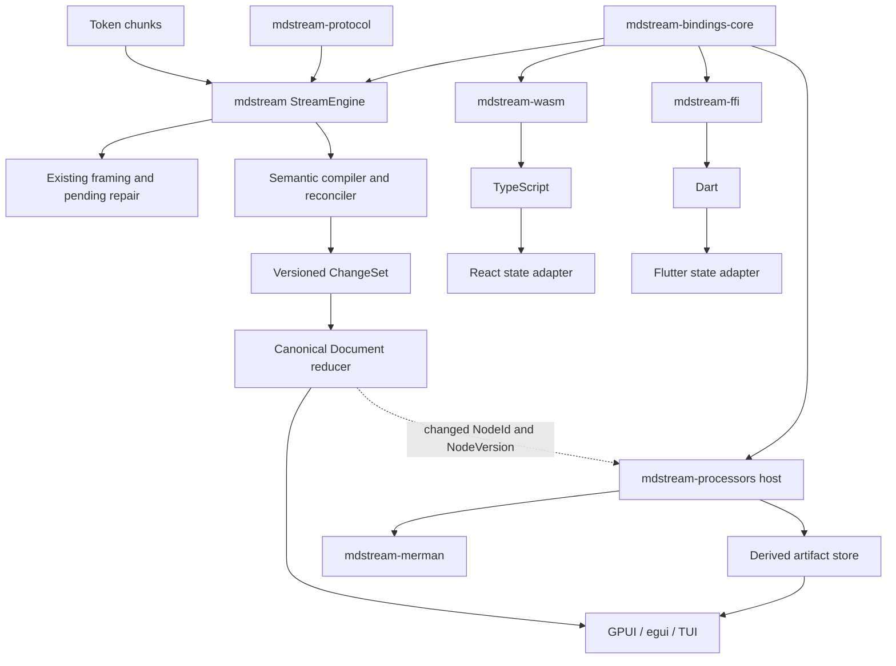
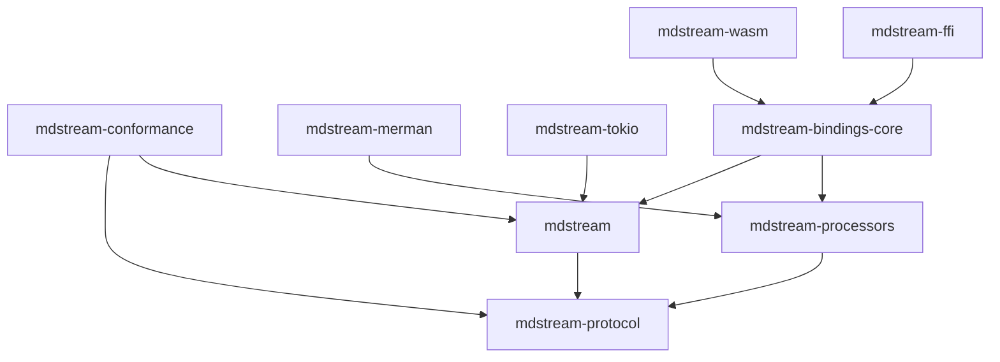
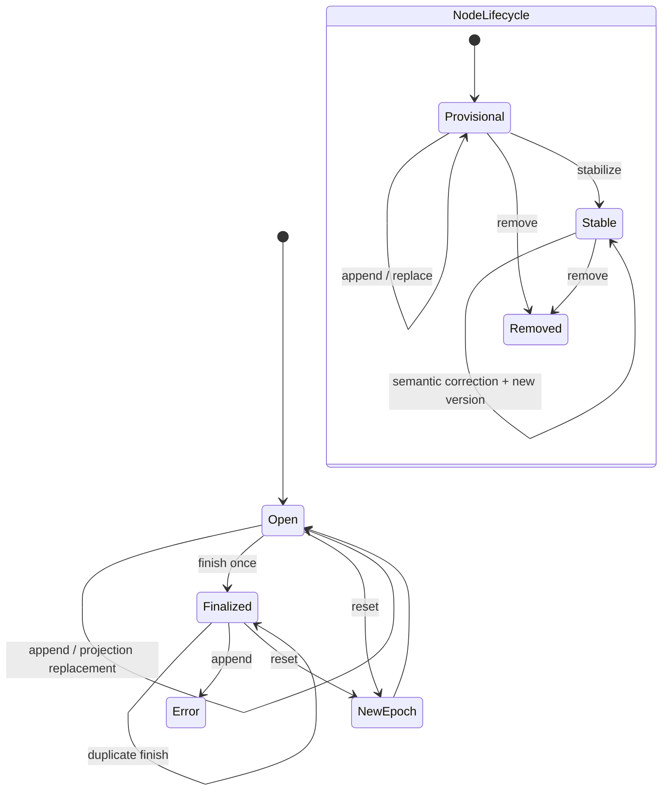
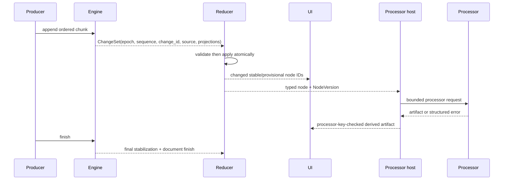
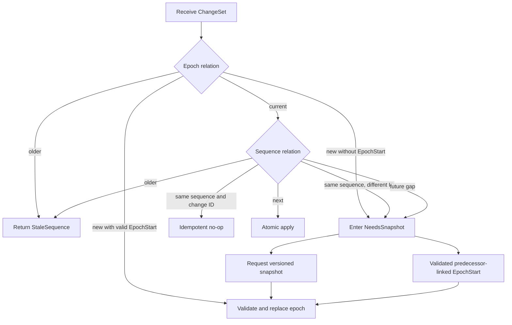
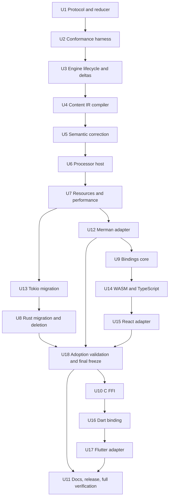

# Streaming Content Engine 0.4 - Plan

## Goal Capsule

- **Objective:** Turn `mdstream` from a streaming Markdown block splitter into a headless, cross-framework rich-content state engine with stable identity, a versioned Content IR, replayable deltas, deterministic conformance, content processors, and Rust/WASM/TypeScript/Flutter integration surfaces.
- **Authority:** This plan supersedes the compatibility-preserving assumptions in the July 6-7 architecture plans. Existing scanner behavior remains evidence, while this plan defines the new public contract.
- **Execution profile:** Fearless 0.4 refactor. Breaking changes and deletion of obsolete code are expected; no compatibility shim is required for the 0.3 public interface.
- **Proof direction:** Establish protocol laws and characterization coverage before replacing behavior. Every behavior-bearing unit needs failing or baseline evidence before production changes.
- **Stop conditions:** The new protocol, reducer, engine, processor host, bindings, adapters, conformance corpus, deterministic complexity limits, migration documentation, and release gates are complete; obsolete public surfaces and abandoned implementations are gone.

---

## Product Contract

### Summary

`mdstream` will expose a canonical streaming document protocol rather than renderer-specific output or implicit `committed + pending` conventions.
The existing incremental line scanner remains the framing implementation behind that protocol.
Consumers receive ordered changes, apply them through a canonical reducer, render stable Content IR nodes, and process specialized content through version-checked adapters such as Merman.

### Problem Frame

The current `Block`, `Update`, `UpdateRef`, and `DocumentState` surface exposes scanner segments, full pending snapshots, and boolean escape hatches.
It cannot represent document finalization, correction, removal, replay, sequence gaps, reset generations, nested semantic identity, or portable wire behavior.
`finalize()` currently has no terminal state: input appended afterward can disappear or panic when a newline is processed.
The owned hot path also copies the full pending tail on every append, so long unfinished content can retain quadratic output cost even though line scanning itself is incremental.

Streamdown is a React renderer that reparses full content and uses positional keys.
Incremark caches stable prefixes but uses offset identity, a two-state lifecycle, and ambiguous update semantics.
They remain valuable compatibility references, not the architecture to copy.

### Actors

- A1. Rust UI integrator using GPUI, egui, TUI, or another native framework.
- A2. Web integrator using WASM, TypeScript, or React.
- A3. Native mobile integrator using C FFI and Dart/Flutter.
- A4. Content processor author implementing Mermaid, math, code, citation, or custom rich-content behavior.
- A5. Maintainer evolving the engine, protocol, compatibility profiles, fixtures, and release surfaces.

### Requirements

#### Protocol, identity, and lifecycle

- R1. The canonical public output must be a versioned, owned protocol that is serializable without exposing Rust lifetimes, parser types, or renderer artifacts.
- R2. Every document must have an epoch, every accepted change set a monotonic sequence and source cursor, and every content node a stable identity plus deterministic opaque `NodeVersion` for compare-and-set and stale-result checks.
- R3. Node stability and document lifecycle must be independent: provisional nodes can become stable, while an open document becomes finalized exactly once.
- R4. `finish` must emit one terminal transition; repeated finish is an idempotent no-op, and append after finish must return a typed error without changing state.
- R5. Reset must emit an `EpochStart` envelope with predecessor coordinates, restart the new epoch at sequence zero, and prevent old-epoch changes or processor results from affecting the new document.
- R6. One atomic change set may append canonical source and mutate canonical projections through insert, replace, remove, and lifecycle operations; semantic correction is a projection replacement and processor artifact invalidation is outside the canonical reducer.
- R7. Retrying the last accepted sequence with the same change ID must be idempotent; an older sequence returns `StaleSequence` without mutation, while a conflicting current sequence or future gap enters `NeedsSnapshot`. In recovery mode ordinary deltas are rejected, and only a validated snapshot or predecessor-linked `EpochStart` may recover the reducer.

#### Content IR and semantics

- R8. U1/U2 must establish a complete internal-draft 0.4 IR/wire vocabulary and fixture shape; U3-U5 may revise it from compiler/correction evidence, U5 promotes it to a binding candidate, and U18 alone performs final public freeze.
- R9. Every IR node must retain canonical source/body ranges and enough structured metadata for adapters to render without reparsing, while one canonical source store owns document text and nodes do not duplicate source bodies.
- R10. One mutable source frontier may compile into multiple provisional IR nodes; public semantics must not preserve the current one-pending-block limitation.
- R11. Stable node identity must survive chunk-boundary differences and semantic correction; source offsets may guide reconciliation but must not be the identity contract.
- R12. Late reference, footnote, and `mdstream.citation/1` context must replace only affected projections through the same delta protocol, preserving identity and producing a new deterministic `NodeVersion` without changing source.
- R13. Canonical semantics must consume classified parser facts so footnote/reference/citation-looking text inside code or opaque custom content does not trigger document semantics.
- R14. Arbitrary editor-style source mutation, collaborative editing, and CRDT/OT behavior are outside 0.4; canonical correction covers engine-derived semantic projection changes over append-only source, while processor artifacts refresh separately.

#### Processors and adapters

- R15. Content processors must consume typed Content IR and return derived artifacts or structured errors keyed by epoch, node ID, input `NodeVersion`, processor identity/version, configuration version, and host-monotonic `RequestGeneration`; a stable epoch/node/processor slot owns at most one current complete key and artifact.
- R16. Processors are trusted cooperative code executed outside reducer/FFI critical sections; adapter boundaries convert panic/exception into structured failure, while untrusted implementations require caller-provided process isolation.
- R17. A lightweight citation-resolution processor and optional Merman adapter must validate different artifact/freshness paths before bindings freeze the processor contract; neither renderer output nor artifact state enters canonical IR.
- R18. Expensive processors default to stable-node processing; provisional preview must be an explicit capability/policy, and document finish must not wait for processors.
- R19. Rust consumers must use the canonical reducer directly; React and Flutter receive thin first-party state adapters without moving rendering policy into the core.

#### Conformance, performance, and safety

- R20. Every legal UTF-8 chunk partition of small fixtures and reproducible seeded partitions of large fixtures must produce the same normalized final snapshot, stable identities, deterministic node versions, and document lifecycle.
- R21. Each trace must independently satisfy continuous sequence and source cursors, legal lifecycle and expected-version transitions, source preservation, replay equivalence, and idempotence; traces from different chunk schedules need not share sequence values or byte-for-byte changes.
- R22. Streamdown, Remend, and Incremark expectations must be recorded as versioned compatibility profiles or upstream-derived goldens, never as self-comparison mislabeled as parity.
- R23. Append change sets must carry source suffixes or bounded projection patches rather than full pending snapshots, so emitted raw-source payload is linear in accepted input.
- R24. Host limits must cover document/pending bytes, nodes/operations, definition edges, encoded changes, processor input/artifact bytes, in-flight jobs, and retained artifacts; processor-specific limits bound trusted implementations, but host accounting is not a sandbox for arbitrary processor allocation.
- R25. Content-bearing Tokio paths must be lossless: blocking and lossless coalescing are allowed, while `DropNew` must not be available for canonical document input.
- R26. Deterministic performance/resource evidence must cover one-byte pending input, semantic correction, reducer replay, retained/transactional memory, and processor limits; Criterion supplies trend evidence only for applicable mdstream hot paths.

#### Bindings, migration, and release

- R27. `mdstream-protocol` must own canonical IR/change/snapshot types and schema versioning; a safe bindings facade owns command envelopes, options parsing, transport errors, explicit snapshot access, and stateful engine handles while WASM and C transports remain thin.
- R28. Epochs, node IDs, sequences, source cursors, and request generations must use JS-safe decimal strings, while node versions/change IDs use opaque strings; TypeScript and Dart call the canonical Rust reducer through WASM/FFI rather than reimplementing reducer laws.
- R29. FFI must use opaque handles, explicit ownership/free operations, typed errors, and a panic boundary; no panic may cross the ABI.
- R30. `mdstream-tokio` must preserve sender/receiver coalescing where valid, migrate its actor to change sets, and emit finalization when input closes.
- R31. Runtime grammar and transformer mutation must be removed; parser/extension setup is sealed before the first input, and host-language processors run outside the parser hot loop.
- R32. The 0.3 `MdStream`, `Block`, `BlockStatus`, `Update`, `UpdateRef`, `DocumentState`, `AnalyzedStream`, `BlockAnalyzer`, runtime `push_*`, mutable cache escape hatches, and old pulldown event cache interface must be deleted after consumers migrate.
- R33. README, architecture, compatibility, adapters, performance, changelog, examples, CI, release metadata, and package ordering must describe and validate the 0.4 product rather than the old Streamdown-parity middleware.
- R34. First-party Rust and React production-shaped integrations must validate initialization, chunk updates, recovery, stable identity, and artifact consumption without direct wire handling or Markdown reparsing before the 0.4 protocol is publicly frozen.
- R35. The Flutter package must bundle and load native mdstream libraries for its declared platforms; the lower-level Dart package may retain a documented host-supplied-library mode.

### Key Flows

- F1. A producer appends a non-empty chunk; the engine frames and compiles the changed frontier, emits one ordered change set, and a consumer reducer updates its snapshot. Empty append is a no-op and never settles a pending carriage return.
- F2. A producer finishes the stream; the engine stabilizes remaining content, emits the terminal document transition once, and rejects later append without mutation.
- F3. A late definition changes an earlier semantic interpretation; the dependency index replaces only affected projections under the same identity and produces new deterministic node versions.
- F4. A processor receives a typed node and later returns an artifact; the host accepts it only when epoch, node ID, node version, processor ID/version, configuration version, and host-issued `RequestGeneration` still match.
- F5. A consumer detects a gap, fork, or unannounced epoch; it stops applying deltas, requests a snapshot, atomically replaces canonical state, and resumes after the snapshot sequence.
- F6. The Rust reducer consumes canonical fixtures directly; WASM/TypeScript and C FFI/Dart exercise that reducer through thin transports and reach equivalent snapshots and typed errors.
- F7. Native Rust and React integrators complete production-shaped flows against the candidate contract; any friction that requires wire handling, reparsing, or unstable identity returns to U1-U15 before U18 freezes 0.4.

### Acceptance Examples

- AE1. Given one Markdown source and multiple UTF-8-safe chunk schedules, when each trace is replayed, then normalized final Content IR, node IDs, deterministic node versions, and finalized state are equal even when trace sequences differ.
- AE2. Given an open engine with pending text, when finish is called twice and append is attempted, then finalization appears once, the second finish is empty, append returns a typed terminal-state error, and no source bytes disappear.
- AE3. Given a stable shortcut reference before its definition, when the definition arrives, then the same node ID receives a different node version with resolved semantics and unrelated nodes do not change.
- AE4. Given `[^fake]` inside a fenced code block, when the stream advances, then canonical footnote semantics do not reset or revise the document.
- AE5. Given a Merman result for an old node version after the diagram changes, when the result is applied, then it is rejected as stale and the current artifact remains unchanged.
- AE6. Given a reducer that misses a sequence or receives the same sequence with a different change ID, when another delta arrives, then it enters `NeedsSnapshot`; after applying a current snapshot, subsequent continuous changes apply normally.
- AE7. Given a long unfinished paragraph delivered one byte at a time, when all change sets are measured, then raw-source delta payload equals normalized source growth and no full pending raw snapshot is emitted per tick.
- AE8. Given a shared golden trace, when the Rust reducer consumes it directly and through WASM/TypeScript or C FFI/Dart transports, then normalized snapshots and typed errors match; React/Flutter adapters additionally preserve stable keys, recovery, and artifact separation.
- AE9. Given native Rust and React production-shaped integrations, when they initialize, stream chunks, recover a gap, and consume citation/Merman-style artifacts, then neither handles raw wire nor reparses Markdown and the candidate contract may be frozen.
- AE10. Given processor request A, node change B, and a later projection equal to A, when the first A result arrives after the new A request, then differing `RequestGeneration` rejects it.
- AE11. Given a pending carriage return, when an empty append arrives, then epoch, sequence, source cursor, and pending-CR state remain unchanged; the next non-empty append or finish resolves it consistently across transports.
- AE12. Given a supported Flutter target, when an application installs the package and creates an engine, then the plugin locates its bundled native library without a host-supplied path and completes the shared smoke trace.

### Success Metrics

- All canonical fixtures pass final-snapshot invariance, replay, sequence, identity, lifecycle, source-preservation, wire-roundtrip, and cross-binding laws.
- Regression coverage reproduces the current post-finalize data loss and newline panic before implementation and proves both impossible afterward.
- Deterministic counters show linear raw-source payload, bounded projection/wire amplification, no unbounded-frontier reparse on append, and near-linear compiler/reducer work under the stated doubling gates.
- Resource-limit tests produce typed errors while preserving the last replayable snapshot and sequence.
- Rust workspace, WASM target, TypeScript/React packages, C FFI, Dart/Flutter package, examples, docs, fuzz, benchmark, package, and MSRV gates pass.
- Native Rust and React adoption integrations validate high-level ergonomics before final protocol freeze; Dart/Flutter then consume the frozen contract without reopening reducer semantics.
- No obsolete 0.3 public symbol or stale documentation path remains after migration.

### Scope Boundaries

#### In scope

- Canonical protocol, reducer, snapshots, lifecycle, identity, node versions, source ranges, Content IR, semantic corrections, processor protocol and artifact host, Merman adapter, compatibility profiles, performance/resource controls, bindings, React/Flutter state adapters, Rust UI integration examples, Tokio migration, and public API deletion.

#### Outside this product's identity

- Renderer themes, UI widgets, design systems, syntax highlighting engines, math rendering engines, browser layout policy, persistence, networking, collaborative editing, and arbitrary historical source editing.
- Async execution inside the core engine or callbacks from JS/Dart into the Rust parser hot loop.
- A public parser-engine trait before a second parser implementation exists.

### Assumptions

- The user authorizes breaking changes, deletion of obsolete code, new crates/packages, dependency changes, and incremental commits.
- The canonical Markdown dialect will be based on `pulldown-cmark` 0.13.x CommonMark/GFM behavior plus explicitly versioned mdstream extensions.
- Merman `0.8.0-alpha.3` is available as an optional crates.io dependency, uses its own Rust 1.95 lane, and remains isolated so it cannot raise the Rust 1.85 core MSRV or default dependency weight.
- JSON is the canonical 0.4 wire and golden-fixture representation; conformance compares decoded normalized structures rather than relying on object-key byte order, and binary codecs are deferred.
- React and Flutter adapters manage state views, canonical reducer handles, and processor artifacts, not rich-content rendering widgets.
- GPUI and egui consume the Rust reducer directly, so compile-tested Rust integration examples are preferable to framework dependencies in the core workspace.
- Native Rust and React are the contract-validation wedge; C/Dart/Flutter are implemented after U18 freezes the candidate contract.
- In-process processors are trusted cooperative implementations. Applications that load untrusted processor code provide their own process/worker isolation.
- Flutter 0.4 declares only the native platforms for which CI builds and loads a bundled mdstream library; web consumers use the WASM/TypeScript surface.
- No institutional learning corpus exists under `docs/solutions/`; the current architecture and reference-source research are the planning authority.

---

## Planning Contract

### Key Technical Decisions

- KTD1. Keep the published `mdstream` crate name as the engine entry point and add stable `mdstream-protocol` and `mdstream-processors` crates.
  Protocol owns canonical state, processors own derived artifact lifecycle, and the ecosystem package keeps its established name.
- KTD2. Make protocol values owned, serializable, and renderer-neutral.
  One canonical source store owns document text and IR nodes reference ranges, so owned wire values do not imply duplicated source bodies.
- KTD3. Model node stability, document finalization, and correction on separate axes.
  Correction is a projection replacement, while deterministic opaque `NodeVersion` is a compare-and-set token rather than a trace-local monotonic counter or lifecycle state.
- KTD4. Require change-set sequence continuity and snapshot recovery.
  The last accepted sequence plus change ID distinguishes exact retry from fork; earlier sequences are stale no-ops with a typed result. Gaps, conflicting current duplicates, and unannounced epochs enter `NeedsSnapshot`, while snapshots and predecessor-linked `EpochStart` envelopes apply only after full validation.
- KTD5. Replace `finalize` with an explicit finished-state transition while keeping the engine inspectable.
  The first finish emits terminal changes, subsequent finish is empty, and later append fails without mutation.
- KTD6. Separate one mutable source frontier from the provisional IR nodes compiled from it.
  Scanner topology remains an implementation fact and no longer constrains the public document model.
- KTD7. Use `pulldown-cmark` as an internal semantic compiler and map its event stream into a versioned mdstream IR.
  Existing framing owns one mutable frontier; every append updates a lossless provisional block/container shell, exact ranges/fence metadata, and text leaf incrementally. Full `pulldown-cmark` compilation occurs only at structural stability/finish or after an append crosses one or more geometric thresholds starting at 256 bytes. One append compiles the current source revision at most once, consumes every crossed threshold by advancing the next checkpoint beyond the frontier, and never recompiles that revision at stability/finish, so total frontier reparse work remains linear while inline/nested semantics between checkpoints stay explicitly provisional.
- KTD8. Reconcile identity from document epoch, allocated top-level identity, structural ancestry, parser facts, and prior snapshot state.
  Exact hashing/matching remains implementation detail, while conformance laws define observable stability.
- KTD9. Centralize references, footnotes, and citations behind a namespaced definition/dependency index that consumes classified content.
  Canonical precedence follows the pinned `pulldown-cmark` 0.13.x behavior per namespace, targeted correction uses reverse edges, and compatibility profiles may override only through versioned fixtures.
- KTD10. Keep artifacts outside canonical Content IR and validate every processor result against its complete processor key.
  A stable `ProcessorSlotKey` of epoch, node ID, and processor identity owns at most one current request/artifact. The complete request key adds node version, processor version, configuration version, and host-monotonic `RequestGeneration`; a new request atomically replaces the slot's complete key and releases its prior artifact, while the generation prevents A-to-B-to-A ABA acceptance. Citation resolution and Merman validate different paths while canonical snapshots never serialize artifacts.
- KTD11. Follow Merman's safe-facade pattern for bindings.
  `mdstream-protocol` owns canonical schemas and the Rust reducer; bindings-core owns stateful command/options/error envelopes, WASM/FFI expose reducer handles, and TypeScript/Dart wrap changed-node views instead of reimplementing reducer laws.
- KTD12. Serialize integer counters and identities as decimal strings and deterministic versions/change IDs as opaque strings in JSON.
  This preserves the Rust integer domain without unsafe JavaScript coercion and avoids inventing numeric ordering for content versions.
- KTD13. Replace advisory compaction with explicit resource limits and compact deltas.
  Limits fail atomically, retained and transactional memory are budgeted separately, and a checked-in preimplementation budget artifact records 0.3/minimal-transport baselines plus absolute limits; deterministic counters are the CI authority and relative percentages only guard regressions.
- KTD14. Migrate through one temporary internal bridge, then remove the old model in the same plan.
  Shipping two public state models would create permanent ambiguity and double the conformance surface.
- KTD15. Seal syntax/transform configuration before input and keep processors host-side.
  Runtime mutators cannot reinterpret stable history, reducer/FFI critical sections only enqueue processor work, adapter boundaries catch processor failures, and foreign-language callbacks never enter the parser hot loop.
- KTD16. Separate source, canonical projection, and derived artifact planes.
  A change set atomically validates a source suffix and projection operations; semantic correction changes only projections, and artifact invalidation follows node-version mismatch outside the reducer.
- KTD17. Make bindings delta-first and snapshots explicit.
  Normal append never serializes a snapshot, language adapters may batch/coalesce input without dropping bytes, and snapshot recovery is a caller-visible request rather than an automatic full-state response per token.
- KTD18. Use conventional live opaque pointers for the C ABI with an exact-once ownership contract.
  Null is handled, live-handle calls serialize or return busy, exported calls catch Rust panic, and callers must wait for calls before exact-once free; racing use/free, arbitrary invalid pointers, and double free are caller violations.
- KTD19. Define citations as the versioned `mdstream.citation/1` Markdown extension rather than claiming parser-native support.
  A shortcut reference label beginning with `@` (`[@key]`) becomes a citation reference and a matching reference definition (`[@key]: destination "title"`) supplies late context. Key normalization and first-definition-wins follow CommonMark reference rules; unresolved references stay typed, and code/opaque content is never scanned. Pandoc citation clusters and external bibliography processing are outside this profile.
- KTD20. Mature the public contract through draft, candidate, and final gates.
  U1-U2 are internal draft, U5 correctness/identity/performance evidence creates the binding candidate, and U18 may revise it from native Rust plus React adoption evidence before final 0.4 freeze; mobile bindings start only after that freeze.
- KTD21. Ship Flutter as a turnkey native plugin over the lower-level Dart FFI package.
  Flutter declares and tests its supported platform build scaffolding and bundled libraries, while standalone Dart keeps an explicit host-supplied-library path.

### High-Level Technical Design

#### Module topology



#### Crate dependency direction



#### Document and node lifecycle



#### Streaming and replay sequence



#### Reducer recovery decisions



### Output Structure

```text
mdstream-protocol/
  src/
  tests/
mdstream/
  src/engine/
  src/compiler/
  src/semantics/
  tests/
mdstream-processors/
  src/
  tests/
mdstream-conformance/
  src/
  tests/
mdstream-merman/
mdstream-bindings-core/
mdstream-wasm/
mdstream-ffi/
bindings/
  typescript/
  react/
  dart/
  flutter/
conformance/
  fixtures/
  schemas/
scripts/
  verify-packages.py
```

### Sequencing



Execution priority follows evidence and reversal cost:

| Priority | Units | Exit condition |
|---|---|---|
| 1. Prove the canonical model | U1-U5 | Protocol laws, chunk invariance, lifecycle, compiler correctness/identity/work gates, and semantic correction pass; otherwise reopen the parser boundary. |
| 2. Bound and migrate the Rust system | U6, U7, U12, U13, U8 | Citation and Merman prove the processor seam, deterministic/absolute budgets pass, Tokio is lossless, and obsolete 0.3 code is deleted. |
| 3. Validate the first adoption wedge | U9, U14, U15, U18 | Rust and React production-shaped integrations pass without local parsing/reduction, then and only then freeze 0.4. |
| 4. Ship frozen native/mobile transports | U10, U16, U17, U11 | C/Dart/Flutter consume the frozen contract, platform packages load, all release gates pass, and documentation matches exports. |

### System-Wide Impact

- **Public Rust interface:** All 0.3 document/update/analyzer entry points are replaced. Downstream Rust users migrate to `StreamEngine`, `ChangeSet`, and the protocol reducer.
- **State lifecycle:** Finish, epoch start, replay gaps/forks, snapshots, semantic correction, processor races, and resource failures become explicit state transitions rather than caller conventions.
- **Performance:** Allocation shifts from full pending snapshots to compact source/projection patches; compiler, reconciliation, reducer, wire, retained source, transaction staging, and derived artifacts receive separate counters and limits.
- **Async integration:** Tokio keeps transport/coalescing ownership but cannot silently drop canonical content and must close streams with finalization.
- **Cross-language behavior:** Canonical protocol wire and bindings command envelopes are separate external contracts. Changes require versioning, normalized structural goldens through each transport, canonical reducer-handle workload evidence, and explicit snapshot requests.
- **Release engineering:** Workspace membership, dependency ordering, crates.io packages, npm packages, Dart/Flutter packages, WASM artifacts, CI, toolchain lanes, and artifact-size checks all expand.
- **Security and safety:** Canonical AI input, definition graphs, wire payloads, queued processor input, and retained artifacts are bounded; trusted in-process processor allocation is measured but not sandboxed. FFI has exact-once ownership and panic isolation, while renderer artifacts remain untrusted derived data.

### Risks and Mitigations

| Risk | Impact | Mitigation |
|---|---|---|
| IR scope grows into a full Markdown implementation | Delays and parser drift | Use `pulldown-cmark` internally, version a bounded dialect, and map only supported events/extensions. |
| Provisional compilation reparses an unbounded frontier | Quadratic token-stream latency | Use incremental facts, bounded parse checkpoints, append-only leaf paths, and per-stage doubling gates starting in U4. |
| Provisional node reconciliation causes identity churn | UI flicker and stale artifacts | Define observable identity laws first, retain prior snapshot context, and fuzz chunk schedules and ambiguous syntax. |
| Owned IR duplicates canonical source into every node | Multiplied retained and transactional memory | Keep one source store, represent bodies with ranges, and assert zero duplicated source-body bytes in canonical snapshots. |
| Old and new models coexist too long | Double bugs and confusing docs | Use a private bridge only, migrate dependency order, and delete the old surface in U8 before bindings are declared stable. |
| Semantic correction creates cycles or broad invalidation | Replay divergence and excess work | Use namespaced definitions, reverse dependency edges, atomic expected-version replacement, and changed-node work gates. |
| Wire schema drifts across languages | Binding incompatibility | Keep one schema version, one fixture corpus, canonical Rust serialization/reduction, and transport goldens in every language package. |
| Processor results race reset/version changes | Wrong diagrams or artifacts | Store one complete request key and at most one artifact per stable `ProcessorSlotKey`; require `RequestGeneration` equality and release stale/replaced slot values outside canonical state. |
| Merman alpha changes raise compatibility, MSRV, or bundle size | Core or package breakage | Isolate it in `mdstream-merman` on Rust 1.95, pin the tested version, keep it out of default bindings, and scan dependency/artifact surfaces. |
| Merman constructs a complete SVG before the adapter can reject its size | Render-time allocation can exceed the retained-artifact cap | Bound source/model/labels first, measure render peak separately, treat Merman as trusted cooperative code, and require caller process isolation for adversarial diagrams until Merman provides a bounded writer. |
| Resource limits silently lose content | Broken AI output | Fail the entire operation atomically, preserve the prior sequence/snapshot, and prohibit lossy content transport. |
| Raw C pointers are treated as runtime-validatable handles | Undefined behavior despite typed-error claims | Validate null and lengths, document live-pointer/exact-once preconditions, catch panic, and test the Dart wrapper's lifecycle rather than arbitrary invalid addresses. |
| Multi-ecosystem release becomes fragile | Partial releases | Encode dependency order and package/version checks in CI and the release checklist before publishing. |

### Alternatives Considered

- **Rewrite around Streamdown or Incremark:** Rejected because Streamdown reparses full content and Incremark retains offset identity and repeated pending-region parsing.
- **Preserve the 0.3 public surface with adapters:** Rejected because `UpdateRef`, implicit flags, mutable accessors, and full pending snapshots constrain the new protocol and performance model.
- **Publish a parser-engine trait now:** Rejected because only one parser implementation exists; this would be a hypothetical seam with a large invariant surface.
- **Put SVG/HTML/render tokens in Content IR:** Rejected because artifacts depend on renderer, theme, platform, processor version, and async timing.
- **Add GPUI and egui dependencies:** Rejected because native frameworks can consume the Rust reducer directly; the core should not become a UI dependency aggregator.
- **Ship all crates in one package:** Rejected because protocol, engine, Merman, WASM, FFI, and language transports have different MSRV, dependency, and release constraints.

### Deferred to Implementation

- Exact internal node reconciliation and `NodeVersion` derivation, provided identity/version outputs are deterministic across chunk schedules without hashing or copying an unbounded frontier per append.
- Exact compact projection diff algorithm, provided it emits minimal bounded patches and passes payload/work-counter limits.
- Exact C header generation tool and npm/Dart package names, provided wire behavior and ownership contracts remain unchanged.

---

## Implementation Units

### Unit Index

| Unit | Title | Primary files | Depends on |
|---|---|---|---|
| U1 | Versioned protocol and reducer | `mdstream-protocol/` | None |
| U2 | Conformance corpus and replay harness | `mdstream-conformance/`, `conformance/` | U1 |
| U3 | Stream engine lifecycle and compact deltas | `mdstream/src/engine/`, `mdstream/src/stream/` | U1, U2 |
| U4 | Canonical Content IR compiler and reconciliation | `mdstream/src/compiler/` | U1-U3 |
| U5 | Semantic corrections and compatibility profiles | `mdstream/src/semantics/`, `mdstream/src/compat/` | U4 |
| U6 | Processor protocol, citation processor, and artifact host | `mdstream-processors/` | U4, U5 |
| U7 | Resource limits and deterministic performance | `mdstream/src/engine/`, `mdstream-processors/`, benches/fuzz | U3, U5, U6 |
| U12 | Merman processor adapter | `mdstream-merman/` | U6, U7 |
| U13 | Lossless Tokio integration | `mdstream-tokio/` | U3, U7 |
| U8 | Public migration and obsolete-code deletion | `mdstream/src/lib.rs`, examples/tests/docs | U3-U7, U13 |
| U9 | Safe bindings facade | `mdstream-bindings-core/` | U3-U7, U12 |
| U14 | WASM and TypeScript bindings | `mdstream-wasm/`, `bindings/typescript/` | U6, U9 |
| U15 | React state adapter | `bindings/react/` | U14 |
| U18 | Adoption validation and final protocol freeze | native/React integration fixtures | U8, U12, U15 |
| U10 | C FFI transport | `mdstream-ffi/` | U9, U18 |
| U16 | Dart FFI reducer wrapper | `bindings/pubspec.yaml`, `bindings/dart/` | U10 |
| U17 | Turnkey Flutter native plugin and state adapter | `bindings/flutter/` | U16 |
| U11 | CI, release, documentation, and final verification | CI/release/docs/workspace files | U18, U17 |

### U1. Build the draft versioned protocol and canonical reducer

- **Goal:** Create the complete internal-draft owned types, IR vocabulary, wire schema, snapshots, operation validation, and canonical reducer laws that U3-U5 validate before candidate freeze.
- **Requirements:** R1-R9, R27, R28.
- **Dependencies:** None.
- **Files:** `Cargo.toml`, `Cargo.lock`, `mdstream-protocol/Cargo.toml`, `mdstream-protocol/src/lib.rs`, `mdstream-protocol/src/ids.rs`, `mdstream-protocol/src/lifecycle.rs`, `mdstream-protocol/src/ir.rs`, `mdstream-protocol/src/delta.rs`, `mdstream-protocol/src/document.rs`, `mdstream-protocol/src/error.rs`, `mdstream-protocol/src/wire.rs`, `mdstream-protocol/tests/reducer_laws.rs`, `mdstream-protocol/tests/wire_roundtrip.rs`.
- **Approach:** Define the complete draft 0.4 IR vocabulary including `mdstream.citation/1`, epoch-aware identities, deterministic node versions, one canonical source store, ranges, phases, change IDs, predecessor-linked epoch starts, source/projection sections, snapshots, reducer modes, and typed errors. Validate the full envelope before atomic commit. Schema/fixture shape is authoritative for implementation but may change from U3-U5 evidence before U5 candidate promotion.
- **Execution note:** Start with reducer, lifecycle, source-ownership, and wire tests that fail against the absent protocol. Duplicate/fork, gap, snapshot, epoch-start, and finish behavior are contract rather than implementation policy.
- **Patterns to follow:** Merman's safe typed model and binding payload separation under `repo-ref/merman/crates/merman-bindings-core/`; current sorted/deduplicated identity handling in `mdstream/src/reference.rs`.
- **Test scenarios:**
  - Happy path: source append plus insert, replace, stabilize, remove, epoch-start, and finalize projection operations produce the expected snapshot atomically.
  - Lifecycle: finish applies once; duplicate finish is a no-op; operations after finalization are rejected unless they start a new epoch.
  - Sequence: retrying the last accepted sequence/change ID is idempotent; the same current sequence with a different ID is a fork; a future gap enters `NeedsSnapshot`; any older sequence returns `StaleSequence` and leaves state unchanged.
  - Epoch: only predecessor-linked `EpochStart` installs a new epoch directly; unannounced future epoch requires a snapshot; old node versions cannot target the new document.
  - Version: expected-version mismatch rejects the whole change set; equal canonical projections produce equal opaque versions without numeric ordering.
  - Recovery: `NeedsSnapshot` rejects ordinary deltas and retains none; a fully validated versioned snapshot or predecessor-linked `EpochStart` restores canonical state, while an invalid/unlinked epoch start leaves recovery state unchanged.
  - Source: expected cursor mismatch, non-suffix mutation, invalid range, or duplicated source body rejects atomically; semantic replacement leaves source bytes/cursor unchanged.
  - IR wire: every built-in, citation, and namespaced custom variant round-trips with ranges and attributes before engine fixtures begin.
  - Wire: decimal counters/IDs and opaque versions/change IDs round-trip without JS precision loss; decoded normalized structures compare equal independent of JSON key order.
  - Error: invalid ranges, duplicate IDs, missing parents, illegal transitions, and oversized protocol values return stable typed errors.
- **Verification:** The crate compiles at Rust 1.85; reducer/source/IR/wire laws pass; indexed replay scales with operations; snapshots report zero duplicated source bodies; no parser/processor/renderer dependency appears; metadata and docs label the schema internal draft until U5.

### U2. Establish the conformance corpus and replay harness

- **Goal:** Freeze the internal fixture envelope and synthetic replay-law shape before engine replacement while allowing U3-U5 to revise draft schema fields and expected values from vertical implementation evidence.
- **Requirements:** R20-R22, AE1, AE6.
- **Dependencies:** U1.
- **Files:** `Cargo.toml`, `mdstream-conformance/Cargo.toml`, `mdstream-conformance/src/lib.rs`, `mdstream-conformance/src/chunks.rs`, `mdstream-conformance/src/trace.rs`, `mdstream-conformance/src/assertions.rs`, `mdstream-conformance/tests/protocol_fixtures.rs`, `conformance/schemas/fixture.schema.json`, `conformance/fixtures/*.json`, `mdstream/tests/support/mod.rs`, `mdstream/tests/chunking_invariance_suite.rs`, `mdstream/tests/proptest_chunking.rs`, `fuzz/fuzz_targets/stream_chunking.rs`.
- **Approach:** Define one draft fixture envelope containing source, dialect/profile, options, chunk schedules, expected normalized snapshot, and required checkpoints. Exhaustively enumerate UTF-8 cuts for bounded inputs and use reproducible seeds plus real LLM traces for large inputs. Synthetic traces and legacy framing characterization pass here; later units populate engine outputs and may evolve draft schema before U5 promotion rather than leaving ignored tests.
- **Execution note:** Characterize all current framing fixtures first. The new harness initially runs against protocol fixtures and a temporary engine bridge; it becomes authoritative as U3-U5 land.
- **Patterns to follow:** Seeded chunking in `mdstream/tests/support/mod.rs`, property strategies in `mdstream/tests/proptest_chunking.rs`, and upstream-version anchoring in `repo-ref/streamdown` and `repo-ref/incremark`.
- **Test scenarios:**
  - All legal chunk partitions of short ASCII, CRLF, and multibyte Unicode fixtures reach the same normalized final snapshot.
  - Different schedules may emit different intermediate changes, but every trace has continuous sequence/source cursors, legal transitions, valid expected-version chains, and replay equivalence.
  - Replaying a trace into a fresh reducer reaches an equal snapshot; retrying the last change is idempotent; deleting one middle change or changing the current sequence's change ID forces `NeedsSnapshot`; replaying an older accepted change returns `StaleSequence` without mutation.
  - Reset fixtures prove epoch separation and reject delayed prior-epoch changes.
  - Fixtures cover headings, paragraphs, lists, quotes, tables, HTML, code, math, Mermaid, footnotes, references, citations, custom containers, and incomplete syntax.
  - Streamdown/Remend/Incremark fixtures record upstream commit/version and expected compatibility profile rather than claiming universal parity.
  - A 10,000-node snapshot plus a 100,000-operation mixed trace visits changed nodes proportional to operations; snapshot build/load cost is reported separately.
  - Fuzzing never loses normalized source, accepts an illegal epoch transition, or produces a reducer-invalid trace.
- **Verification:** Corpus schema validates; synthetic traces replay and legacy framing characterizations pass; no ignored/failing conformance test remains; U3-U5 each activate their own engine/IR/semantic fixture assertions.

### U3. Replace facade orchestration with a lifecycle-aware StreamEngine

- **Goal:** Make a real engine module own input, framing, lifecycle, identity allocation, semantics coordination, compaction, and compact change-set emission.
- **Requirements:** R2-R7, R23, AE2, AE7, AE11.
- **Dependencies:** U1, U2.
- **Files:** `mdstream/src/lib.rs`, `mdstream/src/engine/mod.rs`, `mdstream/src/engine/builder.rs`, `mdstream/src/engine/effects.rs`, `mdstream/src/engine/lifecycle.rs`, `mdstream/src/stream.rs`, `mdstream/src/stream/engine.rs`, `mdstream/src/stream/machine.rs`, `mdstream/src/stream/block_machine.rs`, `mdstream/src/stream/input.rs`, `mdstream/src/stream/compaction.rs`, `mdstream/src/pending/pipeline.rs`, `mdstream/tests/engine_lifecycle.rs`, `mdstream/tests/delta_stream.rs`, `mdstream/tests/stream_trace_equivalence.rs`, `mdstream/tests/append_ref_behavior.rs`, `mdstream/tests/buffer_compaction.rs`.
- **Approach:** Move cross-file `impl MdStream` orchestration into an owning `StreamEngine`. Convert accepted normalized suffixes and scanner effects into one atomically validated source/projection change set. Initial `EpochStart` at sequence zero may carry the first suffix/projections so every trace is self-starting; reset emits a predecessor-linked empty start. Retain `LineBuffer`, boundary detection, mode transitions, repair rules, and code-fence fast paths. Empty append is a no-op even with pending CR; finish is terminal.
- **Execution note:** First add regression tests reproducing post-finalize data loss and newline panic. Observe the failure before changing lifecycle code.
- **Patterns to follow:** `LineBuffer` in `mdstream/src/stream/input.rs`, value decisions in `mdstream/src/stream/boundary_detector.rs`, and pending-display caching in `mdstream/src/pending/pipeline.rs`.
- **Test scenarios:**
  - Happy path: append text across whole, line, character, and random chunks; each change applies through the canonical reducer.
  - Regression: append after finish returns the terminal-state error without buffer mutation, content loss, or panic.
  - Lifecycle: duplicate finish emits no operation; reset from open/finalized state emits a new epoch and accepts new input.
  - Newlines: split CRLF, trailing CR at finish, and Unicode boundaries preserve normalized source and ranges.
  - Empty input: ordinary and pending-CR empty appends emit nothing and advance no clock; the next non-empty append or finish resolves CR identically across chunk schedules.
  - Delta size: append emits the normalized source suffix exactly once and bounded projection edits, never a snapshot or cloned full pending raw block.
  - Compaction: absolute source ranges and identity remain correct after stable-prefix compaction.
  - Extensions: setup-time boundary and pending-repair behavior remains deterministic through the temporary bridge.
- **Verification:** Engine lifecycle and delta tests pass; the finalize regression is fixed; per-epoch raw-source text bytes equal normalized source growth; `UpdateRef` is unnecessary on the new path; U3 engine fixtures replay through the reducer.

### U4. Compile canonical Content IR and reconcile stable identities

- **Goal:** Convert framed source into parser-neutral typed IR, including multiple provisional nodes, stable nested identity, structured metadata, and source ranges.
- **Requirements:** R8-R11, R14.
- **Dependencies:** U1, U2, U3.
- **Files:** `mdstream/Cargo.toml`, `mdstream/src/compiler/mod.rs`, `mdstream/src/compiler/markdown.rs`, `mdstream/src/compiler/extensions.rs`, `mdstream/src/compiler/reconcile.rs`, `mdstream/src/compiler/ranges.rs`, `mdstream/src/compiler/checkpoints.rs`, `mdstream/src/syntax.rs`, `mdstream/src/analyze.rs`, `mdstream/src/adapters/pulldown.rs`, `mdstream/tests/content_ir.rs`, `mdstream/tests/content_identity.rs`, `mdstream/tests/content_frontier.rs`, `mdstream/tests/compiler_complexity.rs`, `mdstream/tests/code_fence_metadata.rs`, `mdstream/tests/analyzed_stream_math.rs`, `mdstream/tests/analyzed_stream_tagged_blocks.rs`.
- **Approach:** Let framing define the mutable source frontier and update its lossless block/container shell, absolute ranges, fence metadata, and append-only text leaves on every append. Run full `pulldown-cmark` compilation only when framing marks a prefix structurally stable, at finish, or after an append crosses one or more deterministic thresholds of 256, 512, 1024, and subsequent doubled bytes. An append crossing any number of thresholds compiles the current frontier once, then advances `next_checkpoint` until it exceeds the frontier length; structural stability or finish does not compile again when that same source revision was just compiled. Lift code fences, math, Mermaid, citations, footnotes, HTML, and configured custom blocks into structured variants, then reconcile prior provisional/stable nodes under observable identity/version laws. U4 is an architecture falsification gate: if the representative corpus cannot simultaneously satisfy canonical correctness, chunk-invariant identity, and deterministic work budgets, stop U5-U18 and reopen KTD7 plus the provisional IR boundary instead of optimizing around the failed design.
- **Execution note:** Write IR golden tests and chunk-schedule identity tests before replacing analyzers. Preserve current parser facts only when they match the canonical dialect.
- **Patterns to follow:** Code-fence parsing in `mdstream/src/syntax.rs`, pure container facts in `mdstream/src/syntax/containers.rs`, Incremark's separation between stable source and provisional AST, without adopting offset identity.
- **Test scenarios:**
  - CommonMark/GFM blocks and inline structures compile to deterministic typed IR with absolute ranges.
  - One mutable source frontier that parses as several top-level nodes emits several provisional IR nodes.
  - Existing nodes retain identity as content appends; semantic changes produce a new deterministic version rather than silently replacing identity.
  - Code fences preserve language, full meta string, body range, and classify Mermaid without reparsing in adapters.
  - Math, citations, footnotes, HTML, and custom namespaced content preserve source and structured attributes.
  - Ambiguous setext/table/list/emphasis prefixes remain provisional until stable and do not churn unrelated IDs.
  - Parser errors and incomplete syntax produce valid provisional IR or typed compiler diagnostics, never invalid protocol operations.
  - A frontier crossing 256/512/1024-byte thresholds compiles at most once for that append and advances the next threshold beyond the new length; appends between thresholds update only incremental facts/leaves, while stabilization/finish compiles only if the current source revision has not already been compiled.
  - One 0-to-64-KiB append and seeded leap-size chunk schedules consume all crossed checkpoints with one compile per append and remain within the same work bounds as small-step schedules.
  - Plain paragraphs, fences, containers, and tables at 8/16/32/64 KiB delivered one byte at a time have no unbounded-frontier full parse during append; stabilization may add one linear parse.
  - Per-stage framing, repair, compiler, and reconciliation counters satisfy `W(2N) / W(N) <= 2.25`; plain/fence source-byte visits stay within `8N + constant`, and container/table visits within `32N + constant`.
- **Verification:** IR, identity, and U4 engine conformance tests pass across chunk schedules; checkpoint traces and deterministic compiler/reconciliation gates pass together; no public `pulldown-cmark` type remains; old analyzers are no longer required by new consumers. Failure of correctness, identity, or work evidence blocks every dependent unit and produces a revised parser-boundary decision before implementation continues.

### U5. Implement targeted semantic correction and compatibility profiles

- **Goal:** Replace reset/invalidation escape hatches with context-aware dependency tracking and expected-version projection replacement while retaining opt-in upstream compatibility.
- **Requirements:** R8, R12-R14, R22, AE3, AE4.
- **Dependencies:** U4.
- **Files:** `mdstream/src/semantics/mod.rs`, `mdstream/src/semantics/definitions.rs`, `mdstream/src/semantics/references.rs`, `mdstream/src/semantics/footnotes.rs`, `mdstream/src/semantics/citations.rs`, `mdstream/src/reference.rs`, `mdstream/src/compat/mod.rs`, `mdstream/src/compat/streamdown.rs`, `mdstream/src/options.rs`, `mdstream/tests/semantic_correction.rs`, `mdstream/tests/reference_definitions_invalidation.rs`, `mdstream/tests/incremark_footnote_invalidation_mode.rs`, `mdstream/tests/pulldown_reference_definitions.rs`, `mdstream/tests/stream_streamdown_*`.
- **Approach:** Build a namespaced definition table and reverse dependency index from classified IR. Define `mdstream.citation/1` as `[@key]` plus `[@key]: destination "title"`, using CommonMark label normalization and first-definition-wins; unresolved references remain typed and code/opaque content is never scanned. On late context, replace only dependent projections with expected/new node versions and no source mutation. Canonical duplicate-definition precedence follows pinned parser behavior; Streamdown single-block footnotes, Remend behavior, and legacy splitting rules move behind explicit versioned profiles. Promote the U1-U2 schema from internal draft to binding candidate only after U4's falsification gate and all U5 correction/conformance evidence pass; this is not the final public freeze.
- **Execution note:** Add failing coverage for footnote-looking text inside fenced code before moving chunk observation behind classification.
- **Patterns to follow:** Reference normalization/indexing in `mdstream/src/reference.rs` and profile isolation in reference projects; do not preserve raw-chunk semantic scanning.
- **Test scenarios:**
  - Late shortcut/collapsed/full/image definitions replace only dependent projections under stable IDs and deterministic versions.
  - Repeated definitions use the pinned namespace precedence and produce no correction when effective semantics are unchanged.
  - Same-change-set definition and use resolve atomically.
  - Footnote/citation-looking text in code, HTML opaque regions, or custom opaque content has no semantic effect.
  - `[@key]` remains a typed unresolved citation until a normalized first definition arrives; the definition replaces only dependent projections, and later duplicate definitions do not change the effective projection.
  - Footnote and citation definitions/references produce targeted correction rather than canonical whole-document reset.
  - Streamdown compatibility profile retains its documented single-block and repair behavior without altering canonical mode.
  - Reset clears dependency state and rejects delayed correction from the old epoch.
  - In a 10,000-node fixture with 100 dependents, one late definition replaces exactly 100 nodes, visits no unrelated node, and a repeated equivalent definition replaces zero.
- **Verification:** Semantic correction traces replay exactly; reverse-edge work scales with affected dependencies; canonical mode has no implicit reset/invalidation flags; compatibility fixtures name and pin their upstream behavior; protocol metadata and fixture schemas become binding-candidate only after correctness, identity, and performance evidence pass. Any failure blocks U6-U18 and reopens the parser/provisional contract rather than freezing a compromised candidate.

### U6. Build the processor protocol and artifact host

- **Goal:** Establish a renderer-neutral processor contract and bounded artifact store outside canonical document state.
- **Requirements:** R15-R19, AE5, AE10.
- **Dependencies:** U4, U5.
- **Files:** `Cargo.toml`, `mdstream-processors/Cargo.toml`, `mdstream-processors/src/lib.rs`, `mdstream-processors/src/key.rs`, `mdstream-processors/src/request.rs`, `mdstream-processors/src/result.rs`, `mdstream-processors/src/host.rs`, `mdstream-processors/src/store.rs`, `mdstream-processors/src/citation.rs`, `mdstream-processors/src/limits.rs`, `mdstream-processors/src/error.rs`, `mdstream-processors/tests/lifecycle.rs`, `mdstream-processors/tests/citation_processor.rs`, `mdstream-processors/tests/resource_limits.rs`.
- **Approach:** Address storage by a stable `ProcessorSlotKey` of epoch, node ID, and processor identity. For every request the host allocates a monotonic `RequestGeneration` and installs a complete key containing the slot, input `NodeVersion`, processor version, and configuration version; installing it atomically releases the slot's prior artifact and makes every older result stale. Keep requests, results, errors, cancellation, limits, and retained artifacts in this crate; expose artifact changes to adapters without adding them to canonical snapshots or reducer operations. Ship a lightweight `mdstream.citation/1` reference processor that resolves typed citation context into derived artifacts so the contract is exercised before Merman by a non-rendering processor. Default expensive work to stable nodes. Processor implementations are trusted and cooperative, execute outside reducer/FFI critical sections, and cross adapter boundaries that convert panic or host-language exception into structured failure; callers isolate untrusted processors in another process or worker.
- **Execution note:** Start with stale-result, reset/removal race, retained-artifact release, and limit tests before implementing the host.
- **Patterns to follow:** Merman's binding error/result separation and mdstream protocol identity/version types; do not depend on Merman or an async runtime.
- **Test scenarios:**
  - A fully matching complete request key installs one artifact in its stable slot without changing canonical IR.
  - Starting a new request for the same slot atomically installs its complete key, releases the previous artifact, and permits no second retained generation.
  - Node-version change, removal, epoch start, processor/configuration version change, or duplicate result rejects stale work and releases replaced storage.
  - In an A-to-B-to-A projection sequence, the first A result is rejected because its `RequestGeneration` differs from the new A request even though the deterministic `NodeVersion` is equal.
  - The citation reference processor resolves typed citation context, reports unresolved/invalid context structurally, and follows the same cancellation, freshness, and artifact lifecycle as renderer processors.
  - Processor failure becomes structured derived state while canonical reducer state remains healthy.
  - A processor panic/exception is caught at the execution adapter, no reducer or FFI lock is held while processor code runs, and untrusted-code isolation remains an explicit caller responsibility.
  - Finish does not wait for outstanding processors; provisional processing requires an explicit capability and policy.
  - Exact processor input/artifact limits succeed, limit-plus-one fails before retention, and stale oversized results never enter the store.
  - In-flight job/input-byte and aggregate artifact budgets bound concurrent work; reset drains the old epoch's retained and in-flight accounting.
- **Verification:** Lifecycle, ABA, citation, containment, and resource tests pass; canonical snapshot serialization contains no artifact field; the crate depends on protocol but not engine, Merman, Tokio, or UI frameworks.

### U7. Enforce resource limits and deterministic performance

- **Goal:** Remove quadratic pending/output behavior and replace advisory caps with atomic, measurable resource contracts across engine, reducer, and processor host.
- **Requirements:** R23, R24, R26, AE7.
- **Dependencies:** U3, U5, U6.
- **Files:** `mdstream/src/engine/limits.rs`, `mdstream/src/engine/storage.rs`, `mdstream/src/engine/work.rs`, `mdstream/src/pending/pipeline.rs`, `mdstream/src/pending/repair.rs`, `mdstream/src/options.rs`, `mdstream-processors/src/limits.rs`, `mdstream/benches/streaming.rs`, `mdstream/tests/resource_limits.rs`, `mdstream/tests/delta_amplification.rs`, `mdstream/tests/retained_memory.rs`, `mdstream/tests/buffer_compaction.rs`, `mdstream-processors/tests/resource_limits.rs`, `conformance/budgets/streaming.json`, `bindings/budgets.json`, `fuzz/fuzz_targets/stream_chunking.rs`.
- **Approach:** Emit source suffixes and bounded projection edits, represent display repair as stable prefix plus bounded tail edits, and enforce limits before state commit. Instrument raw/projection/envelope/wire bytes, per-stage source visits, operations, duplicated source bodies, retained capacities, transaction staging, and processor aggregate state separately. Before U8 deletes 0.3 and before any binding implementation, check in fixed-hardware/toolchain calibration for 0.3 plus a minimal reducer transport, the budget schema/validator, and independent absolute ceilings: default WASM raw `<= 1.5 MiB`, stripped `<= 1.25 MiB`, gzip `<= 450 KiB`, brotli `<= 400 KiB`, npm packed `<= 650 KiB`, standalone Dart packed `<= 160 KiB`, each stripped Flutter native library `<= 6 MiB`, and each platform package increment `<= 8 MiB`; Merman remains excluded from every default artifact. U7 proves budget completeness and calibration provenance, while U14, U16, and U17 measure their first real artifacts against the already-frozen ceilings. Measured baselines explain the ceilings but cannot replace or automatically raise them. Criterion remains supporting trend evidence; deterministic counters and absolute budgets enforce CI.
- **Execution note:** Characterize long-pending payload, repair work, allocation growth, and retained capacity before replacing it. Keep the U4 compiler gates active while adding whole-pipeline proof.
- **Patterns to follow:** Existing code-fence display fast path, `LineBuffer` compaction, tail repair window, and Criterion scenario naming.
- **Test scenarios:**
  - Per epoch, cumulative raw-source text bytes equal normalized source length; normal append carries no snapshot or full source.
  - One-byte 8/16/32/64 KiB paragraph, fence, container, table, and Unicode fixtures satisfy `W(2N) / W(N) <= 2.25` across full engine/reducer processing.
  - Long-pending projection text amplification is at most `8N`; encoded wire stays within `6 * text payload + 512 * change sets + 128 * operations`.
  - Canonical snapshots report zero duplicated source-body bytes; source capacity stays within `2N + constant`, and engine retained text within `3N + 2 * repair window + constant` without artifacts.
  - Source-buffer reallocation copies are amortized to `2N + constant`; snapshot build/load is measured separately from append deltas.
  - Every hard limit leaves epoch, sequence, change ID, source, reducer snapshot, and retained artifact state exactly unchanged; transaction peak stays within prior retained state plus configured staging/change-set caps.
  - The checked-in 0.3/minimal-transport calibration and budget schema are produced before binding implementation, record toolchain/fixture provenance, and fail validation if raw, stripped, gzip, brotli, npm, Dart, Flutter-native, or platform-package ceilings are omitted or replaced by relative-only baselines.
  - Compaction retains absolute ranges, deterministic versions, and semantic dependencies; fuzzing never bypasses a resource limit or loses accepted source.
- **Verification:** Resource, amplification, retained-memory, compiler, reducer, processor, calibration-provenance, and budget-schema completeness suites pass; Criterion and fuzz targets compile and exercise the same scenarios. U7 does not claim to measure artifacts that do not exist yet; later units must pass the frozen ceilings, and size percentages remain regression alarms only.

### U12. Add the Merman processor adapter

- **Goal:** Prove the processor seam with optional headless Mermaid processing without raising core MSRV or default artifact size.
- **Requirements:** R15-R18, R24, AE5.
- **Dependencies:** U6, U7.
- **Files:** `Cargo.toml`, `mdstream-merman/Cargo.toml`, `mdstream-merman/src/lib.rs`, `mdstream-merman/src/options.rs`, `mdstream-merman/src/processor.rs`, `mdstream-merman/tests/mermaid_processor.rs`, `mdstream-merman/tests/resource_limits.rs`, `mdstream-merman/examples/render_change.rs`.
- **Approach:** Implement a standalone `mdstream-processors` adapter pinned to Merman `0.8.0-alpha.3` on a separate Rust 1.95 lane and exclude it from the Rust 1.85 root workspace. Process only typed Mermaid nodes and disable provisional rendering by default. Enforce source, model, and label caps before their owning parse/layout stages; current Merman materializes SVG before its byte count can be checked, so the adapter treats the SVG cap as a pre-retention artifact limit, records render peak/output measurements, and does not claim it bounds renderer peak allocation. A bounded SVG writer is a Merman upstream prerequisite for upgrading that allocation to a hard in-process guarantee; until then Merman remains trusted cooperative processor code subject to caller process isolation for adversarial input.
- **Execution note:** Start with stale-key, invalid Mermaid, and exact-limit/limit-plus-one tests; verify limit propagation before rendering success cases.
- **Patterns to follow:** Merman's headless facade, `RenderResourceLimits`, structured diagnostics, and feature isolation.
- **Test scenarios:**
  - Stable Mermaid nodes return SVG/layout artifacts keyed to the complete processor key; other node types are declined.
  - Invalid or incomplete Mermaid returns structured processor state without panic or canonical mutation.
  - Source rejection happens before parse and model/label limits fail before their owning expensive stages; exact limits succeed and limit-plus-one fails.
  - SVG output at the retention limit is accepted and limit-plus-one is rejected before artifact retention; peak render allocation is measured and reported separately rather than mislabeled as host-bounded.
  - A result made stale by node replacement/reset is rejected and releases its output.
  - Default mdstream core dependency graph and the mdstream-merman package surface prove the adapter is optional and isolated.
- **Verification:** Merman adapter tests pass from its standalone manifest on Rust 1.95; core Rust 1.85 gates remain unchanged; source/model/label prevention and post-render retention limits are distinguished in tests and docs; core dependency and adapter package scans prove isolation, while each later binding unit owns its own negative-Merman scan.

### U13. Migrate Tokio to lossless change sets

- **Goal:** Preserve ordered content and terminal lifecycle through async transport without making the core engine async.
- **Requirements:** R25, R30.
- **Dependencies:** U3, U7.
- **Files:** `mdstream-tokio/src/actor.rs`, `mdstream-tokio/src/sender.rs`, `mdstream-tokio/src/receiver.rs`, `mdstream-tokio/src/options.rs`, `mdstream-tokio/tests/glue.rs`, `mdstream-tokio/tests/backpressure.rs`.
- **Approach:** Keep lossless string coalescing and backpressure, migrate the actor to protocol change sets, remove canonical-input `DropNew`, and finish the engine exactly once when input closes. Output cancellation stops work without publishing a partial envelope.
- **Execution note:** Characterize existing coalescing first, then write close/finalization and prohibited-loss tests before migrating the actor.
- **Patterns to follow:** Current sender/receiver coalescing and Tokio channel lifecycle; canonical ordering comes from U3 rather than transport-local counters.
- **Test scenarios:**
  - Blocking and lossless coalescing preserve normalized byte order across one-byte and bursty producers.
  - No public canonical-input option can drop a chunk; bounded backpressure remains observable.
  - Input close emits final stabilization and document finalization once with continuous sequence/change IDs.
  - Output close cancels work without partial change-set emission, leaked task, or panic.
  - Reset and terminal errors cross the actor as typed protocol/binding results.
- **Verification:** Tokio integration/backpressure tests pass; sender/receiver coalescing remains lossless; actor close always reaches a replayable finalized snapshot when output remains open.

### U8. Migrate Rust consumers and delete the obsolete 0.3 surface

- **Goal:** Make the new engine/protocol/processor crates the only Rust model and delete obsolete state, mutators, shims, and duplicate logic.
- **Requirements:** R19, R31-R33.
- **Dependencies:** U3, U4, U5, U6, U7, U13.
- **Files:** `mdstream/src/lib.rs`, `mdstream/src/types.rs`, `mdstream/src/state.rs`, `mdstream/src/analyze.rs`, `mdstream/src/transform.rs`, `mdstream/src/boundary.rs`, `mdstream/src/extensions/`, `mdstream/src/adapters/`, `mdstream/src/stream.rs`, `mdstream/examples/*.rs`, `mdstream/tests/*.rs`, `mdstream/tests/ui/*.rs`, `mdstream/Cargo.toml`, `README.md`, `CHANGELOG.md`.
- **Approach:** Rewrite Rust integrations around `StreamEngine`, `ChangeSet`, snapshots, reducer updates, setup-only extensions, and the external artifact host. Delete `MdStream`, `Block`, `Update`, borrowed variants, mutable committed access, analyzer wrappers, runtime mutation, old pulldown cache interface, and root repair helpers after the private bridge has no consumer. Keep GPUI/egui integration as framework-neutral compile-tested examples.
- **Execution note:** Migrate in dependency order behind the private bridge, then delete the bridge and old model in one coherent unit. Do not leave deprecation wrappers.
- **Patterns to follow:** Current crate-root re-export discipline, public integration-test style, and migration tables in README/CHANGELOG.
- **Test scenarios:**
  - Maintained Rust examples apply changes through the reducer, update only changed nodes, and discard stale processor artifacts.
  - Setup is rejected after first input and cannot reinterpret stable history.
  - Pure snapshot reads do not run stateful transforms or mutate engine behavior.
  - Compile-fail cases prove every named 0.3 symbol and runtime mutator is absent.
  - Crate-root export scan contains only intentional engine, protocol, processor, and compatibility interfaces.
  - Framing, repair, container, table, HTML, math, reference, footnote, and fuzz behaviors survive under new tests or are explicitly changed by canonical semantics.
- **Verification:** No production/test call site uses the bridge or old types; obsolete files and docs are deleted; Rust examples, compile-fail checks, and public-surface tests pass.

### U9. Add the safe bindings facade

- **Goal:** Centralize stateful engine/processor sessions, options, command envelopes, transport errors, and explicit snapshot access for every foreign-language transport.
- **Requirements:** R17, R27, R28, AE8.
- **Dependencies:** U3, U4, U5, U6, U7, U12.
- **Files:** `Cargo.toml`, `mdstream-bindings-core/Cargo.toml`, `mdstream-bindings-core/src/lib.rs`, `mdstream-bindings-core/src/engine.rs`, `mdstream-bindings-core/src/options.rs`, `mdstream-bindings-core/src/commands.rs`, `mdstream-bindings-core/src/wire.rs`, `mdstream-bindings-core/src/errors.rs`, `mdstream-bindings-core/tests/golden.rs`, `mdstream-bindings-core/tests/session.rs`, `mdstream-bindings-core/tests/workload.rs`.
- **Approach:** Follow Merman's safe-facade boundary while leaving canonical schemas, snapshots, and reducer state in `mdstream-protocol`. Expose stateful engine and canonical reducer handles, append/finish/reset/change/apply-snapshot commands, changed-node views, and explicit snapshot access as owned byte payloads. Classify all errors, reject oversized encoded input before decode, and keep processor artifacts on a separate response plane. Freeze this facade only after the citation reference processor and Merman adapter have exercised two materially different processor paths. Normal append never serializes a full snapshot.
- **Execution note:** Make the facade consume shared protocol goldens and resource errors before adding transport crates.
- **Patterns to follow:** `repo-ref/merman/crates/merman-bindings-core`, canonical reducer behavior from U1-U7, and the citation/Merman processor paths from U6/U12.
- **Test scenarios:**
  - Stateful append, finish, reset, explicit snapshot, processor result, and terminal errors match native behavior.
  - A reducer handle applies continuous changes, enters `NeedsSnapshot` on gap/fork, recovers through an explicit snapshot, and reports changed node IDs without duplicating canonical state.
  - Invalid command/schema/options and encoded-wire limits return typed errors without partial engine mutation.
  - A normal trace serializes zero snapshots; emitted wire count equals produced change sets/artifact responses.
  - Shared goldens decode to normalized structures equal to native Rust outputs.
  - A 10,000-node/100,000-operation workload materializes no unchanged node and scales with changed operations.
  - Default facade dependency graph contains no Merman or transport crate.
- **Verification:** Golden, session, workload, and resource tests pass; bindings-core owns no canonical type duplicate and exposes no parser/renderer-specific value.

### U14. Add WASM and TypeScript bindings

- **Goal:** Deliver a thin WASM transport and typed TypeScript engine/store/processor wrapper that reuse the canonical Rust reducer and preserve bounded streaming behavior.
- **Requirements:** R19, R27, R28, AE8.
- **Dependencies:** U6, U9.
- **Files:** `Cargo.toml`, `mdstream-wasm/Cargo.toml`, `mdstream-wasm/src/lib.rs`, `mdstream-wasm/tests/wasm.rs`, `package.json`, `pnpm-workspace.yaml`, `pnpm-lock.yaml`, `bindings/budgets.json`, `bindings/typescript/package.json`, `bindings/typescript/tsconfig.json`, `bindings/typescript/vitest.config.ts`, `bindings/typescript/src/index.ts`, `bindings/typescript/src/engine.ts`, `bindings/typescript/src/store.ts`, `bindings/typescript/src/views.ts`, `bindings/typescript/src/processors.ts`, `bindings/typescript/tests/golden.test.ts`, `bindings/typescript/tests/recovery.test.ts`, `bindings/typescript/tests/workload.test.ts`.
- **Approach:** Keep WASM as a bindings-core transport plus panic hook that exposes Rust engine and canonical reducer handles. TypeScript owns ergonomic initialization, decoded readonly views, changed-node subscriptions, explicit snapshot recovery, host-side processor scheduling, and configurable lossless input batching; it never implements reducer laws or serializes snapshots during normal append. Enforce U7's checked-in absolute raw/stripped/gzip/brotli and npm packed-size ceilings before and after ergonomic additions, with relative percentages used only as regression alarms.
- **Execution note:** Pass shared goldens and WASM runtime tests before adding batching and TypeScript ergonomics.
- **Patterns to follow:** Merman bindings-core/WASM/web packaging and Incremark React usage only as a compatibility/negative reference.
- **Test scenarios:**
  - WASM session append, finish, reset, explicit snapshot, and typed errors match native bindings-core.
  - Decimal IDs/counters and opaque versions/change IDs round-trip without JS precision loss.
  - The WASM Rust reducer handle handles retry, fork, gap, snapshot recovery, epoch start, correction, removal, and finalization; TypeScript observes typed state and changed-node views without owning those transitions.
  - A 10,000-node/100,000-operation workload creates no unchanged node materialization and no normal-trace snapshot serialization.
  - Lossless batch sizes 1/16/128/4096 preserve final state while reporting payload/copy amplification.
  - Invalid options/schema and oversized encoded input fail before partial decode or state mutation.
  - Default WASM/npm dependency and artifact scans contain no Merman; final raw/stripped/gzip/brotli/npm sizes remain below U7's absolute ceilings and within 15%/20% regression bands from their approved measurements.
- **Verification:** WASM target/runtime tests pass; TypeScript typecheck/tests/build pass; transport structural goldens, recovery, workload, absolute size, and dependency budgets pass; no TypeScript canonical reducer implementation exists.

### U15. Add the React state adapter

- **Goal:** Provide a thin React hook/state adapter over the TypeScript engine without shipping rendering policy or UI widgets.
- **Requirements:** R19, AE8.
- **Dependencies:** U14.
- **Files:** `bindings/react/package.json`, `bindings/react/tsconfig.json`, `bindings/react/vitest.config.ts`, `bindings/react/src/index.ts`, `bindings/react/src/useMdstream.ts`, `bindings/react/src/store.ts`, `bindings/react/tests/useMdstream.test.tsx`, `bindings/react/tests/recovery.test.tsx`.
- **Approach:** Wrap the Rust reducer-backed TypeScript store with stable node IDs as keys, changed-node subscriptions, explicit `NeedsSnapshot` recovery, and separate processor artifact state. Keep rendering, themes, Markdown components, and processor UI outside the package.
- **Execution note:** Start with key stability, rerender isolation, and snapshot recovery tests before hook ergonomics.
- **Patterns to follow:** External-store subscription patterns and the Rust reducer-backed TypeScript store; do not copy Streamdown renderer components.
- **Test scenarios:**
  - Appending or replacing one node preserves all stable keys and rerenders only affected subscriptions.
  - Gap/fork enters `NeedsSnapshot`; applying an explicit snapshot recovers once and resumes continuous changes.
  - Reset replaces epoch state and removes old artifacts; stale processor results are ignored.
  - Finish and terminal errors are observable without coupling to a renderer.
  - StrictMode mount/unmount does not duplicate input, subscriptions, or processor application.
- **Verification:** React typecheck/tests/build pass; package exports only state/engine contracts and contains no renderer/theme dependency.

### U18. Validate native Rust and React adoption, then freeze protocol 0.4

- **Goal:** Exercise the binding candidate through production-shaped native Rust and React integrations plus the standalone Merman path, revise friction at its owning layer, and freeze the public 0.4 contract only after every adoption path passes.
- **Requirements:** R8, R17, R19, R34, AE8, AE9.
- **Dependencies:** U8, U12, U15.
- **Files:** `mdstream/examples/headless_state.rs`, `mdstream/tests/adoption_rust.rs`, `mdstream-merman/tests/adoption_rust.rs`, `bindings/react/examples/headless-chat/`, `bindings/react/tests/adoption.test.tsx`, `conformance/fixtures/adoption/*.json`, `conformance/schemas/fixture.schema.json`, `mdstream-protocol/Cargo.toml`, `mdstream-protocol/src/wire.rs`, `README.md`, `docs/ADAPTERS.md`.
- **Approach:** Build core-native, standalone-Merman, and React integrations that initialize high-level sessions, stream adversarial chunk schedules, apply changed-node views, recover a deliberate gap through a snapshot, preserve stable keys, and consume processor artifacts without reparsing Markdown or handling raw wire. The Rust 1.85 `mdstream` test uses generic/citation processors only; the excluded Rust 1.95 `mdstream-merman` test exercises the real adapter so no Merman dev-dependency enters the core graph. The default React package consumes generic processor artifacts and remains Merman-free. Any ergonomics or semantics failure returns to the owning U1-U15 unit and reruns candidate conformance; only after all three integrations pass may protocol metadata, schemas, and public docs be marked final 0.4.
- **Execution note:** Treat adoption friction as contract evidence, not example-only polish. Start from end-to-end acceptance traces and do not freeze while any adoption path needs raw wire handling, Markdown reparsing, positional identity, or adapter-local reducer logic.
- **Patterns to follow:** Framework-neutral Rust examples, React external-store integration tests, and the candidate conformance fixtures; keep rendering policy outside both paths.
- **Test scenarios:**
  - Core native Rust streams a mixed Markdown/citation/Mermaid fixture, applies only changed nodes, processes generic/citation artifacts, and reaches the canonical normalized snapshot without adding Merman to its dependency graph.
  - The standalone Rust 1.95 Merman adoption test consumes the same typed Mermaid node and artifact lifecycle through the real adapter.
  - React initializes through the high-level TypeScript store, streams the same schedules, preserves component keys, and never imports a parser, renderer, or independent reducer.
  - Both integrations detect a missing change, expose `NeedsSnapshot`, apply one explicit snapshot, and resume continuous updates without duplicate source or node materialization.
  - Node replacement/reset rejects stale artifacts, including A-to-B-to-A results, while current artifacts remain outside the canonical snapshot.
  - Package/dependency scans prove the default React/WASM artifacts exclude Merman and every adoption path avoids raw-wire APIs outside the transport wrapper.
  - A protocol change required by adoption invalidates candidate metadata and reruns U1-U15 conformance before another freeze attempt.
- **Verification:** Core Rust 1.85, standalone Merman 1.95, and React adoption suites pass every AE9 flow; dependency scans prove Merman does not enter the root test graph; no adapter-local parser/reducer or positional key exists; candidate fixtures and schemas are promoted to final 0.4 only in the passing freeze commit.

### U10. Add the C FFI transport

- **Goal:** Expose the frozen bindings-core contract through a stable C ABI with explicit ownership, panic containment, and dynamic/static consumer smoke coverage.
- **Requirements:** R27-R29, AE8.
- **Dependencies:** U9, U18.
- **Files:** `mdstream-ffi/Cargo.toml`, `mdstream-ffi/src/lib.rs`, `mdstream-ffi/src/handles.rs`, `mdstream-ffi/src/buffers.rs`, `mdstream-ffi/src/errors.rs`, `mdstream-ffi/include/mdstream.h`, `mdstream-ffi/tests/abi.rs`, `mdstream-ffi/tests/header_smoke.rs`, `mdstream-ffi/tests/concurrency.rs`, `mdstream-ffi/tests/c_consumer_smoke.rs`, `mdstream-ffi/tests/c_consumer_smoke.c`.
- **Approach:** Use live opaque engine/reducer pointers, owned byte buffers, ABI/version/struct-size probes, explicit free calls, and a panic boundary on every exported behavior path. Null and length combinations are validated; non-null handles must be live values returned by this library and freed exactly once. Calls on a live handle serialize or return busy without exposing Rust references. Callers must wait for all live calls before free; racing use/free, arbitrary invalid pointers, and double free are documented caller violations rather than recoverable inputs.
- **Execution note:** Start with header ownership, null/length, live-handle concurrency, panic injection, and buffer accounting tests; do not test or claim recovery from caller-violation pointer races.
- **Patterns to follow:** Merman's C ABI result/buffer contracts, safety documentation, consumer smoke, and deferred free discipline.
- **Test scenarios:**
  - Live engine and reducer handles support append/apply, finish, reset, explicit snapshot, and exact-once free; null free is a no-op.
  - Invalid UTF-8, null/length mismatch, schema/resource/terminal errors, and caught panic return stable result codes and owned error payloads.
  - A C consumer checks ABI/struct sizes, executes a trace, frees every returned buffer, and reaches the native normalized snapshot.
  - 10,000 create/use/free and error cycles finish with zero outstanding buffers and bytes.
  - Concurrent calls on one live handle either serialize or return busy with no partial response; after all calls return, exact-once free succeeds.
- **Verification:** Rust ABI, live-handle concurrency, header, C consumer, panic, and ownership tests pass for supported targets; generated/package headers match exported symbols; safety docs name every caller precondition.

### U16. Add the Dart FFI reducer wrapper

- **Goal:** Provide a Flutter-independent Dart wrapper over C FFI engine/reducer handles without duplicating canonical reducer semantics.
- **Requirements:** R27-R29, R35, AE8.
- **Dependencies:** U10.
- **Files:** `bindings/pubspec.yaml`, `bindings/dart/pubspec.yaml`, `bindings/dart/lib/mdstream.dart`, `bindings/dart/lib/src/ffi.dart`, `bindings/dart/lib/src/lifecycle.dart`, `bindings/dart/lib/src/protocol.dart`, `bindings/dart/lib/src/reducer_handle.dart`, `bindings/dart/lib/src/engine.dart`, `bindings/dart/lib/src/views.dart`, `bindings/dart/test/golden_test.dart`, `bindings/dart/test/recovery_test.dart`, `bindings/dart/test/workload_test.dart`, `bindings/dart/test/ffi_smoke_test.dart`, `bindings/dart/tool/build_native.dart`.
- **Approach:** Wrap live native engine/reducer pointers and result buffers with exact-once close semantics, decode readonly protocol/views, expose changed-node IDs and explicit snapshot recovery, and provide configurable lossless input batching. The package remains Flutter-independent and supports a documented host-supplied native library path. Create `bindings/pubspec.yaml` with only the existing `dart` member, and make `bindings/dart/pubspec.yaml` declare `resolution: workspace`; U17 adds the Flutter member when its manifest exists. The native test tool builds or locates the platform library deterministically before smoke tests.
- **Execution note:** Prove FFI reducer-handle goldens, recovery, ownership, and error mapping before adding batching ergonomics; the Dart package must not implement canonical reduction.
- **Patterns to follow:** Merman Flutter FFI lifecycle wrapper and mdstream C ownership contract; use structural equality rather than JSON object byte order.
- **Test scenarios:**
  - The native reducer handle passes retry/fork/gap/snapshot/epoch/correction/removal/finalization goldens; Dart observes the same typed state and changed-node views as Rust/WASM.
  - A 10,000-node/100,000-operation workload returns only changed-node views and serializes no implicit snapshots.
  - Native append/finish/reset/snapshot trace reaches the same normalized snapshot and typed error classes.
  - Close is idempotent at the Dart wrapper, native free happens exactly once, and every result buffer is released on success/error paths.
  - Batch sizes 1/16/128/4096 preserve content and report bounded payload/copy amplification.
  - The packed standalone Dart package remains below U7's absolute ceiling and contains no native binary or Flutter dependency.
- **Verification:** Pub workspace resolution, Dart analyze, transport/recovery/workload tests, and platform FFI smoke pass with a reproducible host-supplied native-library path; no Dart canonical reducer implementation exists.

### U17. Add the turnkey Flutter native plugin and state adapter

- **Goal:** Ship a turnkey Flutter native plugin with state notifications over the Dart binding, bundled mdstream libraries, and no rich-content widgets or rendering policy.
- **Requirements:** R19, R27-R29, R35, AE8, AE12.
- **Dependencies:** U16.
- **Files:** `bindings/pubspec.yaml`, `bindings/flutter/pubspec.yaml`, `bindings/flutter/.gitignore`, `bindings/flutter/.pubignore`, `bindings/flutter/lib/mdstream_flutter.dart`, `bindings/flutter/lib/src/controller.dart`, `bindings/flutter/lib/src/state.dart`, `bindings/flutter/lib/src/artifacts.dart`, `bindings/flutter/lib/src/native_library.dart`, `bindings/flutter/android/build.gradle`, `bindings/flutter/android/src/main/AndroidManifest.xml`, `bindings/flutter/android/src/main/kotlin/`, `bindings/flutter/ios/mdstream_flutter.podspec`, `bindings/flutter/ios/mdstream_flutter/Package.swift`, `bindings/flutter/ios/Classes/`, `bindings/flutter/macos/mdstream_flutter.podspec`, `bindings/flutter/macos/mdstream_flutter/Package.swift`, `bindings/flutter/macos/Classes/`, `bindings/flutter/linux/CMakeLists.txt`, `bindings/flutter/linux/include/`, `bindings/flutter/linux/mdstream_flutter_plugin.cc`, `bindings/flutter/windows/CMakeLists.txt`, `bindings/flutter/windows/include/`, `bindings/flutter/windows/mdstream_flutter_plugin.cpp`, `bindings/flutter/tool/build_native.py`, `bindings/flutter/tool/package_smoke.py`, `bindings/flutter/tool/android_smoke.py`, `bindings/flutter/example/`, `bindings/flutter/integration_test/native_load_test.dart`, `bindings/flutter/test/controller_test.dart`, `bindings/flutter/test/recovery_test.dart`, `.github/workflows/flutter-platforms.yml`.
- **Approach:** Add `flutter` to the Pub workspace only after `bindings/flutter/pubspec.yaml` exists, and declare `resolution: workspace` in that manifest. Build a controller/state adapter that exposes stable node keys, changed IDs, document/recovery state, processor artifacts, and structured errors over the Dart FFI handles. Declare Android, iOS, macOS, Linux, and Windows plugin scaffolding, stage the matching stripped libraries into Android `jniLibs`, Apple frameworks/libraries, Linux architecture directories, and the Windows bundle, and resolve them through platform-specific default no-path loading. `.gitignore` excludes generated binaries from source, while `.pubignore` explicitly includes staged release artifacts in package contents. U17 owns the temporary-app smoke scripts and CI platform matrix that build and load every declared target; U11 only aggregates those passing gates into release verification. Keep widgets, themes, Markdown rendering, and Merman linking outside the default package.
- **Execution note:** Start with controller notification, recovery, dispose races, and a real temporary-app native-load smoke on each declared platform; a unit test that injects an explicit library path is not sufficient for turnkey packaging.
- **Patterns to follow:** Flutter `ChangeNotifier`/immutable state conventions and the Dart lifecycle contract.
- **Test scenarios:**
  - One-node changes notify only that node and preserve keys for all unchanged nodes.
  - Gap/fork, snapshot recovery, reset, finish, and typed errors produce deterministic controller states.
  - Stale artifacts after node-version change or reset are rejected; current artifacts remain outside canonical state.
  - Dispose during input/processor work closes the Dart engine once and ignores later callbacks.
  - Default Flutter package dependency/artifact scan contains no Merman binary.
  - Every staged stripped native library and platform package increment remains below U7's frozen absolute ceiling.
  - A temporary Flutter application on every declared CI platform installs the local plugin, opens without a host path, streams the shared smoke trace, and confirms the loaded ABI/version.
- **Verification:** Pub workspace resolution, Flutter analyze/tests, per-platform build, bundled-library load, and package smoke pass; exports contain state integration only and no rendering widget; every declared platform is backed by a CI load test.

### U11. Refresh CI, release surfaces, docs, and complete full verification

- **Goal:** Make every crate/package reproducible, publishable in dependency order, accurately documented, independently reviewed, and free of abandoned code.
- **Requirements:** R22, R26-R35.
- **Dependencies:** U18, U17.
- **Files:** `Cargo.toml`, `Cargo.lock`, `.github/workflows/ci.yml`, `.github/workflows/release.yml`, `scripts/verify-packages.py`, `RELEASE_CHECKLIST.md`, `README.md`, `CHANGELOG.md`, `docs/ARCHITECTURE.md`, `docs/STATE.md`, `docs/EXTENSIONS.md`, `docs/ADAPTERS.md`, `docs/COMPATIBILITY.md`, `docs/PERFORMANCE.md`, `docs/ROADMAP.md`, `docs/USAGE.md`, all Rust crate manifests, `mdstream-merman/Cargo.toml`, `package.json`, `pnpm-lock.yaml`, `bindings/pubspec.yaml`, `bindings/budgets.json`, Dart/Flutter manifests, and Flutter platform packaging files.
- **Approach:** Document canonical versus compatibility behavior, lifecycle/version laws, schema ownership, processor safety, resource/complexity budgets, adapter responsibility, FFI preconditions, migration from 0.3, and release ordering. A versioned package script performs per-crate package-content checks in dependency order and distinguishes local prepublish validation from registry-dependent downstream verification. CI pins Rust targets, wasm-pack, pnpm/Node, Dart, and Flutter lanes and runs actual language/runtime gates.
- **Execution note:** Treat workflow/package/docs checks as release behavior. Do not mark complete with skipped language, runtime, artifact-budget, transport/adoption, or old-symbol gates.
- **Patterns to follow:** Existing CI/release checklist discipline and Merman's package-surface/version/artifact checks.
- **Test scenarios:**
  - Workflow/config validation proves every root-workspace Rust, standalone Rust 1.95 Merman, WASM runtime, Node, Dart, Flutter platform, fuzz, benchmark, MSRV, adoption, and package gate is scheduled.
  - Package script rejects dependency-order/version mismatch, missing packaged files, and accidental unpublished path-only dependencies.
  - Old public symbols and stale 0.3 documentation references are absent from code, examples, generated docs, and package contents.
  - Merman negative dependency scans and absolute WASM/npm/Dart/Flutter artifact budgets fail when an excluded dependency or oversized artifact is injected; relative baseline checks cannot override a hard ceiling.
  - Flutter package smoke loads bundled libraries on every declared platform, while the standalone Dart smoke uses the documented host-supplied-library mode.
  - Migration examples and documented commands compile/run against the exported 0.4 surface.
- **Verification:** Every Verification Contract gate passes; package dependency order and local/registry phases are explicit; docs match exports; full-depth review has no unresolved actionable finding; all task-owned changes are committed and unrelated user changes remain untouched.

---

## Verification Contract

U11 pins Rust 1.85/1.88/1.95 plus stable lanes, `wasm32-unknown-unknown`, wasm-pack 0.15.0, Node 24 LTS, pnpm 11.9.0, Dart 3.8.1, Flutter 3.32.1, cargo-nextest, and cargo-fuzz in checked-in configuration and CI. The root workspace excludes standalone `mdstream-merman`; root `--workspace` gates therefore preserve the core MSRV, while the adapter runs from its own manifest on Rust 1.95.

| Gate | Command | Applies |
|---|---|---|
| Formatting | `cargo fmt --all -- --check`; standalone Merman uses its pinned toolchain/manifest | All Rust units |
| Rust lint | `cargo clippy --workspace --all-targets --all-features -- -D warnings` | Root-workspace Rust units |
| Rust tests | `cargo nextest run --workspace --all-features` | Root-workspace Rust units |
| Rust docs | `cargo test --workspace --all-features --doc` | Root-workspace Rust units |
| Core examples | `cargo check -p mdstream --examples --all-features` | U3-U8, U18, U11 |
| Protocol | `cargo nextest run -p mdstream-protocol --all-features` | U1 onward |
| Conformance | `cargo nextest run -p mdstream-conformance --all-features` | U2 onward |
| Processor host | `cargo nextest run -p mdstream-processors --all-features` | U6 onward |
| Deterministic complexity | Protocol/engine/compiler/semantic/processor workload and retained-memory suites satisfy the U1/U4/U5/U7 thresholds | U1, U4-U7, U11 |
| Merman adapter | `cargo +1.95.0 nextest run --manifest-path mdstream-merman/Cargo.toml --all-features` | U12, U18, U11 |
| Tokio integration | `cargo +1.88.0 nextest run -p mdstream-tokio --all-features` | U13, U8, U11 |
| Bindings facade | `cargo nextest run -p mdstream-bindings-core --all-features` | U9 onward |
| C FFI | `cargo nextest run -p mdstream-ffi --all-features` | U10, U16, U17, U11 |
| WASM target | `cargo check -p mdstream-wasm --target wasm32-unknown-unknown --all-features` | U14, U15, U18, U11 |
| WASM runtime | `wasm-pack test --node mdstream-wasm` | U14, U15, U18, U11 |
| WASM package | `wasm-pack build mdstream-wasm --target web --out-dir ../target/mdstream-wasm-pkg` | U14, U15, U18, U11 |
| TypeScript/React | `pnpm install --frozen-lockfile`, `pnpm -r test`, `pnpm -r build` | U14, U15, U18, U11 |
| Adoption freeze | Native Rust and React production-shaped suites pass AE9 before schema metadata becomes final 0.4 | U18, U11 |
| Dart workspace | Before U17: `(cd bindings && dart pub get && dart pub workspace list && cd dart && dart analyze && dart test)` | U16 |
| Flutter workspace | After U17: `(cd bindings && flutter pub get && dart pub workspace list)`; both members use workspace resolution | U17, U11 |
| Dart package | `(cd bindings/dart && dart analyze && dart test)` | U16, U17, U11 |
| Dart FFI smoke | `(cd bindings/dart && dart run tool/build_native.dart && dart test test/ffi_smoke_test.dart)` | U16, U17, U11 |
| Flutter | `(cd bindings/flutter && flutter analyze && flutter test && python3 tool/package_smoke.py --host)` plus the declared-platform CI matrix | U17, U11 |
| Fuzz compile | `cargo check --manifest-path fuzz/Cargo.toml --bins` | U2-U8, U11 |
| Hot-path benchmark compile | `cargo check -p mdstream --benches --all-features` | U7 onward |
| Artifact budgets | Engine/transport measurements match `conformance/budgets/streaming.json`; WASM raw/stripped/gzip/brotli, npm packed, Dart/Flutter package, native-library, and negative-Merman scans satisfy absolute ceilings in `bindings/budgets.json` | U7, U14-U17, U11 |
| Package validation | `python3 scripts/verify-packages.py` validates contents, versions, dependency order, and local versus registry phases | U11 |
| Protocol freeze | Draft/candidate/final metadata and fixtures prove only U18 can promote the schema to final 0.4 | U1, U5, U18, U11 |
| Core MSRV | `cargo +1.85.0 nextest run -p mdstream-protocol -p mdstream-processors -p mdstream --all-features` | Core-affecting units; final in U11 |
| Non-core MSRV | Tokio passes Rust 1.88; Merman adapter passes Rust 1.95; each binding crate declares and tests its own lane | U9-U17, U11 |
| Diff integrity | `git diff --check`; no task-owned change remains unstaged/uncommitted and unrelated user changes remain untouched | U11 |

Focused unit tests run before the workspace gates.
Any newly installed build tool must match the checked-in version pin and be documented in the release checklist.

---

## Definition of Done

- Every R-ID and acceptance example is implemented and traced to passing unit/integration/conformance coverage.
- Every U-ID is complete in dependency order with recorded proof-first or characterization evidence for behavior changes.
- `mdstream-protocol` is parser/renderer-neutral, Rust 1.85-compatible, versioned, serializable, replayable, and the sole canonical state/wire contract with one source store and complete 0.4 IR vocabulary; it advances from draft to candidate in U5 and becomes final only after U18 adoption validation.
- `StreamEngine` owns lifecycle and produces atomic source/projection change sets; change IDs, epoch starts, finish/reset, source preservation, and post-finish behavior are correct.
- Canonical IR, stable identity, deterministic node versions, semantic correction, `mdstream.citation/1`, compatibility profiles, complete processor keys including `RequestGeneration`, citation/Merman processor paths, and artifact lifecycle pass shared conformance laws.
- Resource limits are hard, typed, and replay-safe where owned by mdstream; compiler/reducer/transport work is bounded by deterministic thresholds; retained/transactional memory and long-pending trends are measured separately; Merman's post-construction SVG cap is documented and tested as a retention bound rather than a renderer peak-allocation guarantee.
- The one Rust reducer passes canonical goldens directly and through WASM/TypeScript and C FFI/Dart transports; host languages contain no duplicate canonical reduction logic; React/Flutter adapters pass stable-key, recovery, workload, and artifact-separation behavior.
- Native Rust and React production-shaped integrations pass initialization, adversarial chunking, snapshot recovery, stable identity, and artifact-consumption flows without raw wire handling or Markdown reparsing before final protocol freeze.
- Flutter declares only platforms backed by CI, bundles and loads the correct native library without a host path, while standalone Dart retains its tested host-supplied-library mode.
- `mdstream-tokio` emits continuous change sets and terminal finalization without lossy content policy.
- The 0.3 public state/update/analyzer/mutator surface, private bridge, duplicate logic, stale examples/tests, and abandoned implementation attempts are deleted.
- Architecture, compatibility, adapters, performance, usage, roadmap, README, changelog, CI, release workflows, package metadata, MSRV lanes, and artifact budgets describe the shipped 0.4 interface.
- All Verification Contract gates pass, full-depth code review has no unresolved actionable finding, commits are conventional/scoped, no task-owned change is uncommitted, unrelated user changes are untouched, and abandoned implementation paths are removed.

---

## Appendix

### Sources and Research

- Current mdstream architecture and public types under `mdstream/src/`, plus the July 6-7 archived/deepening plans.
- Streamdown `e5deed3` / 2.5.0 and Remend 1.3.0 under `repo-ref/streamdown`: useful for UI needs and compatibility fixtures, not incremental architecture.
- Incremark `0e20ef4` / core 0.3.10 under `repo-ref/incremark`: useful for stable-prefix parsing and AST consistency tests, not offset identity or ambiguous updates.
- Merman `e809cde` / 0.8.0-alpha.3 under `repo-ref/merman`: load-bearing patterns for semantic-model separation, safe bindings facade, thin WASM/FFI transports, fixtures, and optional renderer features.
- Read-only architecture review and flow analysis confirmed post-finalize loss/panic, raw-chunk footnote false positives, full-pending copy amplification, ID reuse after reset, sequence/snapshot recovery needs, processor race requirements, and migration order.
