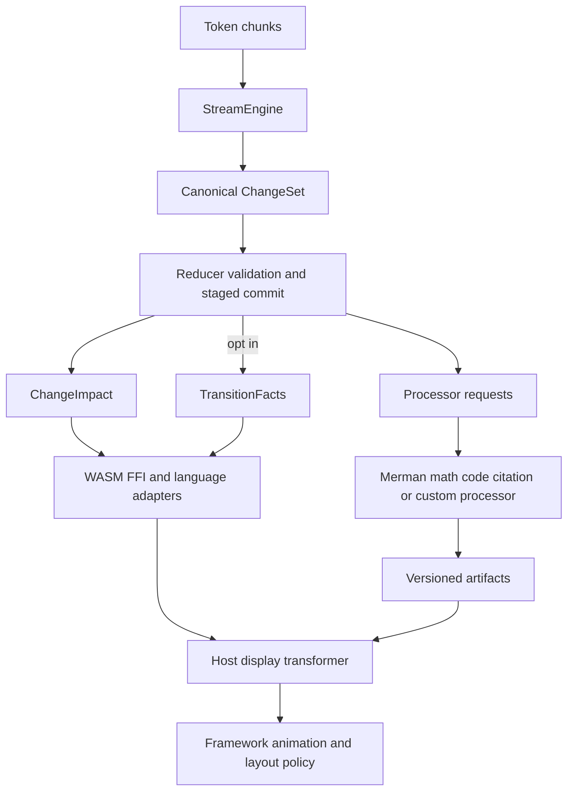
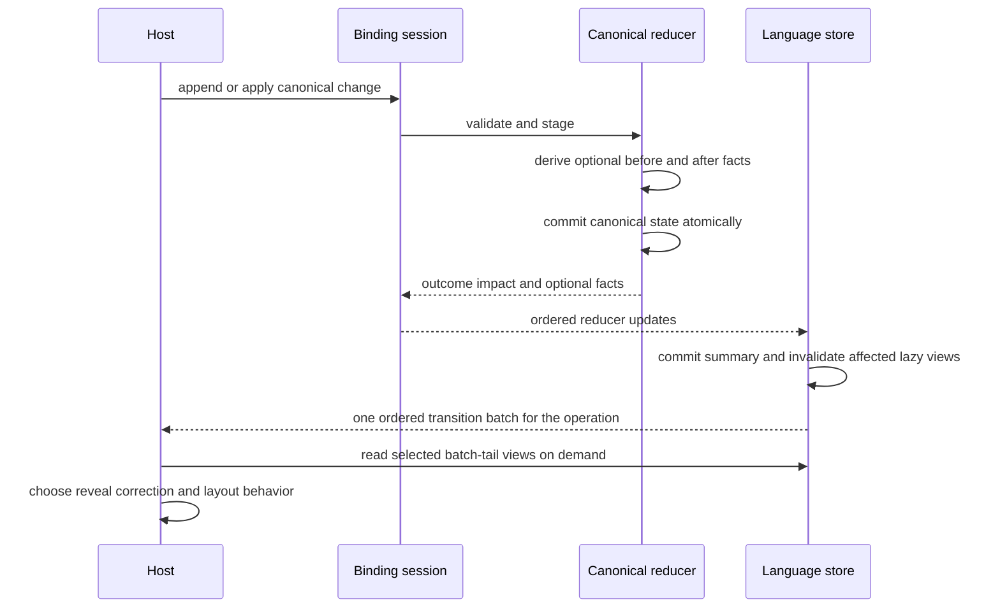
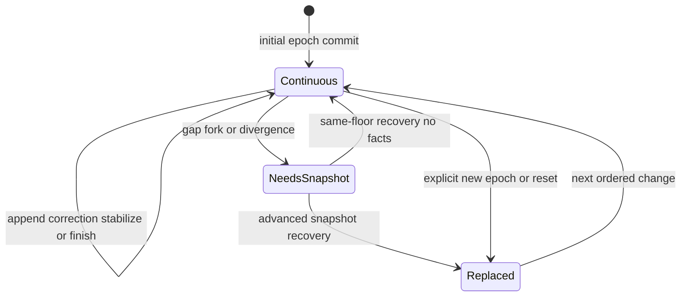
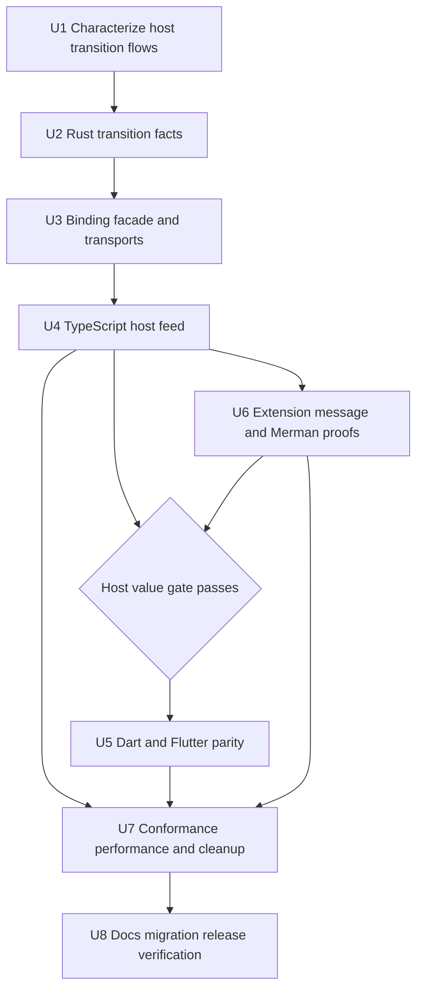

# Host Transition Facts and Extension Contract

## Goal Capsule

- **Objective:** Give framework authors enough deterministic, bounded state-change facts to build streaming text, correction, structure, and layout animations without mdstream owning animation or rendering policy.
- **Authority:** The Product Contract and session-settled decisions in this plan override older adapter examples; canonical Content IR and ADRs remain authoritative where this plan does not revise them.
- **Execution profile:** Breaking refactor across Rust, WASM/FFI, TypeScript, Dart, Flutter, conformance, examples, and documentation. Obsolete or superseded code may be deleted.
- **Stop condition:** Every document-changing reducer result can optionally expose one atomic, ordered transition fact set across supported bindings; control-only same-floor recovery exposes none; the default path remains cheap; extension and AI-message boundaries are demonstrated; all verification gates pass.
- **Tail ownership:** Implementation includes simplification, review, migration notes, release validation, precise conventional commits, and cleanup of abandoned approaches.

---

## Product Contract

### Summary

mdstream 0.4 already provides canonical incremental Markdown state, stable node identity within an epoch, deterministic versions, lifecycle, recovery, custom blocks, and processor artifacts. That is sufficient for a host to render correct state, but it does not let a stateless adapter reliably distinguish an insertion from a retained-node correction, stabilization, move, or removal. Hosts can reconstruct those facts only by retaining old node views and a complete parent index, which duplicates reducer knowledge and is especially awkward across WASM and FFI.

This refactor adds an opt-in, renderer-neutral transition-facts contract beside `ChangeImpact`. It reports atomic before/after facts from the reducer commit boundary. A React, GPUI, egui, Flutter, or other host can then decide whether new text fades in, corrected text cross-fades, moved blocks animate their layout, or all motion is disabled. mdstream supplies no animation names, CSS, timing, geometry, components, renderer registry, or scrolling behavior.

### Problem Frame

The comparison repos expose three different concerns that must stay separate:

- Streamdown marks newly revealed HAST text and applies renderer-owned animations. Its component identity and CSS policy are useful UI precedent, not a core protocol model.
- Cherry Studio combines a host-owned grapheme pacing buffer, Streamdown text reveal, stable message-part mounting, and independent resize/scroll coordination. It demonstrates that animation needs authoritative identity and change facts, while pacing and layout remain application responsibilities.
- Incremark emphasizes incremental parse consistency and stable output. It reinforces conformance requirements, but does not remove the need for cross-framework before/after facts.

The current `ChangeImpact` answers which cached views became invalid. It intentionally does not answer how a live node changed. Exposing raw `ProjectionOp` would leak compiler mechanics, still omit authoritative old state, and force foreign adapters to interpret the canonical mutation language. A second presentation IR would duplicate Content IR and make policy part of the core. The missing abstraction is narrower: a bounded observation of an already-committed canonical transition.

### Actors

- A1. Rust application or UI adapter consuming `mdstream-protocol` directly.
- A2. Framework-neutral TypeScript consumer using `@mdstream/core` and optionally adapting it to React or another web framework.
- A3. Dart or Flutter consumer using the canonical Rust reducer through FFI.
- A4. Host display transformer mapping Content IR and processor artifacts to framework-specific widgets or elements.
- A5. Content processor such as Merman producing derived, version-checked artifacts outside canonical state.
- A6. AI application owning message, part, tool-call, reasoning, and scroll/layout state above one or more mdstream sessions.

### Requirements

#### Transition semantics

- R1. `ChangeImpact` must remain the compact cache-invalidation contract; transition facts are a separate optional value and must not change the meaning of existing impact flags or identifier lists.
- R2. One successful document-changing reducer commit must produce at most one atomic transition fact set describing canonical state immediately before and after that commit. Invalid, idempotent, stale, recovery-required, and control-only same-floor recovery outcomes produce no transition facts.
- R3. Every node reference in transition facts must use a continuity-qualified key composed from a reducer-local continuity generation, epoch, and node ID. The generation increments only when a new document installation creates a real full-replace barrier; a bare node ID or `(epoch, node ID)` pair must never imply continuity across that barrier.
- R4. A retained node fact must expose enough old/new state to distinguish content-version change, provisional-to-stable change, parent change, and child-structure change without requiring the host to retain a full old document or infer from raw projection operations.
- R5. Semantic text facts must distinguish a source-backed projection append from a general replacement when this can be established without scanning the growing prefix. Every projection-append fact owns the exact bounded UTF-8 semantic text appended by that transition so intermediate facts remain usable when the batch-tail node has already changed again; facts never duplicate complete old/new bodies, animation policy, or token timing. Projection append does not claim the text was never displayed through the pending-source view.
- R6. Each changed child-list owner must have at most one deterministic normalized before-to-after splice. The reducer's private staged structure effect retains validated start, removed IDs, and inserted IDs and trims common prefix/suffix only inside that edit window; fact derivation must never rescan a complete unchanged child list, expose the authored `ProjectionOp` sequence, or expose an invalid intermediate tree.
- R7. Resource facts must carry old/new resource version presence and affected node IDs so late citation/link resolution can be animated or announced without treating it as fresh token output.
- R8. Every transition fact set must include before/after document coordinates, lifecycle, projection cursor, and root-structure version where present. Pending raw source remains an on-demand view rather than a node or a transition payload.
- R9. Advanced snapshot recovery, reset/new document installation, and any other real full replacement must expose a coarse full-replace scope, increment continuity generation, and carry no detailed node, structure, or resource facts. Same-floor snapshot recovery restores reducer readiness without replacing the retained document, changing continuity generation, retiring processor work, or emitting transition facts.
- R10. Transition facts are schedule-local observations. Different legal chunk schedules must converge to equal final snapshots, identities, versions, and lifecycle, but their intermediate transition sequences are not required to be identical.

#### Performance and transport

- R11. Transition capture must be disabled by default. A capture-disabled session has an inert transition surface: no facts, empty operation batches, callbacks, or Flutter revision changes. Facts-specific counters must prove the disabled reducer and binding paths do not clone transition state, rebuild parent indexes, visit unchanged entities for facts, copy splice IDs for facts, or serialize fact bytes; established workload and artifact budgets must not regress.
- R12. Enabled capture must reuse reducer staging and indexes, remain proportional to the committed changes plus explicitly reported structural items, and obey a hard encoded-output bound.
- R13. The binding option formerly named for impact-only output must be renamed to describe the complete reducer-update payload. Session construction must prove that the configured bound can encode the worst legal reducer update for capture-off or capture-on mode; an accepted session must never commit canonical state and then fail only because its reducer-update bound was too small. Unknown old option names fail through strict option-schema validation.
- R14. The canonical Content IR schema remains `mdstream.content/0.4`, and the C ABI version and payload-kind discriminants remain unchanged. Binding and options schemas may be refrozen in place only after repository tags and package registries prove 0.4 was never published; otherwise their contract versions must advance consistently before implementation continues.
- R15. Transition facts travel as an optional member of the existing reducer-update payload under a dedicated transition subprotocol. WASM and FFI remain thin transports and do not implement transition logic.

#### Host adapters

- R16. With capture enabled, TypeScript must expose typed transition facts and one ordered transition batch per public operation, including an empty batch for same-floor/no-op/error/artifact-only operations. The batch is published after all reducer updates and cache invalidations commit, before ordinary invalidation notifications; the readable store snapshot corresponds to the batch tail, while intermediate facts are self-contained observations rather than queryable intermediate views. Transition callbacks may read views and unsubscribe, but state-mutating or closing reentry is rejected until that callback returns.
- R17. TypeScript must not ship a first-party React package, hook, component, renderer, theme, CSS, or animation dependency. Documentation may show framework-neutral host pseudocode and a `useSyncExternalStore` adaptation.
- R18. Dart reducer results must preserve ordered transition facts. With capture enabled, Flutter must expose a dedicated revisioned transition-batch listenable, published after batch-tail state and focused values are coherent but before ordinary invalidation notifications. It preserves `A -> B -> A`, replaces stale batches with a new explicit empty batch on same-floor/no-op/error/artifact-only operations, applies the same mutation-reentry guard as TypeScript, and retains aggregated `ChangeImpact` for focused invalidation.
- R19. Reset, recovery, synchronous listener disposal, processor scheduling, and error paths must not publish facts for a stale generation or notify observers before canonical state is readable.

#### Extension and AI-content boundaries

- R20. Custom Markdown grammar declarations, canonical custom Content IR, processor artifacts, and host display mapping remain distinct extension planes. mdstream must not introduce a renderer registry, arbitrary JSON node payload, or callback into parser hot paths.
- R21. Merman remains a standalone, optional Rust processor. Mermaid source is canonical code-block content; generated SVG is a derived, version-checked, untrusted artifact and must never enter Content IR or transition facts.
- R22. AI message envelopes remain host-owned. Each Markdown/text part owns an independent, generation-qualified mdstream session: create on first content, append only to that part, finish independently, preserve across stable-key reorder, reset/replay only that part on historical replacement, and close/cancel on removal. Tool calls, reasoning blocks, attachments, global part ordering, cross-session transition ordering, token pacing, scroll anchoring, and layout geometry remain outside mdstream.
- R23. The Markdown path must not add LALRPOP or another grammar generator. Existing framing plus `pulldown-cmark` and sealed custom-block declarations remain the parser architecture until a demonstrated language requirement invalidates it.
- R24. A framework-neutral, command-line host harness must compare transition facts with the minimum old-view/parent-index reconstruction baseline and prove pending-to-projection reveal, semantic correction, restructure/movement/removal, terminal, advanced recovery, custom block processing, Merman artifact replacement, and multi-part AI-message composition without raw wire interpretation, Markdown reparsing, eager node materialization, or retaining an old canonical document.
- R25. The transition subprotocol remains an internal draft through the Rust-to-TypeScript host value gate. Promotion to `mdstream.transitions/1` requires that gate to pass; `/1` is a closed exact contract in which unknown fields or fact variants are rejected, semantic/additive changes require a new subprotocol version, and native/package schema mismatches fail before use.
- R26. Every SVG adoption example must keep artifact bytes opaque until a clearly named host sanitizer or isolated renderer boundary. Documentation must identify active-content and external-reference risks, and mdstream examples must never normalize direct DOM or `innerHTML` injection.
- R27. Processor input and artifact byte limits do not bound render CPU or peak memory. Untrusted Mermaid/custom input must be constrained by processor-specific input/complexity limits; hosts that cannot trust cooperative execution own timeout plus worker/process isolation because cancellation does not preempt arbitrary synchronous processor code.

### Key Flows

- F1. A text node grows under the same continuity-qualified identity. The reducer commits the new state and reports a source-backed projection append. After the public operation reaches its batch-tail state, the host decides whether that text is unrevealed or was already shown as pending source and applies its chosen motion policy.
- F2. A late definition changes earlier link or citation semantics. The retained node/resource versions change, facts classify replacement/resource correction rather than fresh appended text, and the host may cross-fade or update immediately.
- F3. Closing Markdown syntax restructures provisional nodes. One fact set reports before/after node state and ordered structural splices; no observer sees an intermediate invalid parent tree.
- F4. A stream finalizes. Retained nodes may become stable and lifecycle becomes finalized; the host decides whether to drain its pacing queue and disable later reveal effects.
- F5. A gap requires snapshot recovery. A same-floor snapshot only restores readiness and publishes no facts; an advanced snapshot publishes one coarse full-replace fact set, advances continuity generation, clears prior animation continuity and processor work, and uses new continuity-qualified keys.
- F6. A custom Mermaid block is parsed into canonical custom/code content, Merman produces a checked artifact, and the host maps the artifact to its renderer. A stale artifact result is rejected independently of transition publication.
- F7. An AI message contains text, reasoning, and tool parts. The host creates and independently finishes one generation-qualified mdstream session for each Markdown part, preserves stable sessions across reorder, replaces or removes only the affected part, and composes outputs without a core message-envelope type or global transition order.

### Acceptance Examples

- AE1. Given a paragraph containing ASCII, emoji, and combining characters delivered across UTF-8-safe chunks, when transition capture is enabled, then retained text-node facts identify the exact newly appended semantic text under the same continuity-qualified key without corrupting a Unicode scalar; a host may regroup graphemes across commits for pacing. When capture is disabled, no fact value or fact-building work is observed.
- AE2. Given the same final source under multiple UTF-8-safe chunk schedules, when all traces finish, then normalized final snapshots, node identities, versions, and lifecycle agree while intermediate transition counts may differ.
- AE3. Given an unresolved reference followed by its definition, when the semantic correction commits, then the retained affected node/resource facts expose old/new versions and no appended-text classification is emitted for the correction.
- AE4. Given a list or emphasis boundary that reparents or reorders retained nodes, when the commit completes, then each changed owner has one canonical normalized splice with exact removed/inserted IDs and node facts expose old/new parents; no fact exposes an authored intermediate tree.
- AE5. Given an `A -> B -> A` sequence for the same stable node inside one public operation, when TypeScript/Dart/Flutter publish the result, then the ordered batch contains both transitions even though the readable node view is only final A and the final deterministic version may equal the initial version. The facts are not a replay stream for rendering intermediate B.
- AE6. Given same-floor recovery, when readiness is restored, then no transition fact, continuity change, processor retirement, or artifact rescan occurs. Given advanced recovery or reset, then facts are full-replace only, continuity generation advances, and old pending processor work cannot publish stale updates even when epoch and node IDs repeat.
- AE7. Given a proposed capture-on session whose reducer-update budget cannot encode the configured worst legal transition, when the session is constructed, then strict option preflight rejects it before any canonical state exists. Every successfully constructed session can encode all legal updates under its configured limits.
- AE8. Given a TypeScript transition batch listener, when one public operation completes, then it can synchronously read batch-tail node/document state and unsubscribe safely before ordinary invalidation listeners run. A mutating reentrant call is rejected, one listener failure does not block later listeners, and intermediate facts require no intermediate node materialization.
- AE9. Given a capture-enabled Flutter controller operation that applies multiple updates, when the transition listenable fires, then its new operation revision retains ordered facts and all focused values reflect the batch tail. A following same-floor recovery, no-op, error, or artifact-only operation publishes a new empty batch rather than leaving an old animation trigger visible; capture-disabled sessions never advance the transition revision; aggregate impact remains available separately.
- AE10. Given a custom block declaration and host processor, when its source streams and stabilizes, then Content IR stays typed, processor artifacts stay external, and host dispatch requires neither parser callbacks nor arbitrary renderer metadata in canonical nodes.
- AE11. Given Merman requests `g1(A) -> g2(B) -> g3(A)` where deterministic node/input versions return to A, when the `g1` SVG completes late, then request generation rejects it and only `g3` may replace the artifact. Advanced full replacement cancels and rescans; same-floor recovery does neither; artifact events never enter transition facts.
- AE12. Given a Cherry-style host experiment, when text streams, corrects, finishes, and changes layout, then host code can implement grapheme pacing, reveal color/opacity, reduced-motion behavior, and resize/scroll policy using mdstream facts and framework APIs, with no animation code in mdstream.
- AE13. Given the same host harness with every transition effect mapped to an immediate update, when append, correction, movement, terminal, and recovery flows run, then content and state outcomes remain equivalent; motion or color is never the sole signal distinguishing fresh, corrected, moved, or replaced content.
- AE14. Given a successful Merman SVG artifact, when an adoption example hands it to a web or embedded renderer, then the value remains opaque until an explicit sanitizer or isolated rendering boundary and no mdstream example uses direct markup injection.
- AE15. Given adversarial Mermaid/custom input at configured processor limits, when processing is allowed in process, then byte/complexity limits fail predictably and documentation states remaining CPU/peak-memory risk; a host requiring untrusted execution uses its own timeout and worker/process boundary.

### Success Metrics

- All transition scenarios are covered in Rust conformance and equivalent TypeScript, Dart, and Flutter contract tests, including same-floor/advanced recovery, batch-tail reads, reentry, empty-batch clearing, and continuity generation.
- The default-off reducer records zero facts-specific visits/copies/bytes; enabled incremental work is proportional to changed nodes/resources and normalized removed/inserted splice members.
- The transition-facts subobject for full replacement is constant-size independent of document node count; the existing `ChangeImpact` and reducer summary may retain their established linear identifier cost.
- Bindings carry one canonical transition vocabulary with no host-language reducer reimplementation and no new FFI payload kind.
- Architecture tests continue to reject React dependencies and renderer code in the TypeScript package.
- Extension and Merman experiments prove artifact separation and stale-result safety; multi-part experiments prove the message envelope remains above the core.
- Before Dart/Flutter parity or stable subprotocol freeze, the Rust-to-TypeScript host harness classifies every representative flow while retaining no old canonical node views or complete parent index; its measured retained bookkeeping is strictly smaller than the reconstruction baseline.

### Scope Boundaries

#### In scope

- Atomic transition observation, continuity-qualified keys, old/new state stamps, text append/replacement classification, normalized structure splices, resource correction facts, binding options, ordered host delivery, conformance, performance evidence, examples, documentation, migration, and deletion of superseded experiments.

#### Outside this product's identity

- Animation duration, easing, delay, stagger, color, opacity, blur, transforms, FLIP calculations, spring physics, CSS, DOM/HAST, widget trees, scrolling, resize observation, virtual-list anchoring, grapheme pacing, and reduced-motion policy.
- First-party React bindings or renderers, Flutter widgets, GPUI/egui rendering libraries, syntax-highlighting engines, math renderers, Mermaid display components, or sanitizer policy.
- A built-in SVG sanitizer, browser sandbox, worker/process supervisor, or preemptive execution runtime; mdstream defines and tests the trust handoff but the host selects environment-specific controls.
- AI provider message schemas, tool-call/reasoning state machines, persistence, networking, collaborative editing, or arbitrary historical source editing.
- Public raw projection operations in foreign adapters, callbacks into the parser/reducer critical section, or a second presentation IR.

### Assumptions

- The user authorizes breaking changes, deletion, package-option renames, schema refreezing before the first 0.4 release, and precise incremental commits.
- Version 0.3 is the latest repository tag. Package-registry evidence, not that tag alone, determines whether binding/options 0.4 may be refrozen or must advance; Content IR remains 0.4 in either case.
- `NodeVersion` is a deterministic compare token, not a monotonic animation generation. Ordered transition batches, coordinates, and continuity-qualified keys carry temporal meaning.
- In-process processors are trusted cooperative code but may receive untrusted content. Their byte/complexity limits and cancellation are not a security sandbox or preemption guarantee; generated artifacts remain untrusted data for the host to sanitize or isolate according to its rendering environment.
- No launch-blocking product or architecture question remains.

---

## Planning Contract

### Key Technical Decisions

- KTD1. session-settled: mdstream remains a headless, framework-neutral state engine and ships no first-party React or animation layer. The useful contract is authoritative state/change facts, not a UI abstraction.
- KTD2. Preserve `ChangeImpact` and add optional transition facts as a sibling result. Invalidation and animation-oriented observation have different cost and semantic needs; merging them would either bloat the hot path or leave hosts guessing.
- KTD3. Capture facts at the reducer's validated staged-commit boundary. That boundary already owns old state, new state, parents, structures, resources, and atomicity, so it can report truth without exposing `ProjectionOp` or rescanning the completed document.
- KTD4. Keep capture explicit and default-off through reducer/binding construction options. Existing `apply` and recovery behavior uses an inert no-capture path with no transition notifications or revisions; capture-enabled entry points return ordinary outcomes plus operation batches without maintaining a permanent historical document.
- KTD5. Use before/after state stamps rather than policy-flavored events such as `fade`, `animate`, or `corrected`. Hosts derive insert, update, stabilization, movement, and removal from factual presence and stamps; projection append versus replacement is the only specialized classification, and it does not claim a pending-source renderer has not already revealed the bytes.
- KTD6. Qualify every observed node key with reducer-local continuity generation, epoch, and node ID. Advanced full replacement increments generation even when epoch and node IDs repeat; same-floor recovery preserves it. Continuity generation is observation state, not canonical Content IR or snapshot identity.
- KTD7. Preserve schedule-local order rather than promising cross-schedule transition equality. Chunk invariance applies to canonical final state; making intermediate observations identical would require buffering or token-schedule normalization that conflicts with streaming latency.
- KTD8. Keep real full replacement coarse and distinguish it from same-floor recovery. Detailed advanced-snapshot diffs are expensive and imply questionable identity continuity, while same-floor recovery retains the exact document and therefore emits no transition facts.
- KTD9. Keep processor artifact changes as a parallel output plane. A canonical transition can invalidate or request an artifact, but processor completion is asynchronous and version-checked; folding it into transition facts would blur state authority and reorder independent events.
- KTD10. Embed optional facts in the existing reducer-update binding payload and keep the FFI ABI payload-kind table unchanged. The binding schema already owns typed reducer views, so a new transport channel would add ordering and ownership complexity without a new semantic boundary.
- KTD11. Deliver one language-level transition batch after a public operation's state and cache invalidations commit, before ordinary invalidation observers, never through Rust callbacks. The current view represents only the batch tail; transition callbacks reject mutating reentry so every listener observes the same tail state while view reads and unsubscription remain safe.
- KTD12. Preserve ordered batches in Dart and a dedicated revisioned Flutter transition listenable even when invalidations are aggregated. Deterministic versions permit `A -> B -> A`, so facts retain order but remain non-replayable observations; no intermediate node view is materialized, and no-op/error/artifact-only operations replace the prior Flutter batch with an explicit empty one.
- KTD13. Keep syntax declarations, canonical custom IR, processor artifacts, and host rendering dispatch as four separate extension layers. This prevents parser callbacks, wire-unsafe arbitrary values, and renderer-specific metadata from contaminating Content IR.
- KTD14. session-settled: AI message and part orchestration remains host-owned. A mapping from generation-qualified stable part keys to independently created, finished, reset/replayed, and closed mdstream sessions avoids coupling the engine to provider-specific tool/reasoning envelopes; no global order is promised across sessions.
- KTD15. Do not introduce LALRPOP. The required observation feature is downstream of parsing; the existing scanner, `pulldown-cmark`, and sealed extension declarations already cover the Markdown grammar boundary.
- KTD16. Rename impact-only output budget options to reducer-update budget options across every binding and prove the worst legal capture-off/on encodings during session construction. Runtime wire limits must not change whether a canonical change is accepted after commit.
- KTD17. Version the transition subprotocol independently and gate binding-schema refreeze on release evidence. Content IR 0.4 and C ABI v1 remain stable; unpublished binding/options 0.4 may refreeze, but any observed 0.4 registry publication requires a consistent binding/options version bump instead of silent contract reuse.
- KTD18. Keep the transition subprotocol draft until a Rust-to-TypeScript value gate beats the minimum old-view/parent-index baseline. If the facts harness cannot classify append, correction, restructure/removal, and ABA with less retained canonical bookkeeping, revise or remove the abstraction before Dart/Flutter work rather than freezing sunk cost.
- KTD19. Freeze `mdstream.transitions/1` as a closed exact schema after the value gate. Unknown fields and variants are typed mismatches, optionality is defined only by `/1`, and any future additive or semantic change uses a new transition subprotocol with cross-version golden fixtures; there is no implicit loose decoding or in-band negotiation.

### High-Level Technical Design

#### Module topology

The transition module is a deep protocol module. Its public vocabulary stays small while the reducer privately derives facts from staged node, structure, parent, and resource edits. The directional data shape is:

- A transition set has a continuous or full-replace scope, continuity generation, optional before document stamp, mandatory after document stamp, and ordered node, structure, and resource fact lists.
- A document stamp carries coordinate, lifecycle, accepted-source/projection cursors, and optional root structure version.
- A node fact carries a continuity-qualified key plus optional before/after node stamps. A node stamp carries content version, stability, parent owner, and child structure version.
- A text fact is either a source-backed append descriptor owning only the bounded UTF-8 delta text or a general replacement. Normalized or ambiguous semantic text changes conservatively classify as replacement.
- A structure fact carries owner, old/new structure versions, and exactly one staged-window-normalized splice with exact removed/inserted node IDs.
- A resource fact carries resource identity, optional old/new versions, and affected node IDs.

Facts are not accepted reducer input, cannot reconstruct or replay a canonical document, do not serialize `ProjectionOp`, and do not appear in `ChangeSet`, `Snapshot`, or `ContentNode`. They explain an already committed observation batch; canonical state remains the only state authority.

This shape is directional guidance rather than an exact Rust or wire declaration. Implementation may tighten names or internal representation while preserving the observable laws and cross-binding vocabulary.

#### Atomic publication sequence

No host callback runs while Rust state is mutating. One public operation may contain multiple facts, but the store exposes only the final batch-tail view and keeps untouched/unused nodes unmaterialized. Transition listeners run before ordinary invalidation listeners and may read or unsubscribe but not mutate/close the session reentrantly. Processor requests and artifact changes may follow the reducer update in the existing output ordering, but they are not members of the canonical transition set.

#### Continuity model

Continuous transitions may contain detailed node/structure/resource facts. Replaced transitions increment continuity generation and contain only document stamps plus full-replace scope. Same-floor recovery is a control-state transition, not a document transition, and emits no facts.

### Output Structure

- `mdstream-protocol/src/transition.rs` owns the renderer-neutral transition vocabulary and private derivation helpers used by `document.rs`.
- `mdstream-conformance/src/transition.rs` owns schedule-local laws, trace normalization, and shared scenarios.
- `mdstream/examples/transition_trace.rs` is the command-line observation probe and adoption example.
- `mdstream-bindings-core` adds the opt-in option, optional reducer-update view member, wire bounds, and metrics while leaving payload kinds unchanged.
- `bindings/typescript` exposes typed views and an ordered store-level transition subscription without React.
- `bindings/dart` decodes typed facts in existing ordered reducer results.
- `bindings/flutter` publishes a dedicated revisioned ordered transition-batch listenable beside aggregated impact and focused invalidation listenables.
- Existing custom-block, processor, Merman, and adoption examples are extended rather than replaced by a renderer registry.
- ADR 0005 records the observation boundary and its relationship to ADR 0002 and ADR 0004.

### Sequencing

U1 establishes observable expectations and the minimum host-reconstruction baseline before protocol work. U2 is the semantic authority. U3 transports a draft authority once. U4 proves the Rust-to-TypeScript host state machine and U6 proves extension boundaries; together they form the value gate. Only a passing gate freezes `/1` and permits U5 mobile parity. A failing gate routes back to U2-U4 for redesign or deletion rather than widening the contract. U7 applies cross-binding and simplification pressure before U8 refreezes public documentation and release artifacts.

### System-Wide Impact

- **Protocol:** A new optional observation vocabulary is public Rust API but not canonical persisted Content IR. Reducer atomicity and recovery laws remain unchanged.
- **Bindings:** Reducer-update JSON grows only when explicitly enabled. Strict options and generated/handwritten typed views change together; FFI ownership and payload kinds do not.
- **State adapters:** TypeScript gains an ordered public-operation batch subscription, while Flutter gains a revisioned transition-batch listenable. Batch-tail read semantics, lazy materialization, empty-batch clearing, listener disposal, and mutation reentrancy behavior become public contract.
- **Processors:** Request scheduling still follows `ChangeImpact`; transition facts do not delay finalization or artifact completion.
- **Performance:** Default behavior must add zero facts-specific visits, copies, and encoded bytes relative to current deterministic baselines. Enabled capture adds bounded incremental work proportional to changed entities and normalized splice members; full-replace facts stay constant even though existing impact may be linear.
- **Migration:** The 0.3 transition remains intentionally breaking. Current 0.4-line bindings refreeze only when repository tags and package registries prove they were unpublished; otherwise binding/options contract versions advance consistently. Either path removes the misleading impact-only budget name before the next release.
- **Documentation:** Examples must teach hosts to own animation, accessibility, scroll, layout, message parts, and artifact sanitization, while mdstream owns identity, state, and factual transitions.

### Risks and Mitigations

- **Risk: transition facts become a second IR.** Mitigation: facts contain stamps, presence, ranges, and one normalized net splice per owner only; they are not reducer input, cannot replay a document, and contain no render properties, arbitrary metadata, full node bodies, or authored operation stream.
- **Risk: capture doubles reducer work.** Mitigation: derive from staged edits and existing indexes, keep default off, add deterministic visit/byte counters, and conservatively classify ambiguous text instead of diffing full strings.
- **Risk: full replacement suggests false continuity.** Mitigation: distinguish same-floor recovery, increment local continuity generation only on real replacement, and use continuity-qualified keys with empty detail lists at barriers.
- **Risk: listeners observe half-applied or wrong intermediate state.** Mitigation: publish once per public operation after batch-tail state/cache invalidation, keep views lazy, run transition observers before invalidation observers, reject mutating transition-callback reentry, and never promise an intermediate queryable view.
- **Risk: deterministic versions hide `A -> B -> A`.** Mitigation: preserve ordered transition batches and test ABA across TypeScript, Dart, and Flutter.
- **Risk: structural facts become unbounded.** Mitigation: normalize to one net splice per owner, count exact splice members in capture-on option preflight and reducer-update byte limits, and never expand a full document on advanced recovery.
- **Risk: wire encoding fails after canonical commit.** Mitigation: derive conservative worst-case capture-off/on bounds from protocol limits and reject invalid session options before a reducer or artifact host exists.
- **Risk: Merman SVG is mistaken for trusted canonical content.** Mitigation: keep it in artifact APIs, test stale rejection, keep examples opaque until a named sanitizer/isolated-renderer boundary, and prohibit direct markup-injection examples.
- **Risk: processor limits are mistaken for compute isolation.** Mitigation: test input/complexity bounds, state that artifact retention caps do not bound CPU or peak memory, and require host timeout plus worker/process isolation for untrusted non-cooperative execution.
- **Risk: examples accidentally bless one UI framework.** Mitigation: use a CLI trace plus framework-neutral store tests and pseudocode; architecture tests continue to prohibit React dependencies.

### Alternatives Considered

- **Only document current host bookkeeping:** Lowest implementation cost, but every adapter must retain old views and recreate private parent/resource indexes. It makes animation possible but not reliable or portable.
- **Expose canonical `ProjectionOp`:** Preserves operation order but leaks mutation mechanics, omits authoritative old state, and couples every foreign host to reducer internals.
- **Add a high-level display-session or text-run ledger:** Convenient for a Cherry-like caller, but introduces cumulative-string diffing, pacing assumptions, and a second presentation identity model. It belongs in host libraries.
- **Add flexible callbacks and artifact events to the core transition stream:** Maximally extensible, but creates FFI/WASM reentrancy, ordering, and configuration complexity. Language-level listeners and the existing artifact plane are sufficient.
- **Ship a React renderer or clone Streamdown:** Strong immediate web UX, but duplicates mature libraries and contradicts the cross-framework headless product boundary.
- **Adopt LALRPOP:** Useful for a custom formal grammar, but unrelated to state observation and unnecessary for CommonMark/GFM parsing with the current compiler.

### Deferred to Implementation

- Exact public type and field names may be tightened to match existing Rust and language naming conventions, provided the semantic shape and wire parity remain unchanged.
- The reducer may derive facts directly during staging or from a compact committed-effect journal; focused workload evidence decides which internal shape is simpler and cheaper.
- The host experiment may use an existing compile-tested example or a new small harness, but it must remain framework-neutral and command-line runnable.

---

## Implementation Units

### U1. Characterize transition and host-adoption flows

- **Goal:** Establish a command-line trace and shared scenarios that demonstrate what hosts currently must reconstruct and define the schedule-local observation laws before public API changes.
- **Requirements:** R2-R10, R20-R25.
- **Dependencies:** None.
- **Files:** `mdstream/examples/transition_trace.rs`, `mdstream-conformance/src/lib.rs`, `mdstream-conformance/src/transition.rs`, `mdstream-conformance/tests/transition_contract.rs`, `conformance/fixtures/`.
- **Approach:** Drive `StreamEngine` and the canonical reducer through representative chunk schedules. Record canonical coordinates, impacts, node views, parents, resources, and processor outputs using supported APIs. Turn the observed host bookkeeping into explicit assertions for insertion, append, correction, stabilization, restructure, ABA, finish, reset, and recovery. Keep trace output deterministic and suitable for shell experimentation.
- **Patterns to follow:** `mdstream-conformance/src/trace.rs`, `mdstream-conformance/src/fixture.rs`, `mdstream/examples/gpui_adapter.rs`, and `mdstream/examples/egui_adapter.rs`.
- **Test scenarios:** First node insertion; source-backed projection extension after pending display; closing emphasis/list syntax; late reference correction; stable transition on finish; reorder and reparent; subtree removal; pending-source cursor advance; `A -> B -> A`; explicit reset; same-floor versus advanced snapshot recovery; multiple legal UTF-8 partitions.
- **Verification:** The example compiles and produces deterministic decoded traces; characterization tests fail only for the transition facts not yet implemented and do not introduce a renderer dependency.

### U2. Add opt-in atomic transition facts to the Rust reducer

- **Goal:** Implement the canonical renderer-neutral observation vocabulary and derive it from validated reducer staging without changing default reducer behavior.
- **Requirements:** R1-R12, R14, R20, R23, R25.
- **Dependencies:** U1.
- **Files:** `mdstream-protocol/src/transition.rs`, `mdstream-protocol/src/lib.rs`, `mdstream-protocol/src/document.rs`, `mdstream-protocol/src/lifecycle.rs`, `mdstream-protocol/tests/reducer_laws.rs`, `mdstream-protocol/tests/transition_facts.rs`, `mdstream-conformance/src/transition.rs`, `mdstream-conformance/tests/transition_contract.rs`.
- **Approach:** Add a small public transition module and capture-enabled reducer entry points beside existing apply/recovery methods. Reuse staged nodes, parent changes, resources, and document stamps; extend the private staged structure effect to retain the validated splice window and removed IDs before atomic commit. Track reducer-local continuity generation, normalize only inside staged edit windows, give projection-append facts owned bounded delta text, and classify ambiguous text conservatively. Initial commits may contain detailed inserts; advanced replacement increments generation and contains no detail; same-floor recovery and non-state-changing outcomes return no facts.
- **Patterns to follow:** Transactional staging in `mdstream-protocol/src/document.rs`, version types in `mdstream-protocol/src/ids.rs`, and compact shared structures in `mdstream-protocol/src/ir.rs`.
- **Test scenarios:** Every AE1-AE7 Rust case; no facts for idempotent/stale/recovery-required/error/same-floor outcomes; projection append classification only when the same source-backed semantic range extends; `A -> AB -> A` in one batch retains the owned intermediate `B` delta even though the tail view is A; normalized text becomes replacement; pending-source catch-up is not labeled newly visible; parent and roots owners serialize distinctly; normalized splice is unique for equivalent edit windows; a single edit in a very long child list does not scan the full list; no details on advanced full replacement; continuity advances only at real barriers; existing apply methods have unchanged outcomes and facts-specific counters remain zero.
- **Verification:** Protocol and conformance nextest suites pass on Rust 1.85; no parser, processor, UI, or framework dependency enters `mdstream-protocol`; default-off facts visits/copies remain zero and enabled visits/copies satisfy the changed-entity/splice-member thresholds before binding work begins.

### U3. Carry draft transition facts through bindings-core and WASM

- **Goal:** Add one bounded, opt-in draft reducer-update representation and prove the Rust-to-WASM vertical transport before wider binding rollout.
- **Requirements:** R11-R15, R19, R25.
- **Dependencies:** U2.
- **Files:** `mdstream-bindings-core/src/options.rs`, `mdstream-bindings-core/src/engine.rs`, `mdstream-bindings-core/src/wire.rs`, `mdstream-bindings-core/tests/options_contract.rs`, `mdstream-bindings-core/tests/session.rs`, `mdstream-bindings-core/tests/wire_bound.rs`, `mdstream-bindings-core/tests/golden.rs`, `mdstream-wasm/src/lib.rs`, `mdstream-wasm/tests/wasm.rs`.
- **Approach:** First prove whether binding/options 0.4 has ever been published and select refreeze or version-bump consistently. Add a strict session option for transition capture, encode an internal-draft transition subprotocol inside reducer updates, and rename the impact-only byte budget to the full reducer-update budget. Compute separate conservative construction-time bounds for capture-off and capture-on node/resource facts, owned append-delta bytes, and structural splice members. Define exact unknown-field/variant rejection and cross-version mismatch behavior without freezing `/1` before the host value gate. Do not allocate a new `BindingPayloadKind`; WASM forwards existing reducer-update bytes.
- **Patterns to follow:** Strict schema/options parsing in `mdstream-bindings-core/src/options.rs`, streaming encoders in `mdstream-bindings-core/src/wire.rs`, and transport parity tests in `mdstream-wasm/tests/wasm.rs` and `mdstream-ffi/tests/abi.rs`.
- **Test scenarios:** Option omitted/default false; option true; old budget name rejected; the same small budget accepted off and rejected on; worst legal enabled update including owned text deltas encodes after successful construction; optional member absent when disabled/non-changing/same-floor; advanced full-replace encoding; unknown transition fields/variants and draft/final subprotocol mismatch; cross-version golden rejection; binding/options schema mismatch through WASM/package surfaces; decimal/opaque ID safety; all WASM payload-kind numeric values unchanged.
- **Verification:** Bindings-core, WASM runtime/target, and WASM artifact-budget gates pass before TypeScript work begins; disabled reducer-update bytes remain unchanged except for an intentional, release-evidence-backed schema fixture change. Budgets are not raised merely to admit the feature.

### U4. Add a framework-neutral TypeScript transition feed

- **Goal:** Let web hosts consume typed ordered facts after coherent store updates without a React-specific package or renderer.
- **Requirements:** R13-R17, R19, R24-R25.
- **Dependencies:** U3.
- **Files:** `bindings/typescript/src/views.ts`, `bindings/typescript/src/store.ts`, `bindings/typescript/src/engine.ts`, `bindings/typescript/src/index.ts`, `bindings/typescript/examples/transition-host.mjs`, `bindings/typescript/tests/views.test.ts`, `bindings/typescript/tests/options.test.ts`, `bindings/typescript/tests/adoption.test.ts`, `bindings/typescript/tests/host_transitions.test.ts`, `bindings/typescript/tests/architecture.test.ts`, `bindings/typescript/tests/recovery.test.ts`, `bindings/typescript/tests/workload.test.ts`, `bindings/typescript/README.md`.
- **Approach:** Decode immutable typed draft facts, expose the renamed option, and add an ordered store subscription dedicated to one public-operation batch. Apply every reducer update, commit the batch-tail summary, and invalidate caches without eagerly materializing views. Publish the batch before ordinary invalidation listeners; view reads lazily materialize only requested tail nodes. Guard mutating/closing reentry during transition callbacks while preserving safe reads, unsubscribe, error isolation, and ordered facts. Add a framework-neutral test/CLI host state machine beside a minimum old-view/parent-index baseline; facts must classify pending catch-up, append, correction, restructure/movement/removal, terminal, ABA, and advanced recovery with no old canonical tree and strictly less retained bookkeeping. An immediate-update mode proves reduced-motion semantic equivalence.
- **Patterns to follow:** Existing external-store and keyed subscriptions in `bindings/typescript/src/store.ts`, strict view decoding in `bindings/typescript/src/views.ts`, and architecture prohibitions in `bindings/typescript/tests/architecture.test.ts`.
- **Test scenarios:** AE1, AE3-AE8, and AE12-AE13; listener reads coherent batch-tail node/document/resource state; transition listener runs before ordinary invalidation listener; unsubscribe during callback; one listener throws; mutating/closing reentry is rejected; multiple updates and ABA preserve owned intermediate text deltas while exposing only the tail view; same-floor produces a new empty enabled-capture batch; capture-disabled produces no callback; advanced recovery changes continuity; pending catch-up never re-reveals already displayed text; immediate mode preserves content/state without color/motion-only meaning; 10,000 changed nodes materialize zero views until requested and exactly the requested subset afterward; package dependency graph contains no React, CSS, motion, or renderer package.
- **Verification:** Typecheck, tests, build, package smoke, artifact budgets, and the host-adoption harness pass; facts beat the reconstruction baseline under the stated retained-state criteria. Failure blocks `/1`, U5, and release freeze and routes U2-U4 to redesign or deletion. Public declarations remain framework-neutral.

### U5. Add Dart and Flutter transition parity

- **Goal:** Preserve the same typed ordered observation contract through Dart FFI and a dedicated Flutter transition listenable without changing processor or ordinary notification ordering.
- **Requirements:** R13-R15, R18-R19, R24-R25.
- **Dependencies:** U4 and the U6 host value gate; `/1` must be frozen.
- **Files:** `mdstream-ffi/include/mdstream.h`, `mdstream-ffi/tests/abi.rs`, `mdstream-ffi/tests/recovery.rs`, `bindings/dart/lib/src/options.dart`, `bindings/dart/lib/src/views.dart`, `bindings/dart/lib/src/reducer_handle.dart`, `bindings/dart/lib/src/engine.dart`, `bindings/dart/lib/mdstream.dart`, `bindings/dart/test/options_test.dart`, `bindings/dart/test/views_test.dart`, `bindings/dart/test/protocol_test.dart`, `bindings/dart/test/recovery_test.dart`, `bindings/dart/test/workload_test.dart`, `bindings/flutter/lib/src/state.dart`, `bindings/flutter/lib/src/controller.dart`, `bindings/flutter/test/controller_test.dart`, `bindings/flutter/test/recovery_test.dart`, `bindings/flutter/test/notification_disposal_test.dart`.
- **Approach:** After the value gate freezes `/1`, prove C FFI still forwards the existing reducer-update kind with unchanged ABI/header discriminants. Add immutable Dart transition views and expose them in existing ordered reducer results. Add a dedicated immutable Flutter transition-batch listenable carrying an operation revision and ordered facts while retaining aggregate impact and focused listenables. Prepare batch-tail state and focused values lazily/coherently, publish the transition batch first, then ordinary invalidations. Publish a new empty batch for no-op/error/artifact-only operations, guard mutating callback reentry, and retain reset/dispose/generation protection for processor work.
- **Patterns to follow:** Defensive immutable view decoding in `bindings/dart/lib/src/views.dart`, ordered output draining in `bindings/dart/lib/src/reducer_handle.dart`, and disposal-safe publication in Flutter controller tests.
- **Test scenarios:** ABI/header payload-kind values remain unchanged; C FFI decodes the same finalized reducer-update JSON and rejects native/schema mismatch; typed Dart decode parity; option rename/rejection; projection append and semantic correction; ABA within one operation with tail-only views; multiple structural facts retain order; aggregate impact remains deduplicated; same-floor recovery increments the enabled-capture revision with an empty batch and advanced recovery yields coarse full replace with new continuity; no-op/error/artifact-only also publishes an empty enabled-capture batch; capture-disabled never advances the revision; two listeners cannot be separated by reentrant reset; listeners can unsubscribe/dispose synchronously; later ordinary focused-listener reset cannot launch or publish old-generation processor work.
- **Verification:** Dart native-required full suite and analyze pass; Flutter analyze, tests, package archive validation, and host smoke pass on supported local lanes.

### U6. Prove extension, Merman, and AI-message host boundaries

- **Goal:** Demonstrate that transition facts compose with custom syntax, processors, derived artifacts, and multi-part AI messages without adding presentation policy to the core.
- **Requirements:** R20-R27.
- **Dependencies:** U4.
- **Files:** `mdstream/examples/custom_blocks.rs`, `mdstream/examples/transition_trace.rs`, `mdstream/tests/content_ir.rs`, `mdstream-merman/tests/mermaid_processor.rs`, `mdstream-merman/tests/adoption_rust.rs`, `bindings/typescript/tests/adoption.test.ts`, `bindings/typescript/README.md`, `docs/EXTENSIONS.md`, `docs/ADAPTERS.md`.
- **Approach:** Extend a custom-block example through all four layers: sealed grammar declaration, typed custom Content IR, versioned processor artifact, and host display dispatch. Exercise a real Merman render and `A -> B -> A` request-generation replacement. Keep SVG opaque through a named sanitizer/isolated-renderer handoff and never demonstrate direct markup injection. Exercise input/complexity limits and document why in-process cancellation cannot bound arbitrary CPU/peak memory. Add a host-side message-part session state machine that independently creates, appends, finishes, reorders, resets/replays, and closes generation-qualified sessions without defining message types in Rust.
- **Patterns to follow:** Current `CustomBlockSpec`, `ContentProcessor`, `ArtifactHost`, `mdstream-merman`, and TypeScript processor scheduler examples.
- **Test scenarios:** Custom opaque block streams provisionally then stabilizes; host selects a custom renderer without metadata in Content IR; Merman `g1(A) -> g2(B) -> g3(A)` accepts only g3; advanced replacement cancels/rescans while same-floor does neither; artifact changes do not appear in transition facts; SVG remains opaque until an explicit trust boundary and examples contain no direct injection; input/complexity limits fail predictably while docs state residual compute risk; two text parts evolve independently around a tool part; stable-key reorder preserves sessions; independent finish/recovery does not affect siblings; historical replacement resets only one part; removal closes/cancels it; removed-key reuse requires a new generation and rejects late callbacks.
- **Verification:** Core examples compile; Merman standalone Rust 1.95 tests pass; TypeScript adoption tests prove no raw Markdown reparse, wire handling, old canonical tree, or unsafe SVG handoff; host value criteria pass; dependency scans confirm Merman remains absent from default core/binding packages.

### U7. Complete conformance, performance, and simplification

- **Goal:** Prove the observation contract is bounded and cross-binding consistent, then remove duplicate or abandoned transition/diff machinery.
- **Requirements:** R1-R27.
- **Dependencies:** U4-U6.
- **Files:** `mdstream-conformance/src/transition.rs`, `mdstream-conformance/tests/transition_contract.rs`, `mdstream-protocol/tests/transition_facts.rs`, `mdstream-protocol/tests/reducer_laws.rs`, `mdstream-bindings-core/tests/workload.rs`, `bindings/typescript/tests/workload.test.ts`, `bindings/dart/test/workload_test.dart`, `bindings/flutter/test/controller_test.dart`, `conformance/budgets/streaming.json`, `bindings/budgets.json`, `fuzz/fuzz_targets/`.
- **Approach:** Consolidate the early U2 reducer and U3 wire/artifact evidence into shared schedule-local and cross-binding normalized fixtures. Extend facts-built, entity-visit, splice-ID-copy, lazy-view, and encoded-fact-byte metrics across language workloads. Compare default-off baselines, enabled append/correction workloads, large splices, and advanced replacement without weakening checked-in budgets. Before deleting anything, record the exact files and symbols; cleanup is limited to abandoned paths introduced by this implementation, old option names, or code explicitly superseded by the new API and no longer serving capture-off consumers. Existing unlisted adapters/examples are out of cleanup scope.
- **Patterns to follow:** Existing chunk permutation, workload, budget, fuzz, golden, and artifact-package contracts.
- **Test scenarios:** Exhaustive small UTF-8 partitions; seeded large partitions; one-byte long paragraph; late semantic correction; wide structure splice; advanced replacement at increasing document sizes; ABA order; capture toggle; construction-time output-limit boundary; Rust/WASM/TypeScript/FFI/Dart normalized equality; malformed optional facts rejected by strict decoders.
- **Verification:** Deterministic counters show zero default-off facts work, enabled incremental capture proportional to changed entities and deleted/inserted normalized-splice members, lazy view materialization, and constant-size advanced-full-replace facts; existing whole-update impact costs remain explicit. Fuzz targets compile, full cross-language suites pass, budgets were not silently raised, and no abandoned implementation path remains.

### U8. Refreeze public documentation, migration, and release surfaces

- **Goal:** Make the final 0.4 product boundary, breaking migration, examples, changelogs, package contracts, and release checks accurately describe the implemented transition/extension model.
- **Requirements:** R13-R27.
- **Dependencies:** U7.
- **Files:** `docs/ADR_0005_HOST_TRANSITION_FACTS.md`, `docs/ARCHITECTURE.md`, `docs/STATE.md`, `docs/ADAPTERS.md`, `docs/EXTENSIONS.md`, `docs/USAGE.md`, `docs/ROADMAP.md`, `README.md`, `CHANGELOG.md`, `bindings/typescript/README.md`, `bindings/dart/README.md`, `bindings/dart/CHANGELOG.md`, `bindings/flutter/README.md`, `bindings/flutter/CHANGELOG.md`, `scripts/verify-packages.py`, `.github/workflows/`.
- **Approach:** Record the decision, value gate, schema-evolution rule, and explicit non-goals in ADR 0005. Document continuity-qualified keys, schedule-local non-replayable facts, same-floor versus advanced recovery, batch-tail/listener ordering, lazy views, option/schema migration, non-motion semantic equivalence, custom extension layers, opaque SVG sanitizer/isolation handoff, processor CPU/peak-memory limits, and the host-owned part-session/animation/layout lifecycle. Merge release notes carefully with the already rewritten changelogs. Refreeze binding fixtures only after tag/registry evidence, the host value gate, and package verification pass.
- **Patterns to follow:** ADR 0002 source/projection/artifact planes, ADR 0004 framework-neutral web bindings, the 0.4 migration structure already present in changelogs, and exact-archive verification scripts.
- **Test scenarios:** Documentation snippets/examples compile where applicable; architecture scans reject React/UI/animation dependencies and direct SVG injection examples; accessibility guidance requires equivalent immediate updates and non-color-only meaning; processor docs distinguish retention limits from CPU/peak-memory isolation; old option names and stale contract text are absent except migration notes; content/binding/options/transition-subprotocol versions match the release-evidence and value-gate decisions across native and package archives; packages contain updated declarations/readmes and no forbidden dependencies; changelog clearly separates 0.3-to-0.4 migration from optional transition adoption.
- **Verification:** Documentation and release checks pass, all package archives are verified exactly, diff integrity is clean, and the public 0.4 contract no longer contains ambiguous impact-only or React-renderer promises.

---

## Verification Contract

| Gate | Command | Applies |
|---|---|---|
| Formatting | `cargo fmt --all -- --check` | All Rust units |
| Rust lint | `cargo clippy --workspace --all-targets --all-features -- -D warnings` | U2-U3, U6-U8 |
| Rust workspace tests | `cargo nextest run --workspace --all-features` | U1-U3, U6-U8 |
| Rust docs | `cargo test --workspace --all-features --doc` | U2-U3, U6-U8 |
| Core MSRV | `cargo +1.85.0 nextest run -p mdstream-protocol -p mdstream-processors -p mdstream --all-features` | U1-U3, U6-U8 |
| Protocol facts | `cargo nextest run -p mdstream-protocol --test transition_facts --all-features` | U2 onward |
| Conformance | `cargo nextest run -p mdstream-conformance --all-features` | U1 onward |
| Core examples | `cargo check -p mdstream --examples --all-features` | U1, U6-U8 |
| Bindings facade | `cargo nextest run -p mdstream-bindings-core --all-features` | U3 onward |
| C FFI | `cargo nextest run -p mdstream-ffi --all-features` | U5, U7-U8 after the value gate |
| WASM target | `pnpm wasm:check` | U3-U4, U7-U8 |
| WASM runtime | `pnpm wasm:test` | U3-U4, U7-U8 |
| TypeScript tests | `pnpm --dir bindings/typescript test` | U4, U6-U8 |
| TypeScript types | `pnpm --dir bindings/typescript typecheck` | U4, U6-U8 |
| TypeScript package | `pnpm --dir bindings/typescript build` | U4, U6-U8 |
| Host value gate | `pnpm --dir bindings/typescript build && node bindings/typescript/examples/transition-host.mjs --assert` | U4, U6; blocks U5 and stable `/1` |
| Binding artifact budgets | `pnpm artifacts:check` | U4, U7-U8 |
| Dart native suite | `(cd bindings/dart && dart run tool/test_native.dart)` | U5, U7-U8 |
| Dart analyze | `(cd bindings/dart && dart analyze)` | U5, U7-U8 |
| Flutter tests | `(cd bindings/flutter && flutter test)` | U5, U7-U8 |
| Flutter analyze | `(cd bindings/flutter && flutter analyze)` | U5, U7-U8 |
| Flutter package smoke | `(cd bindings/flutter && python3 tool/package_smoke.py --host)` | U5, U7-U8 |
| Merman adapter | `cargo +1.95.0 nextest run --manifest-path mdstream-merman/Cargo.toml --all-features` | U6-U8 |
| Tokio compatibility | `cargo +1.88.0 nextest run -p mdstream-tokio --all-features` | U2, U7-U8 |
| Fuzz compile | `cargo check --manifest-path fuzz/Cargo.toml --bins` | U2, U7-U8 |
| Benchmark compile | `cargo check -p mdstream --benches --all-features` | U2, U7-U8 |
| Package verifier tests | `python3 -m unittest scripts/test_verify_packages.py` | U8 |
| Package static validation | `python3 scripts/verify-packages.py --phase static` | U8 |
| Diff integrity | `git diff --check` | Every unit and final tail |

Focused red/green tests run before broad gates. Apple XCFramework host smoke may remain a macOS CI-only observation when the local Xcode framework version is incompatible; every other locally supported gate must pass or carry an explicit, reproducible environment limitation.

---

## Definition of Done

- Every R-ID and acceptance example is traced to passing protocol, conformance, binding, adoption, or documentation coverage.
- Transition capture is renderer-neutral, atomic, schedule-local, continuity-qualified, bounded, optional, and disabled by default.
- Detailed facts distinguish insertion/removal, retained content change, text append/replacement, stability, structure splice, reparent/reorder, resource correction, lifecycle, and cursors without exposing raw projection operations.
- Same-floor recovery emits no facts and preserves identity/work; advanced replacement is a coarse continuity-generation barrier and cannot reuse animation identity or publish stale processor events.
- Existing `ChangeImpact`, canonical Content IR, reducer recovery, processor artifacts, and FFI payload-kind semantics retain their distinct responsibilities.
- TypeScript publishes one ordered batch after coherent tail state/cache invalidation and before ordinary notifications, keeps node views lazy, rejects mutating transition-callback reentry, and contains no React, renderer, CSS, motion, or animation dependency.
- Dart preserves ordered facts; Flutter exposes a revisioned transition-batch listenable, clears stale batches on every public operation, and keeps aggregate invalidation plus disposal-safe ordinary notifications.
- The Rust-to-TypeScript command-line host beats the old-view/parent-index reconstruction baseline before `/1`, FFI, Dart, or Flutter freeze; if it does not, the draft facts abstraction is redesigned or removed rather than widened.
- Custom grammar, custom IR, processors, host display mapping, Merman artifacts, and AI message parts are demonstrated as composable but separate layers.
- Merman stays standalone on Rust 1.95, generated SVG stays outside canonical state/facts and opaque until a named sanitizer/isolated-renderer handoff, stale result rejection remains generation/version safe, and processor limits are not represented as compute isolation.
- Immediate-update/reduced-motion host mode preserves complete content and state meaning, and no example uses motion or color as the only distinction between transition classes.
- `mdstream.transitions/1` is promoted only after the value gate and has exact unknown-field/variant rejection plus cross-version golden coverage; future semantic/additive changes use a new subprotocol version.
- The old impact-only budget option is removed from active APIs and appears only in migration documentation; binding/options fixtures and packages consistently use the release-evidence-selected contract version.
- Deterministic workload evidence proves zero default-off facts work, enabled incremental change/splice-proportional work, lazy views, construction-proven bounded output, and constant-size advanced-full-replace facts without hiding existing impact cost.
- Architecture, state, adapters, extensions, usage, README, ADR, changelogs, package metadata, and release verification describe the headless cross-framework product accurately.
- All Verification Contract gates pass or have a documented environment-only exception; full-depth simplification and code review leave no unresolved actionable finding.
- U7 records every deleted file/symbol; only this implementation's abandoned paths, the removed option name, and code explicitly superseded for both capture modes are deleted. Existing unlisted adapters and examples remain untouched.
- Commits are conventional and precisely scoped; task-owned changes are committed, unrelated user edits remain untouched, and the branch is ready for the repository's normal push/PR workflow.

---

## Appendix

### Sources and Research

- Current protocol, reducer, binding, adapter, processor, and ADR implementation at mdstream commit `3fc75f4`.
- `repo-ref/streamdown` at `e5deed330aa4`, especially `packages/streamdown/lib/animate.ts`, `packages/streamdown/index.tsx`, animation regression tests, and CSS reveal policy.
- `repo-ref/incremark` at `0e20ef433307`, especially incremental parsing, stable output, and consistency tests.
- `repo-ref/cherry-studio` at `61ac59406c76`, especially `src/renderer/hooks/useSmoothStream.ts`, `MainTextBlock`, `StreamingMarkdown`, `MessagePartsRenderer`, and resize/scroll anchoring code.
- `repo-ref/merman` at `e809cdec7a05`, plus the existing standalone `mdstream-merman` processor adapter.
- `docs/ADR_0002_PROJECTION_FRONTIER.md` for source/projection/artifact ownership and `docs/ADR_0004_FRAMEWORK_NEUTRAL_WEB_BINDINGS.md` for the no-React web boundary.
- `docs/plans/2026-07-14-001-refactor-streaming-content-engine-plan.md` for the completed 0.4 protocol, binding, processor, conformance, and release foundation.
