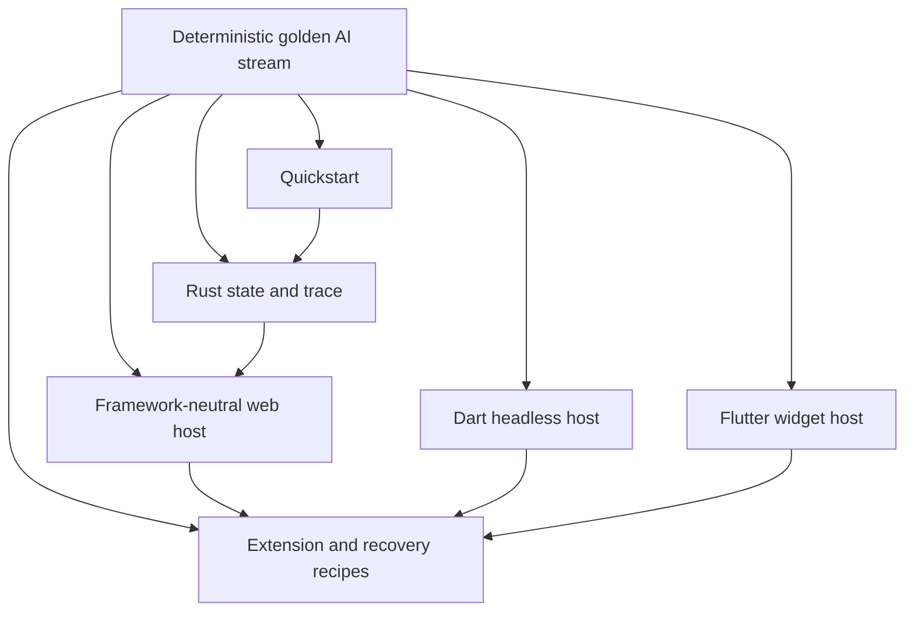
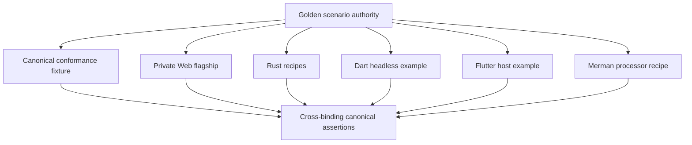
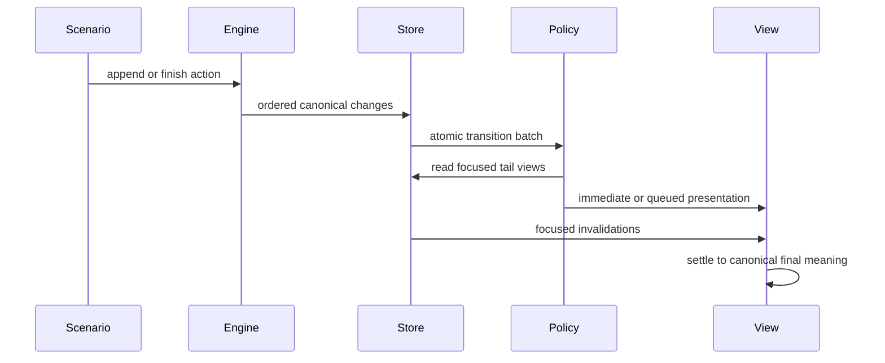
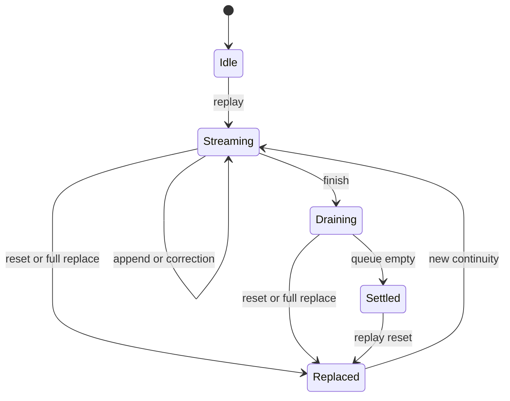

# Example Adoption System - Plan

## Goal Capsule

- **Objective:** Let a new integrator run a representative streaming AI answer within ten minutes, understand mdstream's ownership boundary, and customize one presentation policy without changing mdstream.
- **Product authority:** This Product Contract defines the example and adoption experience. The canonical Content IR and the accepted framework-neutral web and host-transition ADRs remain authoritative for runtime behavior and product boundaries.
- **Execution profile:** Deep cross-surface implementation spanning conformance inputs, Rust examples, a private Web host, Dart and Flutter examples, the standalone Merman lane, documentation, package inventories, and CI.
- **Stop conditions:** Stop if implementation would require a new public runtime schema, a renderer or animation API in a published package, a React dependency, or Merman in the default dependency graph. Surface that conflict instead of widening scope.
- **Open blockers:** None. The execution assumptions below resolve the quickstart, scenario, distribution, and CI questions without changing mdstream's accepted product identity.
- **Tail ownership:** Land reviewable Conventional Commits on the current branch, push the branch after all verification gates pass, and do not open a PR unless requested.

---

## Product Contract

### Summary

Build an adoption-first example system around one deterministic golden AI stream. A short learning ladder will lead from a visible first success to canonical state, host transitions, processors, Merman, recovery, and cross-binding adoption without turning mdstream into a renderer or UI framework.

### Problem Frame

The repository has strong executable contract evidence but a weak first-run story. The root README lists commands without explaining which capability each example teaches, what successful output looks like, or which example should come next.

Rust covers basic streaming, invalidation, processors, custom blocks, transition traces, and Tokio. The strongest TypeScript example is a large machine-oriented CLI probe, Dart has no standalone runnable example, and the Flutter example displays only the native runtime version. Several examples prove behavior through assertions while producing little output a new integrator can inspect.

This forces adopters to reconstruct a learning path from READMEs, tests, and architecture documents before they can see why stable identity, pending source, semantic correction, transition facts, and derived artifacts matter in an AI output host.

### Key Decisions

- **Adoption is the primary outcome.** (session-settled: user-directed — chosen over showcase-first or SDK-parity-first: first-run navigation and understanding are the strongest current pain.) Visual polish supports adoption but does not replace copyable integration code.
- **One golden stream anchors the system.** (session-settled: user-directed — chosen over a recipe-only catalog or a full cross-platform gallery: a shared scenario combines a coherent first experience with lower behavioral drift.) Focused recipes extend the scenario instead of inventing unrelated demos.
- **The golden stream is deterministic and provider-free.** (session-settled: user-approved — chosen over a live AI provider demo: every adopter and CI lane must run it offline without credentials or outbound provider traffic.) Provider connectors may consume the same host boundary later but are not part of the first example system.
- **Presentation remains host-owned.** (session-settled: user-approved — chosen over a first-party animation or rendering package: adopters need customizable effects without expanding mdstream's product identity.) Examples may contain local display policy, but no example policy becomes a public mdstream abstraction.
- **The web flagship remains framework-neutral.** (session-settled: user-directed — chosen over a first-party React package: existing React libraries can consume the headless store without mdstream competing with them.) The flagship demonstrates `@mdstream/core` directly and does not establish a framework-specific rendering contract.

The example system has one content authority and several progressively deeper views of it:



### Actors

- A1. **New integrator:** Evaluates mdstream and needs a fast, observable first success before studying its full protocol model.
- A2. **Host author:** Maps canonical state and transition facts into a UI framework while retaining ownership of rendering, animation, layout, scrolling, and accessibility.
- A3. **Extension author:** Adds custom syntax or a processor and needs to understand typed content, artifact lifecycle, stale-result rejection, and trust boundaries.
- A4. **Maintainer:** Keeps examples correct across schemas, bindings, package releases, and breaking refactors without maintaining duplicate application logic.

### Requirements

**First-run navigation**

- R1. The root documentation must present a recommended learning path beginning with one clearly identified quickstart rather than an unqualified command list.
- R2. The documentation must map each public capability to one primary runnable example and distinguish tutorials, focused recipes, interactive showcases, and machine-oriented contract probes.
- R3. Every user-facing example entry must state its prerequisites, run command, expected observable result, concepts taught, and recommended next example.
- R4. A new integrator must be able to reach a visible streaming result in no more than three documented commands and without credentials, external network services, outbound provider requests, or prior protocol knowledge. A local browser development server is allowed.
- R5. The first-run path must explain the ownership split: mdstream owns canonical state, identity, lifecycle, and factual transitions; the host owns presentation policy.

**Golden AI stream**

- R6. One deterministic input timeline must serve as the shared content authority for the quickstart and cross-binding examples. Focused advanced recipes reuse it when that does not obscure their single teaching concept; a minimal local input must never become a second shared authority.
- R7. The timeline must contain named stages that demonstrate incremental text, incomplete syntax, pending presentation, stabilization, a semantic correction, structured rich content, and a continuity-changing recovery or reset.
- R8. The representative rich content must include ordinary prose plus code, citation, and Mermaid content so typed Content IR and derived artifacts are visible in one coherent answer.
- R9. Every host that consumes the golden timeline must reach the same final canonical content even when it chooses a different presentation policy.
- R10. The scenario must expose deterministic named checkpoints and final canonical expectations so examples fail automatically when behavior drifts; raw transition sequences remain schedule-local and are asserted only for their declared schedule.
- R11. The scenario must remain inspectable and useful without animation, color, or a graphical environment.

**Host adoption examples**

- R12. A framework-neutral browser example must provide the flagship visual adoption path for `@mdstream/core` without React or another framework becoming part of mdstream's public contract.
- R13. The browser example must visibly distinguish fresh append, already-presented pending text, correction, stabilization, structural change, and continuity replacement while reading canonical tail state through supported stores.
- R14. The browser example must let an adopter switch between immediate and paced presentation and demonstrate that both modes preserve identical final content and state meaning.
- R15. The browser example must make stable host keys and lazy focused views observable without requiring users to decode wire payloads, reparse Markdown, retain an old canonical tree, or implement adapter-local reducer logic.
- R16. The browser example must isolate its timing, styling, geometry, and scroll decisions as replaceable host policy so an adopter can change one visible behavior without changing mdstream.
- R17. The Flutter example must become a real `MdstreamController` adoption path that renders the golden stream through stable keys, focused listenables, pending source, and transition batches.
- R18. The Flutter example must keep widget composition and animation controllers local to the example and must not imply that `mdstream_flutter` provides a Markdown widget or renderer.
- R19. Dart must have a standalone runnable headless example that uses the same scenario to demonstrate native runtime setup, state reads, ordered transitions, and explicit lifecycle cleanup without requiring Flutter.
- R20. Rust must retain a minimal engine-and-reducer entry and a deterministic trace entry, with narrative output that connects each observed change to the corresponding host responsibility.
- R21. The Tokio TUI must be positioned as an advanced runtime-host example rather than the universal quickstart and must state which actor, backpressure, scrolling, and lifecycle concepts it adds.

**Extensions, artifacts, and resilience**

- R22. Focused advanced recipes must cover custom blocks, citation processing, generic processor lifecycle, Merman, replica recovery, and stale-result rejection without forcing those concepts into the quickstart.
- R23. The primary Merman recipe must stream normal Markdown through `StreamEngine` before rendering a Mermaid artifact rather than requiring adopters to construct protocol operations manually.
- R24. Every SVG example must keep Merman output opaque until an explicitly named sanitizer or isolated-renderer handoff and must not demonstrate direct markup injection.
- R25. Artifact examples must show that processor output remains outside canonical Content IR and that reset, replacement, or request-generation changes reject late results.
- R26. Recovery examples must distinguish same-floor recovery from advanced full replacement and show when continuity-qualified host keys may be retained or must be discarded.
- R27. Resource-limit examples must fail predictably and explain that retention limits and cooperative cancellation are not CPU or peak-memory isolation.

**Maintenance and truthfulness**

- R28. Existing examples whose names imply a real framework integration must either exercise that framework or be relabeled so their actual headless responsibility is unambiguous.
- R29. Large adoption probes and assertion-heavy traces must remain executable verification assets but must not be presented as the first tutorial users should copy.
- R30. Focused recipes must add one primary concept at a time and reuse the golden scenario where doing so does not obscure that concept.
- R31. Example-only presentation code must not enter publishable core, protocol, binding, or processor package APIs or default dependency graphs.
- R32. Every documented command and user-facing example must run in CI on its supported lane, and deterministic examples must provide a non-interactive assertion or smoke mode.
- R33. Example navigation and package READMEs must stay consistent with the root capability matrix and must not advertise removed, draft, or framework-specific product promises.
- R34. Immediate and animated presentation must communicate corrections, removals, and replacements through content or state semantics rather than motion or color alone.

### Key Flows

- F1. First successful stream
  - **Trigger:** A1 opens the repository or package documentation with no mdstream protocol knowledge.
  - **Actors:** A1
  - **Steps:** Select the quickstart, run the documented commands, watch the golden answer stream, inspect the final state, and follow the next-example link.
  - **Outcome:** A1 sees a correct streaming result and can explain which state belongs to mdstream and which behavior belongs to the host.
  - **Covered by:** R1-R11, R20.
- F2. Customize presentation
  - **Trigger:** A2 wants a product-specific reveal or correction effect.
  - **Actors:** A2
  - **Steps:** Run the browser flagship, switch immediate and paced modes, change one host presentation policy, and compare canonical final state.
  - **Outcome:** The visible behavior changes while canonical content and mdstream APIs remain unchanged.
  - **Covered by:** R12-R16, R34.
- F3. Adopt a foreign binding
  - **Trigger:** A2 targets Dart or Flutter rather than Rust or browser JavaScript.
  - **Actors:** A2
  - **Steps:** Run the binding-native example, observe the same golden milestones, bind stable identities to host state, and close or dispose the session.
  - **Outcome:** The host reaches the same final content through the binding's idiomatic state primitive.
  - **Covered by:** R6-R11, R17-R19.
- F4. Add rich-content processing
  - **Trigger:** A3 needs citation or Mermaid output.
  - **Actors:** A3
  - **Steps:** Follow a focused processor recipe, observe request and artifact identity, complete or supersede work, and cross the explicit display trust boundary.
  - **Outcome:** A versioned artifact is displayed or rejected without mutating canonical state.
  - **Covered by:** R22-R25, R27.
- F5. Recover host continuity
  - **Trigger:** A2 observes a gap, fork, reset, or advanced snapshot.
  - **Actors:** A2
  - **Steps:** Run the recovery recipe, compare same-floor and replacement outcomes, and retain or clear host presentation identity accordingly.
  - **Outcome:** Canonical state resumes without reusing invalid animation or processor identity.
  - **Covered by:** R26, R32.

### Acceptance Examples

- AE1. **Covers R1-R5.** Given a fresh checkout and no credentials, when a new integrator follows the primary quickstart, then a visible streaming answer completes in no more than three documented commands and the page points to the next learning step.
- AE2. **Covers R6-R11.** Given two supported hosts consume the golden timeline with different legal chunk or presentation schedules, when both finish, then their normalized final content and schedule-independent named checkpoints agree while their raw transition sequences may differ.
- AE3. **Covers R12-R16.** Given pending text has already been painted, when typed projection catches up and later appends fresh text, then the browser host does not reveal the pending bytes twice and may pace only the fresh delta.
- AE4. **Covers R13-R16, R34.** Given a late definition corrects existing content, when the correction facts arrive, then the host replaces the affected tail view and communicates the change meaningfully in both immediate and paced modes.
- AE5. **Covers R14, R34.** Given immediate and paced modes consume the same operation batches, when all queued presentation work settles, then displayed content, canonical digest, lifecycle, and accessibility meaning are equal.
- AE6. **Covers R17-R19.** Given Dart and Flutter run the same scenario, when their sessions finish, then both expose the expected stable identities, transition ordering, final content, and explicit cleanup behavior through their native APIs.
- AE7. **Covers R22-R25.** Given Mermaid source changes from A to B to A while render work overlaps, when results complete out of order, then only the current generation artifact is accepted and SVG remains opaque until the named trust handoff.
- AE8. **Covers R26.** Given one same-floor recovery and one advanced replacement, when a host updates its keyed state, then it retains identity for the former and clears prior continuity for the latter.
- AE9. **Covers R28-R33.** Given an adopter selects a capability from the root matrix, when they run its primary example, then the command, observed output, example label, package README, and CI smoke describe the same supported contract.

### Success Criteria

- A new integrator can reach the visible flagship result through a documented path of no more than three commands and can identify a next example without searching tests or plans.
- An adopter can change one fresh-text presentation policy in host code while all canonical and immediate-mode assertions remain unchanged.
- Every public capability named in the root documentation has one primary runnable example, and every example has one declared teaching role.
- The golden scenario produces equivalent final state and named semantic milestones across every binding that claims scenario coverage.
- CI executes every documented command or an equivalent non-interactive smoke mode on the platform lane that can support it.
- Published mdstream packages remain free of React, renderer, animation, provider, and example-only presentation dependencies.

### Scope Boundaries

**Deferred for later**

- Hosted public demo deployment, recorded videos, and polished marketing media.
- Full real-framework GPUI or egui applications beyond truthful headless integration recipes.
- Additional UI-framework showcases after the framework-neutral browser and Flutter adoption paths prove the contract.
- Provider-specific token-stream connectors and tool-call demonstrations.

**Outside this product's identity**

- A first-party Markdown renderer, React package, Flutter Markdown widget, theme system, animation library, or layout engine.
- Pixel-identical behavior across browser, Flutter, TUI, GPUI, and egui hosts.
- Network access, API-key management, AI provider message schemas, persistence, or chat-product state inside the golden example authority.
- Treating example timing, colors, geometry, scrolling, sanitization, or accessibility choices as canonical mdstream policy.

### Dependencies and Assumptions

- The final `mdstream.content/0.4`, binding/options schemas, and `mdstream.transitions/1` remain the shared behavioral authority.
- `@mdstream/core` can support a local browser adoption host without adding a framework dependency to its published package graph.
- `mdstream_flutter` continues to provide turnkey native loading while widget rendering remains example-owned.
- `mdstream-merman` remains a standalone Rust 1.95 package and does not enter default core or binding dependencies.
- Supported CI lanes can exercise platform-specific examples; unsupported local platforms may use compile or contract smoke evidence rather than pretending to run unavailable UI stacks.

### Outstanding Questions

**Resolved by the Planning Contract**

- Use a compact, versioned, repository-only JSON scenario with one hand-edited authority and generated package-local copies.
- Keep the browser flagship in a private Vite/Playwright workspace that consumes the public `@mdstream/core` surface without publishing its host code.
- Retain focused probes, remove the misleading egui adapter, rename the GPUI-shaped example by its processor responsibility, and keep Tokio as an advanced host.
- Check in deterministic semantic expectations and named checkpoints; use screenshots only as responsive-layout diagnostics, never as canonical behavior oracles.

No product or implementation blocker remains open.

### Sources and Research

- `README.md:111` for the current unqualified example command list.
- `mdstream/examples/` and `mdstream-tokio/examples/agent_tui.rs` for the current Rust learning surface.
- `bindings/typescript/examples/transition-host.mjs` and `bindings/typescript/README.md:95` for the current command-line web adoption probe.
- `bindings/dart/README.md:39` and `bindings/flutter/example/lib/main.dart:3` for the current binding-entry gaps.
- `mdstream-merman/examples/render_change.rs:6` for the current manual Content IR construction path.
- `docs/ADR_0004_FRAMEWORK_NEUTRAL_WEB_BINDINGS.md` and `docs/ADR_0005_HOST_TRANSITION_FACTS.md` for the accepted React, renderer, animation, and host-policy boundaries.
- `docs/plans/2026-07-19-001-refactor-host-transition-extension-contract-plan.md` for the transition adoption and extension constraints this example system must preserve.

---

## Planning Contract

### Product Contract Preservation

Planning and headless review clarified the Product Contract without changing its accepted identity: R4 distinguishes forbidden external services from an allowed localhost development server; R6 limits exclusivity to the shared cross-binding authority; R10 and AE2 separate final/checkpoint invariants from schedule-local observations; AE4 uses the declared `paced` mode name. Provider-free and host-owned boundaries are unchanged.

### Key Technical Decisions

- KTD1. **Keep every published runtime surface headless.** (session-settled: user-directed — chosen over a first-party React or renderer package: mature UI libraries already serve framework rendering, while mdstream's differentiator is canonical streaming state.) Example-only widgets, DOM mapping, styling, and animation policy remain outside exported package APIs and default dependency graphs.
- KTD2. **Use one Golden AI Stream as the adoption authority.** (session-settled: user-directed — chosen over unrelated per-language recipes or a full framework gallery: one scenario makes cross-binding drift observable while preserving a coherent learning path.) Focused recipes extend that authority instead of creating competing examples.
- KTD3. **Keep the Golden AI Stream deterministic and provider-free.** (session-settled: user-approved — chosen over a live provider integration: offline replay must work in CI and without credentials, provider schemas, or outbound provider traffic.)
- KTD4. **Keep presentation policy in each host example.** (session-settled: user-approved — chosen over a shared animation abstraction: timing, color, layout, scrolling, reduced motion, and accessibility policy belong to the consuming product.) mdstream supplies canonical state and transition facts only.
- KTD5. **Make the browser flagship framework-neutral.** (session-settled: user-directed — chosen over a first-party React example: the example should prove the complete Web state boundary without making one framework part of the product contract.)

### Assumptions

These plan-time choices were not separately confirmed because the user requested planning followed immediately by implementation. They remain visible so implementation or review can challenge them without silently changing product scope.

- The example authority is a compact, versioned repository-only scenario schema. It does not widen `mdstream.conformance/0.4` or any published runtime protocol.
- The authority contains a `mainline` episode for first success and a `recovery` episode for gap, same-floor recovery, advanced replacement, and reset. Both reuse one content source and named checkpoints without requiring every introductory host to implement replication.
- The Rust `minimal --assert` example is the primary first-success quickstart on a reference macOS or Linux workstation with Rust installed. The browser is the primary visual second step and documents its additional Node, pnpm, WASM target, `wasm-pack`, `wasm-tools`, and Chromium prerequisites.
- The browser lives in a private pnpm workspace with example-only Vite and Playwright dependencies. It consumes `@mdstream/core` through the workspace package and publishes none of its host code.
- Switching immediate and paced modes cancels host work, closes the current engine/store, creates a fresh session, and replays deterministically. Public `engine.reset()` remains reserved for the explicit continuity-replacement episode.
- Cargo, Dart, Flutter, and Merman examples ship in their conventional package archives. The browser application remains repository-only, while `@mdstream/core` keeps its existing package inventory and framework-neutral snippets.
- The published Dart example accepts only `--library` or the existing native-library environment variables. Repository CI may read metadata written by `tool/build_native.dart` and pass the resulting path explicitly; compatibility validation does not authenticate native executable code.
- CI invokes the same example entrypoints documented for users with deterministic `--assert`, `--smoke`, or Playwright modes. Compile-only checks remain supplementary evidence, not the sole proof that an example works.

### High-Level Technical Design

The compact scenario is the human-readable source of example actions and named observations. The existing conformance fixture remains the exact protocol oracle and is regenerated from the scenario mainline. Package-local scenario copies are generated artifacts guarded by byte-for-byte checks.



Mainline playback separates canonical mutation from presentation scheduling. Transition subscribers read coherent tail state before focused/root invalidations; the host may delay presentation without delaying or rewriting canonical state.



Presentation state is local to a host. Reset or advanced recovery clears queued work and continuity-qualified keys; same-floor recovery preserves them.



### Output Structure

```text
examples/
  fixtures/
    golden-ai-stream.json
    golden-ai-stream.schema.json
  web/
    package.json
    index.html
    src/
    tests/
bindings/dart/example/
bindings/flutter/example/
mdstream/examples/
mdstream-merman/examples/
docs/EXAMPLES.md
```

The per-package fixture copies live below these example directories and are generated from `examples/fixtures/golden-ai-stream.json`.

### Sequencing

U1 establishes the scenario authority and drift checks. U2 and U3 can then build the Rust and Web learning paths independently. U4, U5, and U6 add the remaining binding and processor examples against the same scenario. U7 lands navigation, package inventory enforcement, and CI only after every documented entrypoint exists.

### System-Wide Impact

- **Public APIs:** No new runtime API is planned. Existing Content IR, focused views, transition facts, processor leases, and recovery calls are exercised as-is.
- **Dependency topology:** Vite and Playwright are private Web-example dependencies. Merman remains isolated on Rust 1.95, and no example dependency enters a published core package graph.
- **Packaging:** Cargo/Dart/Flutter/Merman archives gain example files and compact fixtures. Package budgets and inventory checks must account for these additions without weakening forbidden-path or native-binary rules.
- **CI:** Each toolchain lane gains a runtime example gate and keeps its existing protocol, package, budget, and architecture tests.
- **Documentation:** The root capability matrix becomes the navigation authority; package READMEs link into the same learning ladder rather than maintaining competing catalogs.

### Risks and Mitigations

- **Scenario drift:** Generated package copies could diverge. A single sync command and a byte-exact check fail before language-specific tests run.
- **Conformance confusion:** A readable example schema could be mistaken for a runtime protocol. Its schema name, location, docs, and tests explicitly mark it repository-only; exact protocol truth stays in `mdstream.conformance/0.4`.
- **Example renderer creep:** Useful DOM or Flutter code could migrate into package APIs. Architecture tests scan published source and dependency manifests, while docs call the renderer example-owned.
- **Paced-mode semantic drift:** Queued presentation could duplicate pending bytes or survive replacement. Pure policy tests and browser assertions compare settled display meaning with immediate mode and force queue/key invalidation on continuity changes.
- **Merman trust leakage:** SVG could be mounted as trusted markup. The recipe terminates at a named sanitizer or isolated-renderer handoff and tests that artifacts never enter canonical snapshots or unrestricted DOM sinks.
- **False CI confidence:** Build-only gates can miss broken commands. CI runs the documented entrypoint or its explicit assertion mode and verifies packaged example inventories separately.

---

## Implementation Units

### U1. Establish the Golden Scenario Authority

- **Goal:** Create one compact, readable scenario authority with mainline and recovery episodes, derive the existing adoption conformance oracle from it, and prevent distributed copies from drifting.
- **Requirements:** R6-R11, R30-R32; F1, F5; AE2, AE8, AE9; KTD2, KTD3.
- **Dependencies:** None.
- **Files:** `examples/fixtures/golden-ai-stream.json`, `examples/fixtures/golden-ai-stream.schema.json`, `scripts/sync-example-fixtures.py`, `scripts/test_sync_example_fixtures.py`, `mdstream/examples/fixtures/golden-ai-stream.json`, `mdstream-merman/examples/fixtures/golden-ai-stream.json`, `bindings/dart/example/fixtures/golden_ai_stream.json`, `bindings/flutter/example/assets/golden_ai_stream.json`, `mdstream/tests/adoption_rust.rs`, `conformance/fixtures/adoption/headless-rich-content.json`, `mdstream-conformance/tests/protocol_fixtures.rs`.
- **Approach:** Keep action order, chunks, episode boundaries, and named semantic observations in the compact scenario. Mainline actions discriminate `append`, `finish`, and `checkpoint`; recovery actions identify producer or replica targets, reference generated change ordinals and named snapshots, and declare the expected continuity disposition without embedding wire payloads. Exclude timing, colors, framework state, provider envelopes, wire payloads, and SVG bytes. Regenerate the canonical protocol fixture from the mainline source and schedules, while a Python sync/check layer maintains exact package-local copies.
- **Patterns to follow:** `mdstream/tests/adoption_rust.rs` fixture generation, `mdstream-conformance/src/fixture.rs` frozen-schema validation, `scripts/verify-packages.py` deterministic verifier errors, and `scripts/test_verify_packages.py` negative-contract tests.
- **Test scenarios:**
  - Covers AE2. Whole-source, stage-aligned, and adversarial schedules reach the same normalized final snapshot. Source-cursor-anchored checkpoints agree between schedules that preserve those semantic stage boundaries; pending, provisional, correction, and raw transition observations remain explicitly schedule-local otherwise.
  - An incomplete inline construct and an incomplete fenced block expose pending/provisional observations before later actions stabilize them.
  - A late citation definition produces a named semantic-correction checkpoint without changing unrelated stable identity.
  - The recovery episode distinguishes same-floor recovery from advanced replacement and includes a reset/new-epoch observation.
  - Missing, duplicated, reordered, unknown, or malformed action/checkpoint fields fail schema and semantic validation with deterministic diagnostics.
  - Every generated copy is byte-identical to the authority; `--check` fails on one changed byte and never rewrites files.
- **Verification:** The compact scenario validates, all copies match, the regenerated conformance fixture is stable, and existing Rust/TypeScript/Dart/Flutter/Merman adoption tests still accept the oracle.

### U2. Build the Rust Learning Ladder and Truthful Recipes

- **Goal:** Turn Rust examples into a narrative first layer plus focused identity, processor, recovery, transition, and Tokio runtime recipes whose names match what they actually execute.
- **Requirements:** R1-R5, R20-R22, R26, R28-R32; F1, F4, F5; AE1, AE8, AE9; KTD1, KTD2.
- **Dependencies:** U1.
- **Files:** `mdstream/examples/minimal.rs`, `mdstream/examples/headless_state.rs`, `mdstream/examples/transition_trace.rs`, `mdstream/examples/custom_blocks.rs`, `mdstream/examples/egui_adapter.rs` (delete), `mdstream/examples/gpui_adapter.rs` (replace with `mdstream/examples/processor_lifecycle.rs`), `mdstream/examples/replica_recovery.rs`, `mdstream/examples/README.md`, `mdstream/tests/adoption_rust.rs`, `mdstream/tests/example_recipes.rs`, `mdstream-tokio/examples/agent_tui.rs`, `mdstream-tokio/tests/actor.rs`.
- **Approach:** Make `minimal` the concise narrative engine/reducer entry. Merge the misleading egui dirty-ID sketch into the headless state recipe, relabel the GPUI-shaped artifact example by its actual processor lifecycle, and add an executable replica recovery recipe. Keep `transition_trace` machine-readable and position the Ratatui app as an advanced actor/backpressure host with a non-interactive smoke path.
- **Patterns to follow:** Existing `apply` helpers in Rust examples, `mdstream/tests/adoption_rust.rs`, `mdstream-conformance/src/transition.rs`, and `mdstream-merman/tests/adoption_rust.rs` recovery assertions.
- **Test scenarios:**
  - Covers AE1. `minimal --assert` replays the mainline, prints named observations and a final success marker, and reaches the expected finalized source.
  - Stable node IDs survive append/stabilization while only changed/removed identities are reported to the host cache.
  - Processor output remains outside the canonical snapshot, and a reset makes a late result stale.
  - Covers AE8. The recovery recipe retains identity on same-floor recovery and clears continuity-qualified host state on advanced replacement.
  - Transition trace remains deterministic for a fixed schedule and shows schedule-local work without claiming identical fact sequences across schedules.
  - Tokio `--smoke` uses the same actor path without terminal control and terminates with finalized content and bounded-channel counters.
- **Verification:** Every Rust example compiles on its owning MSRV lane, user-facing examples execute in assertion mode, misleading framework names are absent from active documentation, and no UI framework dependency enters the core workspace.

### U3. Implement the Framework-Neutral Web Flagship

- **Goal:** Provide the primary visual adoption step after the Rust quickstart: a real browser host for `@mdstream/core` that replays the Golden AI Stream, exposes canonical/focused state, and demonstrates replaceable immediate and paced presentation policies.
- **Requirements:** R2-R16, R29-R34; F2; AE2-AE5, AE9; KTD1-KTD5.
- **Dependencies:** U1.
- **Files:** `pnpm-workspace.yaml`, `package.json`, `pnpm-lock.yaml`, `examples/web/package.json`, `examples/web/tsconfig.json`, `examples/web/index.html`, `examples/web/src/main.ts`, `examples/web/src/scenario.ts`, `examples/web/src/host-state.ts`, `examples/web/src/host-policy.ts`, `examples/web/src/url-policy.ts`, `examples/web/src/content-ir-view.ts`, `examples/web/src/styles.css`, `examples/web/tests/host-policy.test.ts`, `examples/web/tests/golden-stream.spec.ts`, `examples/web/playwright.config.ts`, `examples/web/README.md`, `bindings/typescript/tests/architecture.test.ts`.
- **Approach:** Add a private workspace that imports only the published `@mdstream/core` surface. Render typed node/resource views with stable continuity-qualified DOM keys and focused subscriptions; never reparse Markdown or use unrestricted `innerHTML`. Route citation destinations through an example-local `https`/`http` allowlist with inert-text fallback and safe external-link attributes. Keep the presentation queue, pending-range accounting, colors, timing, layout, scrolling, and reduced-motion behavior in example-local host policy. A mode change cancels the queue, closes the session, creates a fresh session, and replays the same scenario.
- **Interaction design:** Use an answer-first hierarchy: replay/mode/lifecycle controls, streamed answer, then a secondary expandable identity/lazy-view inspector. Cover `booting`, `ready-empty`, `streaming`, `draining`, `settled`, interrupted replay, and recoverable initialization/scenario errors with explicit control availability, retry, and reset behavior. Wide screens use answer and inspector regions; narrow screens place the inspector after the answer, wrap controls, and keep code scrolling local.
- **Accessibility:** Use native controls with logical keyboard focus and visible focus. Send lifecycle, correction, and replacement messages to one polite atomic status region; never announce token-by-token streamed text. Reduced motion settles paced work immediately.
- **Execution note:** Establish policy and host-state tests before browser styling. The clean-checkout preparation path builds `@mdstream/core` and its WebAssembly artifacts before consumer checks, and Playwright installs its pinned Chromium before desktop/mobile screenshots and interaction assertions.
- **Patterns to follow:** `bindings/typescript/examples/transition-host.mjs` for pending interval accounting, immediate/paced parity, full-replace cleanup, and lazy-view metrics; `bindings/typescript/tests/adoption.test.ts` for canonical fixture replay; ADR 0004 and ADR 0005 for ownership boundaries.
- **Test scenarios:**
  - Covers AE3. Pending bytes already painted are removed atomically when projection catches up and are never paced or displayed twice.
  - Fresh projection appends may be paced, while replacement, correction, stabilization, structure, removal, and full replacement receive distinct semantic states.
  - Covers AE4. A late citation definition updates the affected content and a persistent textual status log communicates correction in immediate, paced, and reduced-motion modes.
  - Covers AE5. After the paced queue drains, immediate and paced fresh sessions have equal visible text, canonical digest, lifecycle, stable keys, and accessibility labels.
  - Full replacement cancels queued work, clears prior continuity keys, and renders only the replacement epoch; same-floor recovery preserves eligible keys.
  - Root, node, resource, pending, and artifact views are materialized on demand, and unrelated node updates do not rebuild the full answer.
  - Failed WASM initialization, invalid scenario input, and interrupted replay expose a usable retry path; successful retry reaches the same final state.
  - Keyboard-only Playwright runs cover replay, mode, inspector, focus order, focus visibility, one polite status region, and reduced-motion precedence without token-level announcements.
  - `javascript:`, `data:`, and malformed citation destinations render as inert text and never become executable DOM attributes.
  - Desktop and mobile Playwright runs show a nonblank answer-first layout, readable secondary inspector, wrapped controls, locally scrolling code, no page overflow or overlap, and no console errors.
- **Verification:** A documented source-checkout path prepares generated Web artifacts and starts the browser app without credentials, external services, or outbound requests. Playwright provisions pinned Chromium and proves state recovery, accessibility, both policies, and responsive layouts; package-boundary tests show no example dependency or renderer code leaked into `@mdstream/core`.

### U4. Add a Standalone Dart Headless Example

- **Goal:** Give Dart users a runnable, publishable example that opens an explicit native runtime, replays the Golden AI Stream, reads focused state and transitions, and closes every native handle.
- **Requirements:** R3, R6-R11, R19, R29-R33; F3; AE2, AE6, AE9; KTD1-KTD4.
- **Dependencies:** U1.
- **Files:** `bindings/dart/example/golden_stream.dart`, `bindings/dart/example/fixtures/golden_ai_stream.json`, `bindings/dart/test/example_adoption_test.dart`, `bindings/dart/README.md`, `bindings/dart/.pubignore`, `scripts/verify-packages.py`, `scripts/test_verify_packages.py`.
- **Approach:** Accept `--library` first, then existing native-library environment variables; never discover a library from ambient repository metadata inside the published example. Repository-only tooling may resolve freshly generated metadata and pass that path explicitly. Document every accepted path as trusted executable code and ABI/schema checks as compatibility checks, not authenticity checks. Replay the same mainline with transition capture, print stable IDs, pending source, ordered transition categories, and final lifecycle, and use `try/finally` for engine cleanup.
- **Patterns to follow:** `bindings/dart/tool/build_native.dart`, `bindings/dart/test/support/native_library.dart`, `bindings/dart/test/golden_test.dart`, and the explicit `close()` patterns in `bindings/dart/README.md`.
- **Test scenarios:**
  - Covers AE6. An explicit `--library` path and the documented environment variable both open a compatible trusted runtime and reach the expected final source, IDs, lifecycle, and named checkpoints.
  - Missing library input produces a concise usage failure before creating a session; incompatible binding schemas preserve the existing structured error.
  - Pending source and transition facts are read only when requested and appear in their wire order.
  - Assertion mode compares final canonical state with the scenario and exits nonzero on drift.
  - Engine cleanup is idempotent, and native allocation metrics return to zero on success and structured failure.
  - The actual Dart package archive contains the example and fixture but no native binary, test directory, repository build helper, or forbidden framework dependency.
- **Verification:** `dart analyze`, native tests, the documented example command, and exact-archive inventory verification pass on the Dart lane.

### U5. Turn the Flutter Sample into a Real Host

- **Goal:** Replace the runtime-version screen with an example-owned Flutter host that uses `MdstreamController`, stable keys, focused listenables, pending source, and transition batches without exporting a Markdown widget.
- **Requirements:** R3, R6-R11, R17-R18, R29-R34; F2, F3; AE3-AE6, AE9; KTD1-KTD5.
- **Dependencies:** U1.
- **Files:** `bindings/flutter/example/lib/main.dart`, `bindings/flutter/example/lib/bootstrap.dart`, `bindings/flutter/example/lib/golden_stream_host.dart`, `bindings/flutter/example/lib/content_ir_view.dart`, `bindings/flutter/example/assets/golden_ai_stream.json`, `bindings/flutter/example/pubspec.yaml`, `bindings/flutter/example/test/golden_stream_test.dart`, `bindings/flutter/example/integration_test/golden_stream_smoke_test.dart`, `bindings/flutter/test/example_architecture_test.dart`, `bindings/flutter/integration_test/native_load_test.dart`, `bindings/flutter/README.md`, `bindings/flutter/.pubignore`, `scripts/verify-packages.py`, `scripts/test_verify_packages.py`.
- **Approach:** Share one example-local bootstrap between `main.dart` and the supported-platform integration smoke: open the native runtime, load the asset, create the controller, start playback, and expose the final checkpoint. Build root order from the controller, node widgets from `controller.node(id)`, keys from `controller.nodeKey(id)`, and pending/transition indicators from their focused listenables. Render typed prose, code, citation, and Mermaid source as local widgets; do not bundle Merman or inject SVG. Keep controller and clock injection available to tests without exporting anything from package `lib/`.
- **Interaction design:** Keep replay/mode/lifecycle controls and the streamed answer primary; diagnostics follow as a secondary section on phones and may sit beside the answer on wide layouts. Cover booting, ready-empty, streaming, draining, settled, interrupted replay, native/asset errors, and retry using native semantics, logical focus, and visible focus.
- **Execution note:** Prove focused rebuild and disposal behavior with widget tests before adding example-local motion and visual polish.
- **Patterns to follow:** `bindings/flutter/test/controller_test.dart`, `bindings/flutter/test/recovery_test.dart`, `bindings/flutter/test/artifacts_test.dart`, and the package's `ValueListenableBuilder`-compatible focused surfaces.
- **Test scenarios:**
  - Covers AE6. The real controller replays the mainline and the widget tree reaches the same expected final source, stable identities, lifecycle, and named checkpoints as Dart.
  - Unrelated node updates do not rebuild a focused node widget; stabilization retains its `MdstreamNodeKey`.
  - Pending source is shown once and disappears as typed projection catches up without duplicating text.
  - Immediate and paced local policies settle to the same visible text and semantic labels; reduced-motion settles paced work immediately.
  - Semantics and focus tests cover replay, mode, correction/replacement status, and retry without token-level announcements.
  - Phone and wide widget tests preserve answer-first ordering, wrapped controls, and local code scrolling without overflow.
  - The supported-platform integration smoke invokes the same bootstrap as `main.dart` and reaches the final named checkpoint through real asset loading and controller creation.
  - Controller, timer, subscriptions, animation controllers, and processor registrations dispose without a late callback or native allocation leak.
  - The published Flutter archive includes the example source and scenario asset, while `lib/` remains free of widgets, render policy, Merman, and parser dependencies.
- **Verification:** Flutter analyze, controller tests, example widget tests, supported-platform native smoke, and exact-archive inventory checks all pass.

### U6. Complete the Merman and Processor Recipes

- **Goal:** Make the primary Merman example follow the normal Markdown engine path and demonstrate artifact identity, trust handoff, limits, cancellation, and stale-result rejection without manual protocol construction.
- **Requirements:** R8, R22-R25, R27, R30-R32; F4; AE7, AE9; KTD1-KTD4.
- **Dependencies:** U1, U2.
- **Files:** `mdstream-merman/Cargo.toml`, `mdstream-merman/examples/render_change.rs` (delete), `mdstream-merman/examples/render_golden.rs`, `mdstream-merman/examples/fixtures/golden-ai-stream.json`, `mdstream-merman/tests/adoption_rust.rs`, `mdstream-merman/tests/mermaid_processor.rs`, `mdstream-merman/tests/resource_limits.rs`, `mdstream-merman/README.md`, `docs/EXTENSIONS.md`.
- **Approach:** Add the repository-pinned `serde_json` version as a dev-only dependency for the packaged fixture loader. Replay the scenario through `StreamEngine -> Reducer -> ArtifactHost`, find the typed Mermaid node, invoke `MermaidProcessor`, and print artifact key/protocol/media type before ending at a named sanitize-or-isolate handoff. Use deterministic request generations for A-to-B-to-A stale-result coverage; retain current resource-limit tests and document that limits and cooperative cancellation are not process isolation.
- **Patterns to follow:** `mdstream-merman/tests/adoption_rust.rs` for the real engine path, `mdstream-merman/tests/mermaid_processor.rs` for artifact identity, and `mdstream-merman/tests/resource_limits.rs` for model/output boundaries.
- **Test scenarios:**
  - Covers AE7. Streaming the golden mainline produces a typed stable Mermaid node and a keyed `image/svg+xml` artifact without changing canonical state.
  - The example never constructs `ContentNode`, `ProjectionOp`, or `ChangeSet` manually and never emits SVG into an unrestricted HTML sink.
  - A-to-B-to-A overlapping requests accept only the current generation; late completions become stale and cannot replace the active artifact.
  - Source, model, label, edge, output, and artifact-retention limits fail with their documented structured codes.
  - Reset and advanced recovery remove old artifacts and cancel or reject old generations; same-floor recovery retains eligible work.
  - The default workspace dependency graph remains Merman-free, and the standalone package stays on its Rust 1.95 lane.
- **Verification:** The standalone example executes in assertion mode, all Merman tests pass on Rust 1.95, package inventory contains the recipe/fixture, and the negative dependency-graph check remains green.

### U7. Publish the Learning Path and Enforce Every Entry

- **Goal:** Make the example catalog discoverable, truthful, and continuously executable across source checkouts and package archives.
- **Requirements:** R1-R5, R21, R28-R34; F1-F5; AE1, AE9; KTD1-KTD5.
- **Dependencies:** U1-U6.
- **Files:** `README.md`, `docs/EXAMPLES.md`, `docs/USAGE.md`, `docs/ADAPTERS.md`, `bindings/typescript/README.md`, `bindings/dart/README.md`, `bindings/flutter/README.md`, `mdstream-merman/README.md`, `mdstream-tokio/README.md`, `.github/workflows/ci.yml`, `.github/workflows/flutter-platforms.yml`, `scripts/verify-packages.py`, `scripts/test_verify_packages.py`, `bindings/budgets.json`.
- **Approach:** Put one compact capability-to-example matrix and the Rust `minimal --assert` first-success quickstart in the root README, then link directly to the browser as the primary visual customization step. Put prerequisites, exact command, expected observation, concepts, teaching role, source-tree/package availability, and next example in `docs/EXAMPLES.md`; registry-facing package READMEs use repository URLs that also resolve outside a checkout. Add assertion/runtime gates to each owning CI lane and make the static package verifier require those gates and packaged example inventories.
- **Patterns to follow:** The existing package/workflow contract map in `scripts/verify-packages.py`, exact-archive verification, root documentation link checks, and toolchain-specific CI jobs.
- **Test scenarios:**
  - Covers AE1. A reader reaches the Rust `minimal --assert` quickstart from the root README, runs one command after prerequisites, observes the success marker, and sees the browser as the next visual adoption step.
  - Covers AE9. Every capability matrix row names one primary runnable example whose path, command, expected output, README link, and CI marker all exist.
  - Tutorials, focused recipes, interactive showcases, and machine probes are labeled distinctly; the transition CLI and assertion-heavy tests are not presented as starter code.
  - Removing or misspelling one documented path, workflow marker, packaged example file, or next-step link makes a verifier test fail.
  - Package budgets remain under their ceilings after example additions, and forbidden dependencies/paths remain rejected.
  - Documentation never promises React, a renderer, a Flutter Markdown widget, bundled Merman, provider integration, or cross-host pixel identity.
- **Verification:** Static contract verification, documentation link/path checks, every toolchain CI lane, package archive verification, and artifact budget checks pass with the final catalog.

---

## Verification Contract

| Gate | Command | Proves | Units |
|---|---|---|---|
| Scenario authority | `python3 scripts/sync-example-fixtures.py --check` | Schema validity and byte-identical distributed copies | U1-U6 |
| Verifier contracts | `python3 -m unittest scripts/test_sync_example_fixtures.py scripts/test_verify_packages.py` | Drift, inventory, and workflow failures are detected | U1, U4-U7 |
| Core MSRV | `cargo +1.85.0 nextest run -p mdstream-conformance -p mdstream-protocol -p mdstream-processors -p mdstream --all-features` | Scenario-derived oracle, core recipes, identity, correction, and recovery | U1, U2 |
| Rust example runtime | `cargo +1.85.0 run -p mdstream --example minimal -- --assert` and focused recipe assertion modes | Documented Rust entries execute, not only compile | U2 |
| Workspace runtime | `cargo +1.88.0 nextest run --workspace --all-features` and Tokio smoke mode | Shared crates and actor host remain valid | U1, U2, U7 |
| Web | `pnpm web:prepare && pnpm -r typecheck && pnpm -r test && pnpm -r build` | Clean-checkout core/WASM preparation, private Web host, policy parity, package boundary, and production build | U3, U7 |
| Browser behavior | `pnpm --filter @mdstream/example-web exec playwright install --with-deps chromium` followed by `pnpm --filter @mdstream/example-web test:e2e` | Pinned Chromium plus real desktop/mobile replay, controls, accessibility, layout, screenshots, and console health | U3 |
| Dart | `dart run tool/test_native.dart` followed by the example assertion mode | Native transport, headless example, final parity, and cleanup | U4 |
| Flutter | `flutter analyze && flutter test` plus the example widget and supported-platform integration smoke targets | Real bootstrap/asset/controller startup, focused widgets, presentation parity, and disposal | U5 |
| Merman | `cargo +1.95.0 nextest run --manifest-path mdstream-merman/Cargo.toml --all-features` plus the example assertion mode | Real rendering, stale results, limits, trust boundary, and isolation | U6 |
| Package contracts | `python3 scripts/verify-packages.py --phase static` and ecosystem-local exact-archive checks | Examples ship where promised without dependency or budget leakage | U4-U7 |
| Final quality | `cargo fmt --all -- --check`, standalone Merman fmt, Clippy with warnings denied, and `git diff --check` | Formatting, lint, and patch hygiene | U1-U7 |

Browser screenshots are diagnostic evidence, not a semantic oracle. The semantic exit gate is equality of settled visible text, canonical digest/state, lifecycle, continuity behavior, and accessible correction/replacement status across immediate and paced policies.

---

## Definition of Done

- The Rust `minimal --assert` quickstart produces the documented first-success marker in one command, and its next step leads directly to the browser flagship.
- The browser flagship prepares from a clean checkout, displays a deterministic streaming AI answer, exposes immediate and paced host policies, and reaches the same final meaning in both modes.
- The Golden scenario is the only hand-edited shared cross-binding timeline. Every package-local copy is generated, checked, and tied to the existing canonical conformance oracle; a focused recipe may use a minimal local input only when it does not become a second shared authority.
- Rust, Web, Dart, Flutter, Tokio, and Merman each have a truthful primary example or focused recipe with prerequisites, command, expected observation, teaching role, assertion/smoke mode, and next step.
- Stable identity, pending source, semantic correction, stabilization, structured code/citation/Mermaid content, processor artifacts, stale rejection, same-floor recovery, advanced replacement, and reset are observable somewhere in the declared learning ladder.
- Dart and Flutter examples use their idiomatic lifecycle and focused-state primitives; all native and UI resources are explicitly released.
- The Merman recipe starts from streamed Markdown, produces only a derived opaque artifact, ends at a named sanitizer/isolated-renderer handoff, and stays outside the default dependency graph.
- No published core, protocol, binding, or processor package gains React, a renderer, animation policy, provider integration, example-only UI dependencies, or adapter-local Markdown parsing.
- CI runs every documented entrypoint or its same-codepath assertion mode on the owning toolchain lane, and exact archives contain every example promised by package documentation.
- All Verification Contract gates pass, browser screenshots are nonblank and overlap-free on desktop/mobile, and no unreviewed test skip is used to hide an unavailable native runtime.
- U1-U7 satisfy their enumerated test scenarios and verification outcomes.
- Dead, superseded, misleading, and abandoned-attempt example code is removed; no `egui_adapter`, `gpui_adapter`, manual Merman protocol construction, duplicate scenario authority, generated build output, or experimental dependency remains in the final diff.
- Changes are split into reviewable Conventional Commits and pushed to the existing branch only after the worktree and index are inspected for unrelated user changes.
